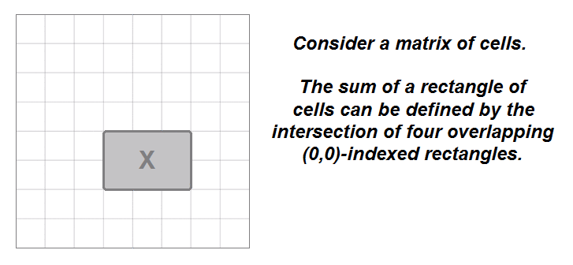

# FB Screening Interview - June 30th 2021

## Q1> Variant of [LeetCode - 304. Range Sum Query 2D - Immutable.](https://leetcode.com/problems/range-sum-query-2d-immutable/)

#### LeetCode Problem Description

Given a 2D matrix matrix, handle multiple queries of the following type:

Calculate the sum of the elements of matrix inside the rectangle defined by its upper left corner `(row1, col1)` and lower right corner `(row2, col2)`.
Implement the NumMatrix class:

`NumMatrix(int[][] matrix)` Initializes the object with the integer matrix matrix.
`int sumRegion(int row1, int col1, int row2, int col2)` Returns the sum of the elements of matrix inside the rectangle 
defined by its upper left corner `(row1, col1)` and lower right corner `(row2, col2)`.

#### Solution Explanation
> The sum of the rectangle `(0,0)->(i,j)` is equal to the cell `(i,j)`,
> plus the rectangle `(0,0)->(i,j-1)`, plus the rectangle `(0,0)->(i-1,j)`, 
> minus the rectangle `(0,0)->(i-1,j-1)`. We subtract the last rectangle 
> because it represents the overlap of the previous two rectangles that were added.
>
> 

#### My Interview Solution

```python
>>> from typing import List
>>> class NumMatrix(object):
      # TC: O(M*N)
      # SC: O(1)
      def __init__(self, matrix: List[List[int]]):
          if matrix is None or not matrix:
              return
          rows, cols = len(matrix), len(matrix[0])
          self.sums = [ [0 for j in range(cols+1)] for i in range(rows+1) ]
          for i in range(1, rows+1):
              for j in range(1, cols+1):
                  self.sums[i][j] = matrix[i-1][j-1] + self.sums[i][j-1] + self.sums[i-1][j] - self.sums[i-1][j-1]
    
      def sumRegion(self, row1: int, col1: int, row2: int, col2: int) -> int:
          row1, col1, row2, col2 = row1+1, col1+1, row2+1, col2+1
          print(f'self.sums[row2][col2] = {self.sums[row2][col2]}')
          print(f'self.sums[row2][col1-1] = {self.sums[row2][col1-1]}')
          print(f'self.sums[row1-1][col2] = {self.sums[row1-1][col2]}')
          print(f'self.sums[row1-1][col1-1] = {self.sums[row1-1][col1-1]}')
          return self.sums[row2][col2] - self.sums[row2][col1-1] - self.sums[row1-1][col2] + self.sums[row1-1][col1-1]

        
>>> numMatrix = NumMatrix2(matrix)
>>> numMatrix.sumRegion(2, 1, 4, 3)
self.sums[row2][col2] = 38
self.sums[row2][col1-1] = 14
self.sums[row1-1][col2] = 24
self.sums[row1-1][col1-1] = 8
8
```
 
#### [More Elegant Solution](https://leetcode.com/problems/range-sum-query-2d-immutable/discuss/1204283/Python-short-dp-explained)
```python
from itertools import product
from functools import lru_cache
from typing import List

class NumMatrix:
    def __init__(self, matrix: List[List[int]]):
        M, N = len(matrix), len(matrix[0])
        self.dp = [[0] * (N+1) for _ in range(M+1)] 
        for c, r in product(range(N), range(M)):
            self.dp[r+1][c+1] = self.dp[r+1][c] + self.dp[r][c+1] - self.dp[r][c] + matrix[r][c]
    
    @lru_cache(None)
    def sumRegion(self, row1: int, col1: int, row2: int, col2: int) -> int:
        print(f'self.dp[r2+1][c2+1] = {self.dp[r2+1][c2+1]}')
        print(f'self.dp[r1][c2+1] = {self.dp[r1][c2+1]}')
        print(f'self.dp[r2+1][c1] = {self.dp[r2+1][c1]}')
        print(f'self.dp[r1][c1] = {self.dp[r1][c1]}')
        return self.dp[r2+1][c2+1] - self.dp[r1][c2+1] - self.dp[r2+1][c1] + self.dp[r1][c1]
```

## Q2> Variant of [LeetCode - 200. Number of Islands](https://leetcode.com/problems/number-of-islands/) ... Similar to the question asked at [Facebook - Phone - Counts of Connected Islands](https://leetcode.com/discuss/interview-question/980711/facebook-phone-counts-of-connected-islands).

#### Similar Problem Description

Given matrix with 0 as water and 1 as island, find the number of connected islands.
If any island has another island in its proximity (all 4 adjacent vertex, diagonals not allowed), then they are connected.

```
# Examples:

[[0, 1, 0],
[0, 0, 0],
[0, 1, 0]]
Answer: 0 islands.

[[1, 1, 0],
[1, 1, 0],
[0, 1, 1]]
Answer: 6 islands are connected from top to bottom

[[0, 1, 1],
[1, 1, 0],
[0, 1, 1]]
Answer: 6 islands are connected from top to bottom.
```

```python
class Solution:
    def connected_islands(self, grid):
        if not grid:
            return 0
        
        num_connected, island_id = 0, 2
        
        for i in range(len(grid)):
            for j in range(len(grid[0])):
                if grid[i][j] == 1:
                    sz = self.dfs(grid, (i, j), island_id)
                    if island_id == 2:
                        num_connected += sz
                    island_id += 1
                    
        return num_connected if num_connected>1 else num_connected-1
        
        
    def dfs(self, grid, starting_point, island_id):
        r, c = starting_point
        grid[r][c] = island_id
        
        sz = 0
        
        for dx, dy in (0, 1), (0, -1), (1, 0), (-1, 0), (-1, 1), (1, 1), (1, -1), (-1, -1):
            nr = r + dy
            nc = c + dx
            
            if 0 <= nr < len(grid) and 0 <= nc < len(grid[0]) and grid[nr][nc] == 1:
                sz += self.dfs(grid, (nr, nc), island_id)
                                                     
        return sz + 1

>>> Solution().connected_islands([[0, 1, 0],[0, 0, 0],[0, 1, 0]])
0
>>> Solution().connected_islands([[1, 1, 0],[1, 1, 0],[0, 1, 1]])
6
>>> Solution().connected_islands([[0, 1, 1],[1, 1, 0],[0, 1, 1]])
6
```

