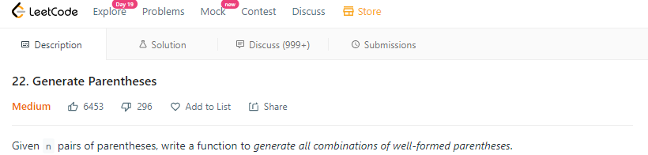
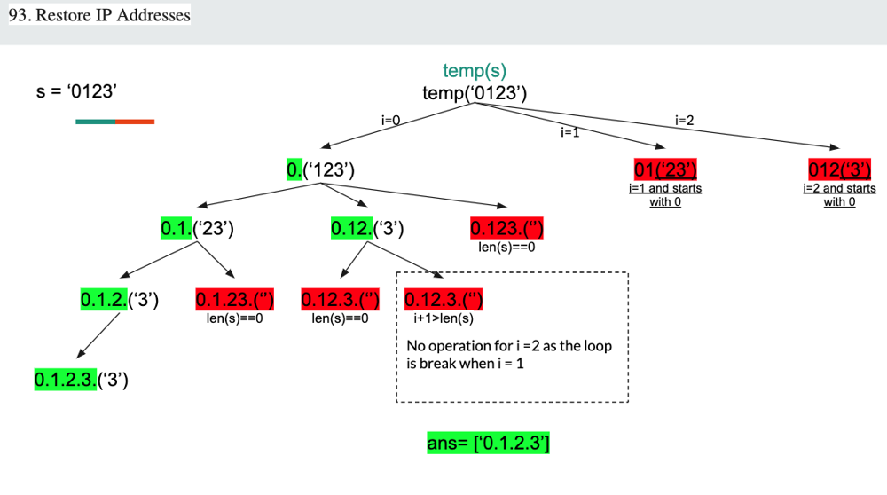
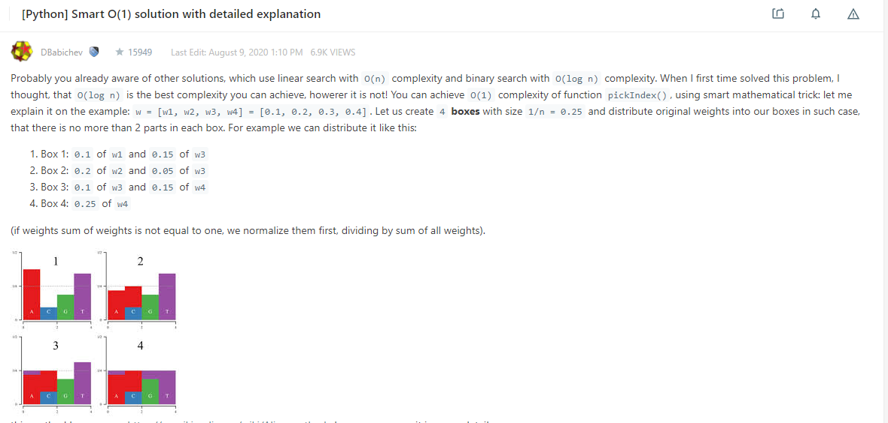
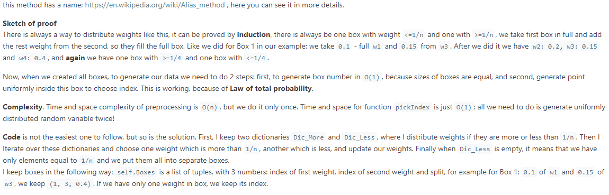
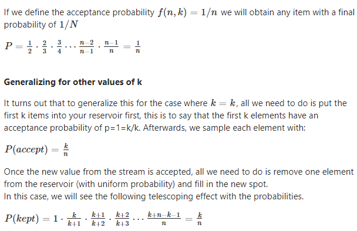

# facebook_interview_prep_2021
## Facebook Interview Process Explained
* [Hacking the Facebook Interview Process](https://candor.co/articles/interview-prep/hacking-the-facebook-interview-process)
* [Preparing for your Software Engineering Interview at Facebook](https://www.facebook.com/careers/life/preparing-for-your-software-engineering-interview-at-facebook/)

## Facebook - Interview Stages
* Stage 1 - Initial Technical Screen
1. Introductions
2. Discussion of Career Aspirations
3. Coding
4. Questions


* Stage 2 - Onsite Interview
1. Coding Interview
2. Design Interview
3. Behavioral Interview
4. Questions


## Facebook - 5 Core Values
1. Be Bold
2. Focus on Impact
3. Move Fast
4. Be Open
5. Build Social Value

## Tips for the Interview
* Familiarize yourself with our 5 core values (move fast, be bold, focus on impact, be open, and build social value). This is how we work together to make the world more open and connected. We look for people who believe in these values and practice them daily.
* Be yourself! Be open and honest about your successes and failures.
* Be humble and focus on team work, leadership and mentorship qualities.

## Important Resources
* [Facebook Phone Interview Questions](https://leetcode.com/discuss/interview-question/790428/Facebook-Phone-Interview-Questions)
* [Facebook interview experiences - All Combined from LC - Till Date 07-Jun-2020](https://leetcode.com/discuss/general-discussion/675445/facebook-interview-experiences-all-combined-from-lc-till-date-07-jun-2020)
* [Facebook Interviews](https://leetcode.com/list/xyvbjku7/)
* [FB-Phone-Interview-List](https://leetcode.com/list/5h1lvmem/)
* [Cracking the top 40 Facebook coding interview questions](https://www.educative.io/blog/cracking-top-facebook-coding-interview-questions)
* [Facebook Interview Questions and Answers](https://hackr.io/blog/facebook-interview-questions)
* [Import and Useful Links from all over the LeetCode](https://leetcode.com/discuss/general-discussion/665604/important-and-useful-links-from-all-over-the-leetcode)

## Study Links
* [DP - Idea of Dynamic Programming](https://afteracademy.com/blog/idea-of-dynamic-programming)
* [DP - Optimal Substructure and Overlapping Subproblems](https://afteracademy.com/blog/optimal-substructure-and-overlapping-subproblems)

## Data_Structure Deep-Dives
* [Heap](https://leetcode.com/discuss/general-discussion/1127238/master-heap-by-solving-23-questions-in-4-patterns-category)

## Algorithm Deep-Dives
* [Dynamic_Programming](https://leetcode.com/discuss/general-discussion/475924/my-experience-and-notes-for-learning-dp)
* [Dynamic_Programming_from_good_to_great](https://leetcode.com/problems/house-robber/discuss/156523/From-good-to-great.-How-to-approach-most-of-DP-problems.)
* [Dynamic_Programming_Patterns-MUST-READ](https://leetcode.com/discuss/general-discussion/458695/dynamic-programming-patterns)

## 1. Phone Screen:
| No. | LC-#     | Title	                                                                                                 | url                                                                                        | Time                                                       | Space                 | Difficulty | Data_Structure | Algorithm                    | Premium    |
| --- | -------- | --------------------------------------------------------------------------------------------------------- | ------------------------------------------------------------------------------------------ | ---------------------------------------------------------- | --------------------- | ---------- | -------------- | ---------------------------- | ---------- |
| 1   | 238      | [Product of Array Except Self](#lc-238product-of-array-except-self)                                       | https://leetcode.com/problems/product-of-array-except-self/                                | _O(n)_                                                     | _O(1)_                | Medium     | Array          |                              |            |
| 2   | 1428     | [Leftmost Column with at Least a One](#lc-1428leftmost-column-with-at-least-a-one)                        | https://leetcode.com/problems/leftmost-column-with-at-least-a-one/                         | _O(R+C)_ or _O(N+M)_ [ RxC matrix or N*M matrix ]          | _O(1)_                | Medium     | Array/Matrix   | Binary Search                | 🔒         |
| 3   |          | [Leftmost Column Index of 1](#leftmost-column-index-of-1) { Similar to LC-1428 }                          | https://leetcode.com/discuss/interview-question/341247/facebook-leftmost-column-index-of-1 | _O(R*log(C)_ or _O(N*log(M))_ [ RxC matrix or N*M matrix ] | _O(1)_                | Medium     | Array/Matrix   | Binary Search                |            |
| 4   | 240      | [Search a 2D Matrix II](#lc-240search-a-2d-matrix-ii)                                                     | https://leetcode.com/problems/search-a-2d-matrix-ii                                        | _O(M+N)_                                                   | _O(1)_                | Medium     | Array          |                              |            |
| 5   | 759      | [Employee Free Time](#lc-759employee-free-time)                                                           | https://leetcode.com/problems/employee-free-time/                                          | _O(m * log(n))_                                            | _O(n)_                | Hard       | Heap/Priority Queue | Greedy                  | 🔒         |
| 6   |          | [Lowest Common Ancestor When Root Node Is Not Known](#lowest-common-ancestor-when-root-node-is-not-known) | https://www.geeksforgeeks.org/lowest-common-ancestor-in-a-binary-tree-set-2-using-parent-pointer/ | _O(h)_                                              | _O(1)_                | Medium     | Binary Tree    |                              |            |
| 7   | 560      | [Subarray Sum Equals K](#lc-560subarray-sum-equals-k)                                                     | https://leetcode.com/problems/subarray-sum-equals-k/                                       | _O(n)_                                                     | _O(n)_                | Medium     | Array          | DP ; Prefix Sum              |            |
| 8   | 138      | [Copy List with Random Pointer](#lc-138copy-list-with-random-pointer)                                     | https://leetcode.com/problems/copy-list-with-random-pointer/                               | _O(n)_                                                     | _O(1)_                | Medium     | Linked List    |                              |            |
| 9   | 297      | [Serialize and Deserialize Binary Tree](#lc-297serialize-and-deserialize-binary-tree)                     | https://leetcode.com/problems/serialize-and-deserialize-binary-tree/                       | _O(n)_                                                     | _O(n)_                | Hard       | Tree           | Level Order Traversal ; DFS ; BFS |            |
| 10  | 428      | [Serialize and Deserialize N-ary Tree](#lc-428serialize-and-deserialize-n-ary-tree)                       | https://leetcode.com/problems/serialize-and-deserialize-n-ary-tree/                        | _O(n)_                                                     | _O(h)_                | Hard       | Tree           | Binary Serailzation ; DFS-Recursive ; BFS | 🔒  |
| 11  | 139      | [Word Break](#lc-139word-break)                                                                           | https://leetcode.com/problems/word-break/                                                  | _O(n^2)_                                                   | _O(n)_                | Medium     |                | DP                           |            |
| 12  | 140      | [Word Break II](#lc-140word-break-ii)                                                                     | https://leetcode.com/problems/word-break-ii/                                               | _O(n^2)_                                                   | _O(n^2)_              | Hard       |                | DP ; DFS                     |            |
| 13  | 261      | [Graph Valid Tree](#lc-261graph-valid-tree)                                                               | https://leetcode.com/problems/graph-valid-tree/                                            | _O(\|V\| + \|E\|)_                                         | _O(\|V\| + \|E\|)_    | Medium     | Graph          | BFS ; DFS ; UnionFind        | 🔒         |
| 14  | 98       | [Validate Binary Search Tree](#lc-98validate-binary-search-tree)                                          | https://leetcode.com/problems/validate-binary-search-tree/                                 | _O(N)_                                                     | _O(1)_                | Medium     | Tree           | Morris Traversal             |            |
| 15  |          | [Google And Facebook:Validate Single Binary Tree](#google-and-facebookvalidate-single-binary-tree)     | https://leetcode.com/discuss/interview-question/347374/                                    | _O(N)_                                                     | _O(N)_                | Medium     | Tree           |                              |            |
| 16  | 621      | [Task Scheduler](#lc-621task-schduler)                                                                    | https://leetcode.com/problems/task-scheduler/                                              | _O(N * n)_ where, N=number_of_tasks , n=cool_off_period    | _O(1)_                | Medium     | Heap/Priority Queue | Greedy                  |            |
| 17  |          | [FB Phone Interview - Variant of Task Scheduler](#fb-phone-interviewtask-scheduler-variant)               | https://leetcode.com/discuss/interview-question/673575/Facebook-or-Phone-or-Task-Scheduler | _O(N)_                                                     | _O(N)_                | Medium     |                | Greedy                       |            |
| 18  | 494      | [Target Sum](#lc-494target-sum)                                                                           | https://leetcode.com/problems/target-sum/                                                  | _O(|nums|*(Upperbound of Sum - Lowerbound of Sum))_        | _O(|nums|*(Upperbound of Sum - Lowerbound of Sum))_ | Medium | | DP                |            |
| 19  | 22       | [Generate Parentheses](#lc-22generate-parenetheses)                                                       | https://leetcode.com/problems/generate-parentheses/                                        | _O( 4^n / (n^ 1/2) )_                                      | _O( 4^n / (n^ 1/2) )_  | Medium    |                | Backtracking ; Catalan Numbers |          |
| 20  | 400      | [Nth Digit](#lc-400nth-digit)                                                                             | https://leetcode.com/problems/nth-digit/                                                   | _O(logn)_                                                  | _O(1)_                | Easy       |                | Binary Search                |            |
| 21  | 380      | [Insert Delete GetRandom O(1)](#lc-380insert-delete-getrandom-o1)                                         | https://leetcode.com/problems/insert-delete-getrandom-o1/                                  | _O(1)_                                                     | _O(n)_                | Hard       |                |                              |            |
| 22  | 381      | [Insert Delete GetRandom O(1) - Duplicates allowed](#lc-381insert-delete-getrandom-o1-duplicates-allowed) | https://leetcode.com/problems/insert-delete-getrandom-o1-duplicates-allowed/               | _O(1)_                                                     | _O(n)_                | Hard       |                |                              |            |
| 23  | 721      | [Accounts Merge](#lc-721accounts-merge)                                                                   | https://leetcode.com/problems/accounts-merge/                                              | _O(nlogn)_                                                 | _O(n)_                | Medium     |                | Union Find                   |            |
| 24  | 408      | [Valid Word Abbreviation](#lc-408valid-word-abbreviation)                                                 | https://leetcode.com/problems/valid-word-abbreviation/                                     | _O(n)_                                                     | _O(1)_                | Easy       |                |                              | 🔒         |
| 25  | 723      | [Candy Crush](#lc-723candy-crush)                                                                         | https://leetcode.com/problems/candy-crush/                                                 | _O((R * C)^2)_                                             | _O(1)_                | Medium     |                |                              |            |
| 26  | 875      | [Koko Eating Bananas](#lc-875koko-eating-bananas)                                                         | https://leetcode.com/problems/koko-eating-bananas/                                         | _O(nlogr)_                                                 | _O(1)_                | Medium     |                |                              |            |
| 27  | 199      | [Binary Tree Right Side View](#lc-199binary-tree-right-side-view)                                         | https://leetcode.com/problems/binary-tree-right-side-view/                                 | _O(n)_                                                     | _O(h)_                | Medium     |                |                              |            |
| 28  | 93       | [Restore IP Addresses](#lc-93restore-ip-addresses)                                                        | https://leetcode.com/problems/restore-ip-addresses/                                       | _O(1)_                                                     | _O(1)_                | Medium     |                |                              |            |
| 29  | 50       | [Pow(x, n)](#lc-50powx-n)                                                                                | https://leetcode.com/problems/powx-n/                                                      | _O(1)_                                                     | _O(1)_                | Medium     |                |                              |            |
| 30  | 354      | [Russian Doll Envelopes](#lc-354russian-doll-envelopes)                                                   | https://leetcode.com/problems/russian-doll-envelopes/                                      | _O(nlogn)_                                                 | _O(1)_                | Hard       |                |                              |            |
| 31  | 286      | [Walls and Gates](#lc-286walls-and-gates)                                                                 | https://leetcode.com/problems/walls-and-gates/                                             | _O(m * n)_                                                 | _O(g)_                | Medium     |                |                              | 🔒         |
| 32  | 121      | [Best Time to Buy and Sell Stock](#lc-121best-time-to-buy-and-sell-stock)                                 | https://leetcode.com/problems/best-time-to-buy-and-sell-stock/                             | _O(n)_                                                     | _O(1)_                | Easy       |                |                              |            |
| 33  | 515      | [Find Largest Value in Each Tree Row](#lc-515find-largest-value-in-each-tree-row)                         | https://leetcode.com/problems/find-largest-value-in-each-tree-row/                         | _O(n)_                                                     | _O(h)_                | Medium     |                |                              |            |
| 34  | 415      | [Add Strings](#lc-415add-strings)                                                                         | https://leetcode.com/problems/add-strings/                                                 | _O(n)_                                                     | _O(1)_                | Easy       |                |                              |            |
| 35  | 39       | [Combination Sum](#lc-39combination-sum)                                                                  | https://leetcode.com/problems/combination-sum/                                             | _O(k * n^k)_                                               | _O(k)_                | Medium     |                |                              |            |
| 36  | 670      | [Maximum Swap](#lc-670maximum-swap)                                                                       | https://leetcode.com/problems/maximum-swap/                                               | _O(logn)_                                                  | _O(logn)_             | Medium     |                |                              |            |
| 37  |          | [Facebook Onsite dot product of sparse vectors](#facebook-onsite-dot-product-of-two-sparse-vectors)       | https://leetcode.com/discuss/interview-question/124823/                                    | _O(h)_                                              | _O(1)_                | Medium     | Binary Tree    |                              |            |
| 38  | 1570     | [Dot Product of Two Sparse Vectors](#lc-1570dot-product-of-two-sparse-vectors)                            | https://leetcode.com/problems/dot-product-of-two-sparse-vectors/                           | ctor: _O(n)_<br>dot_product: _O(min(n, m))_                | _O(n)_                | Medium     |                |                              | 🔒          |
| 39  | 528      | [Random Pick with Weight](#lc-528random-pick-with-weight)                                                 | https://leetcode.com/problems/random-pick-with-weight/                                     | ctor: _O(n)_ <br> pick: _O(logn)_                          | _O(n)_                | Medium     |                |                              |            |
| 40  | 438      | [Find All Anagrams in a String](#lc-438find-all-anagrams-in-a-string)                                     | https://leetcode.com/problems/find-all-anagrams-in-a-string/                               | _O(n)_                                                     | _O(1)_                | Easy       |                |                              |            |
| 41  | 934      | [Shortest Bridge](#lc-934shortest-bridge)                                                                 | https://leetcode.com/problems/shortest-bridge/                                             | _O(n^2)_                                                   | _O(n^2)_              | Medium     |                | BFS, DFS                     |            |
| 42  | 403      | [Frog Jump](#lc-403frog-jump)                                                                             | https://leetcode.com/problems/frog-jump/                                                   | _O(n^2)_                                                   | _O(n^2)_              | Hard       |                |                              |            |
| 43  | 680      | [Valid Palindrome II](#lc-680valid-palindrome-II)                                                         | https://leetcode.com/problems/valid-palindrome-ii/                                         | _O(n)_                                                     | _O(1)_                | Easy       |                |                              |            |
| 44  | 230      | [Kth Smallest Element in a BST](#lc-230kth-smallest-element-in-a-bst)                                     | https://leetcode.com/problems/kth-smallest-element-in-a-bst/                               | _O(max(h, k))_                                             | _O(min(h, k))_        | Medium     |                |                              |            | 
| 45  | 523      | [Continuous Subarray Sum](#lc-523continuous-subarray-sum)                                                 | https://leetcode.com/problems/continuous-subarray-sum/                                    | _O(n)_                                                     | _O(k)_                | Medium     |                |                              |            |
| 46  |          | [Facebook OnSite Randomly generate mines on a grid](#facebook-onsite-randomly-generate-mines-on-a-grid)   | https://leetcode.com/discuss/interview-question/algorithms/124759                          | _O(k*m*n)_                                                 | _O(m*n)_              | Medium     |                | Reservoir Sampling           |            |
| 47  | 953      | [Verifying an Alien Dictionary](#lc-953verifying-an-alien-dictionary)                                     | https://leetcode.com/problems/verifying-an-alien-dictionary/                               | _O(n * l)_                                                 | _O(1)_                | Easy       |                |                              |            |
| 48  | 269      | [Alien Dictionary](#lc-269alien-dictionary)                                                               | https://leetcode.com/problems/alien-dictionary/                                            | _O(n)_                                                     | _O(1)_                | Hard       |                | Topological Sort ; BFS ; DFS | 🔒         |
| 49  | 207      | [Course Schedule](#lc-207course-schedule)                                                                 | https://leetcode.com/problems/course-schedule/                                             | _O(\|V\| + \|E\|)_                                         | _O(\|E\|)_            | Medium     |                | Topological Sort             |            |
| 50  | 986      | [Interval List Intersections](#lc-49interval-list-intersections)                                          | https://leetcode.com/problems/interval-list-intersections/                                 | _O(m + n)_                                                 | _O(1)_                | Medium     |                |                              |            |
| 51  | 1249     | [Minimum Remove to Make Valid Parentheses](#lc-1249minimum-remove-to-make-valid-parentheses)              | https://leetcode.com/problems/minimum-remove-to-make-valid-parentheses/                    | _O(n)_                                                     | _O(1)_                | Medium     |                | Stack                        |            |
| 52  | 66       | [Plus One](#lc-66plus-one)                                                                                | https://leetcode.com/problems/plus-one/                                                    | _O(n)_                                                     | _O(1)_                | Easy       |                |                              |            |
| 53  |          | [Find an index of maximum occurring element with equal probability](#find-an-index-of-maximum-occurring-element-with-equal-probability) | https://www.geeksforgeeks.org/find-index-maximum-occurring-element-equal-probability/      | _O(n)_                       | _O(n)_                | Medium     |                |                              |            |
| 54  | 938      | [Range Sum of BST](#lc-938range-sum-of-bst)                                                               | https://leetcode.com/problems/range-sum-of-bst/                                            | _O(n)_                                                     | _O(h)_                | Medium     |                | DFS                          |            |
| 55  | 323      | [Number of Connected Components in an Undirected Graph](#lc-323number-of-connected-components-in-an-undirected-graph/) | https://leetcode.com/problems/number-of-connected-components-in-an-undirected-graph/ | _O(n)_                                              | _O(n)_                | Medium     |                | Union Find                   | 🔒          |
| 56  |          | [Facebook Phone Connected Components in Graph](#facebook-phone-connected-components-in-graph)             | https://leetcode.com/discuss/interview-question/982506/Facebook-or-Phone-or-Connected-Components-in-Graph/798145                                        |                       | Medium     |                | BFS                          |            |
| 57  | 67       | [Add Binary](#lc-67add-binary)                                                                            | https://leetcode.com/problems/add-binary/                                                  | _O(n)_                                                     | _O(1)_                | Easy       |                |                              |            |
| 58  | 125      | [Valid Palindrome](#lc-125valid-palindrome)                                                               | https://leetcode.com/problems/valid-palindrome/                                            | _O(n)_                                                     | _O(1)_                | Easy       |                |                              |            |
| 59  | 415      | [Add Strings](#lc-415add-strings)                                                                         | https://leetcode.com/problems/add-strings/                                                 | _O(n)_                                                     | _O(1)_                | Easy       |                |                              |            |
| 60  | 236      | [Lowest Common Ancestor of a Binary Tree](#lc-236lowest-common-ancestor-of-a-binary-tree)                 | https://leetcode.com/problems/lowest-common-ancestor-of-a-binary-tree/                     | _O(n)_                                                     | _O(h)_                | Medium     | EPI            |                              |            |
| 61  | 866      | [Smallest Subtree with all the Deepest Nodes](#lc-866smallest-subtree-with-all-the-deepest-nodes)         | https://leetcode.com/problems/smallest-subtree-with-all-the-deepest-nodes/                 | _O(n)_                                                     | _O(h)_                | Medium     |                | DFS                          |            |
| 62  | 257      | [Binary Tree Paths](#lc-257binary-tree-paths)                                                             | https://leetcode.com/problems/binary-tree-paths/                                           | _O(n * h)_                                                 | _O(h)_                | Easy       |                |                              |            |
| 63  | 76       | [Minimum Window Substring](#lc-76minimum-window-substring)                                                | https://leetcode.com/problems/minimum-window-substring/                                    | _O(n)_                                                     | _O(k)_                | Hard       |                |                              |            |
| 64  |          | [Google Remove Duplicates from Unsorted Array](#google-remove-duplicates-from-unsorted-array)             | https://leetcode.com/discuss/interview-question/168757/Google%3A-Remove-Duplicates-from-Unsorted-Array |                                                |                       | Hard       |                |                              |            |
| 65  | 83       | [Remove Duplicates from Sorted List](#lc-83remove-duplicates-from-sorted-list)                            | https://leetcode.com/problems/remove-duplicates-from-sorted-list/                          | _O(n)_                                                     | _O(1)_                | Easy       |                |                              |            |
| 66  | 26       | [Remove Duplicates from Sorted Array](#lc-26remove-duplicates-from-sorted-array)                          | https://leetcode.com/problems/remove-duplicates-from-sorted-array/                         | _O(n)_                                                     | _O(1)_                | Easy       |                | Two Pointers                 |            |
| 67  | 53       | [Maximum Subarray](#lc-53maximum-subarray)                                                                | https://leetcode.com/problems/maximum-subarray/                                            | _O(n)_                                                     | _O(1)_                | Medium     |                | `Kadane's Algorithm`         |            |
| 68  | 20       | [Valid Parentheses](#lc-20valid-parenetheses)                                                             | https://leetcode.com/problems/valid-parentheses/                                           | _O(n)_                                                     | _O(n)_                | Easy       |                |                              |            |
| 69  | 56       | [Merge Intervals](#lc-56merge-intervals)                                                                  | https://leetcode.com/problems/merge-intervals/                                             | _O(nlogn)_                                                 | _O(1)_                | Hard       |                |                              |            |
| 70  | 133      | [Clone Graph](#lc-133clone-graph)                                                                         | https://leetcode.com/problems/clone-graph/                                                 | _O(n)_                                                     | _O(n)_                | Medium     |                |                              |            |
| 71  |          | [Facebook Onsite Generate Random Max Index](#facebook-onsite-generate-random-max-index)                   | https://leetcode.com/discuss/interview-question/451431/facebook-onsite-generate-random-max-index |                                                      |                       | Medium     |                |                              |            |
| 72  |          | [Facebook Interview Question Minimum number of people to spread a message](#facebook-interview-question-minimum-number-of-people-to-spread-a-message) | https://leetcode.com/discuss/interview-question/124827/Find-minimum-number-of-people-to-reach-to-spread-a-message-across-all-people-in-twitter/ |  |  | Medium     |                |                              |            |
| 73  |          | [Facebook Phone Interview Question Given a directed graph remove return minimum of edges to keep all paths](#facebook-phone-interview-question-given-a-directed-graph-remove-return-minimum-of-edges-to-keep-all-paths) | https://leetcode.com/discuss/interview-question/630806/facebook-phone-transitive-reduction-factorial-trailing-zeroes |  |  | Medium     |                |                              |            |
| 74  |          | [Facebook Phone screen Shortest Path with Obstacles](#facebook-phone-screen-shortest-path-with-obstacles) | https://leetcode.com/discuss/interview-question/301192/Facebook-phone-screen-Shortest-Path-with-Obstacles/283312 |  |  | Medium     |                |                              |            |

#### [LC-238:Product of Array Except Self](https://leetcode.com/problems/product-of-array-except-self/)
##### Solution Explanation
```
=================================================================================================================================================================
Approach 1: Left and Right Arrays that capture the multiplication product scanning from left-to-right or right-to-left.
=================================================================================================================================================================
- We maintain a left and right array that captures the multiplication product scanning from left-to-right or right-to-left.
- The time complexity is two linear traversals, thus it's linear time.

- The tricky part is to keep a multiplicative counter with result till its previous element (not its self),
  and assign this value on to its left/right_array.

=================================================================================================================================================================
Approach 2: Optimized Space Solution. Without using extra memory of left and right product list.
=================================================================================================================================================================
Step 1. Create a list that contains the product of all left side elements except the current index of nums element.
Step 2. Create a variable of the right product and multiply with what we have in Step 1 (List that contains all the
        left side produts except the current index itself) through the loop --> this will calculate the product of
        array except for self.
Step 3. Keep updating the right product and loop.
Step 4. Return the answer.
```
##### Complexity Analysis:
```
=================================================================================================================================================================
Approach 1: Left and Right Arrays that capture the multiplication product scanning from left-to-right or right-to-left.
=================================================================================================================================================================
Time complexity : O(N) [ Technically O(2N) ]
========================
We traverse the list containing N elements twice. Each look up in the list costs only O(1) time.

Space complexity : O(1) [ As per problem, the output array does not count as extra space for space complexity analysis. ]
========================
Constant space since we only create a single output array to store the results.

=================================================================================================================================================================
Approach 2: Optimized Space Solution. Without using extra memory of left and right product list.
=================================================================================================================================================================
Time complexity : O(N) [ Technically O(2N) ]
========================
We traverse the list containing N elements twice. Each look up in the list costs only O(1) time.

Space complexity : O(1) [ As per problem, the output array does not count as extra space for space complexity analysis. ]
========================
Constant space since we only create a single output array to store the results.
```
```python
from typing import List
import unittest

class Solution(object):
    #
    # -------------------------------------------------------------------------------------------------------------------------
    # Approach 1: Left and Right Arrays that capture the multiplication product scanning from left-to-right or right-to-left.
    # -------------------------------------------------------------------------------------------------------------------------
    #
    # TC: O(N)
    # SC: O(N)
    def productExceptSelf_Solution_1(self, nums: List[int]) -> List[int]:
        """
        :type nums: List[int]
        :rtype: List[int]
        """
        if not nums: return []
        
        l = len(nums)
        left_arr, right_arr, left, right = [1]*l, [1]*l, 1, 1
        
        for i in range(1, l):
            left *= nums[i-1]
            left_arr[i] = left
        
        for j in range(l-2, -1, -1):
            right *= nums[j+1]
            right_arr[j] = right
        
        return [tup[0]*tup[1] for tup in zip(left_arr, right_arr)]

    #
    # -------------------------------------------------------------------------------------------------------------------------
    # Approach 2: Optimized Space Solution. Without using extra memory of left and right product list.
    # -------------------------------------------------------------------------------------------------------------------------
    # TC: O(N)
    # SC: O(1) [ excluding the output/result array, which does not count towards extra space, as per problem description. ]
    def productExceptSelf_Solution_2(self, nums: List[int]) -> List[int]:
        """
        :type nums: List[int]
        :rtype: List[int]
        """
        length_of_list = len(nums)
		result = [0]*length_of_list
		
        # update result with left product.
        result[0] = 1
        for i in range(1, length_of_list):
            result[i] = result[i-1] * nums[i-1]

        right_product = 1
        for i in reversed(range(length_of_list)):
            result[i] = result[i] * right_product
			right_product *= nums[i]

        return result

class Test(unittest.TestCase):
    def setUp(self) -> None:
        pass

    def tearDown(self) -> None:
        pass

    def test_reverseList(self) -> None:
        sol = Solution()
        for nums, solution in (
            [
                [1,2,3,4],
                [24,12,8,6],
            ],
            [
                [-1,1,0,-3,3],
                [0,0,9,0,0]
            ]
        ):
            self.assertEqual(
                sol.productExceptSelf_Solution_1(nums),
                solution
            )
            self.assertEqual(
                sol.productExceptSelf_Solution_2(nums),
                solution
            )

if __name__ == "__main__":
    ##Input: nums = [1,2,3,4]
    ##Output: [24,12,8,6]
    #nums = [1,2,3,4]
    #print(productExceptSelf(nums))
    ##Input: nums = [-1,1,0,-3,3]
    ##Output: [0,0,9,0,0]
    #nums = [-1,1,0,-3,3]
    #print(productExceptSelf(nums))
	unittest.main()
```

<br/>
<div align="right">
    <b><a href="#1-phone-screen">⬆️ Back to Top</a></b>
</div>
<br/>

####  [LC-1428:Leftmost Column with at Least a One](https://leetcode.com/problems/leftmost-column-with-at-least-a-one/)
##### Solution Explanation:
```
=================================================================================================================================================================
 Approach 1: Linear Search Each Row
=================================================================================================================================================================
Intuition
------------------------------------------------------------------
This approach won't pass, but we'll use it as a starting point.
Also, it might be helpful to you if you just needed an example of how to use the API, but don't want to see a complete solution yet!
------------------------------------------------------------------
The leftmost 1 is the 1 with the lowest column index.

The problem can be broken down into finding the index of the first 1 in each row and then taking the minimum of those indexes.

     0   1   2   3   4   5   6   7   8   9
   +---+---+---+---+---+---+---+---+---+---+   +---+
 0 | 0 | 0 | 0 | 0 | 0 | 0 |*1*|   |   |   |-->| 6 |
   +---+---+---+---+---+---+---+---+---+---+   +---+
 1 | 0 | 0 | 0 | 0 | 0 | 0 | 0 |*1*|   |   |-->| 7 |
   +---+---+---+---+---+---+---+---+---+---+   +---+
 2 | 0 | 0 | 0 | 0 | 0 |*1*|   |   |   |   |-->| 5 |
   +---+---+---+---+---+---+---+---+---+---+   +---+
 3 | 0 | 0 | 0 | 0 | 0 | 0 | 0 | 0 | 0 | 0 |-->|-1 |
   +---+---+---+---+---+---+---+---+---+---+   +---+
 4 | 0 | 0 | 0 | 0 | 0 |*1*|   |   |   |   |-->| 5 |
   +---+---+---+---+---+---+---+---+---+---+   +---+
 5 | 0 | 0 |*1*|   |   |   |   |   |   |   |-->+ 2 +
   +---+---+---+---+---+---+---+---+---+---+   +---+
 6 | 0 | 0 | 0 | 0 |*1*|   |   |   |   |   |-->| 4 |
   +---+---+---+---+---+---+---+---+---+---+   +---+

The simplest way of doing this would be a linear search on each row.

-------------------------------------------------------------------
Complexity Analysis for Approach-1
-------------------------------------------------------------------
If you ran this code, you would have gotten the following error.

text You made too many calls to BinaryMatrix.get().

The maximum grid size is 100 by 100 , so it would contain 10000 cells. In the worst case, the linear search algorithm we implemented has to check every cell. With the problem description telling us that we can only make up to 1000 API calls, this clearly isn't going to work.

Let N be the number of rows, and M be the number of columns.

Time complexity : O(N * M)

We don't know the time complexity of binaryMatrix.get() as its implementation isn't our concern.
Therefore, we can assume it's O(1).

In the worst case, we are retrieving a value for each of the N * M cells.
At O(1) per operation, this gives a total of O(N * M).

Space complexity : O(1).

We are only using constant extra space.

=================================================================================================================================================================
 Approach-2 ( Binary Search Each Row )
=================================================================================================================================================================
Intuition
------------------------------------------------------------------
This isn't the best approach, but it passes, and coding it up is a good opportunity to practice binary search.
------------------------------------------------------------------
When linear search is too slow, we should try to find a way to use binary search.
If you're not familiar with binary search, [check out this Explore Card!](https://leetcode.com/explore/learn/card/binary-search/).
We recommend doing the first couple of binary search questions to get familiar with the algorithm before coming back to this problem.

Also, have a go at First Bad Version.
The only difference between that problem and this one is that instead of 0 and 1 , it uses false and true.

Like we did with the linear search, we're going to apply binary search independently on each row.
The target element we're searching for is the first 1 in the row .

The core part of a binary search algorithm is how it decides whether the target element 
is to the left or the right of the middle element.
Let's figure this out by thinking through a couple of examples.

In the row below, we've determined that the middle element is a 0.
On what side must the target element (first 1 ) be?
The left, or the right? Don't forget, all the 0's are before all the 1's.
   
                                            middle
											  |
											 \|/
    +----+----+----+----+----+----+----+----******----+----+----+----+----+----+----+----+
*** | 51 | 52 | 53 | 54 | 55 | 56 | 57 | 58 * 59 * 60 | 61 | 62 | 63 | 64 | 65 | 66 | 67 | ***
    +----+----+----+----+----+----+----+----******----+----+----+----+----+----+----+----+
    +----+----********************+----+----******----+----+******************-+----+----+
*** |    |    *Is it to the left?*|    |    * 0  *    |    |*Or to the right?* |    |    | ***
    +----+----********************+----+----******----+----+******************-+----+----+

In this next row, the middle element is a 1?
What side must the target element be on? Could it also possibly be the 1 we just found?

                                            middle
											  |
											 \|/
    +----+----+----+----+----+----+----+----******----+----+----+----+----+----+----+----+
*** | 28 | 29 | 30 | 31 | 32 | 33 | 34 | 35 * 36 * 37 | 38 | 39 | 40 | 41 | 42 | 43 | 44 | ***
    +----+----+----+----+----+----+----+----******----+----+----+----+----+----+----+----+
    +----+----********************+----+----******----+----+******************-+----+----+
*** |    |    *Is it to the left?*|    |    * 1  *    |    |*Or to the right?* |    |    | ***
    +----+----********************+----+----******----+----+******************-+----+----+

For the first example, we can conclude that the target element ( if it exists ) must be to the 
**right** of the middle element.
This is because we know that everything to the left of a 0 must also be a 0.

For the second example, we can conclude that the target element is either the middle element 
itself or it is some other 1 to the **left** of the middle element.
We know that everything to the right of a 1 is also a 1,
but these can't possibly be further left than the one we just found.

In summary, if the middle element is a:

- **0** , then the target must be to the **right**.
- **1** , then the target is either this element or to the **left**.

We can then put this together into an algorithm that finds the index of the target element (first 1)
in each row, and then returns the minimum of those indexes.

-------------------------------------------------------------------
Algorithm
-------------------------------------------------------------------
If you're already quite familiar with binary search, feel free to skip down to the implementation below.
I've decided to include lots of details here, as binary search is one of those algorithms 
that a lot of people get frustrated with easily and find it difficult to master.

In a binary search, we always keep track of the range that the target might be in by using two variables: 
lo to represent the lowest possible index it could be, and hi to represent the highest possible index it could be.
Ignoring the binaryMatrix API details for the moment, here is a rough outline of our binary search in pseudocode.

define function binary_search(input_list):
  lo = the lowest possible index
  hi = the highest possible index
  while the search space contains 2 or more items:
    mid = the middle index in the remaining search space
	if the element at input_list[mid] is 0:
      lo = mid + 1 (the first 1 is *further right*, and can't be mid itself)
	else:
      hi = mid (the first 1 is either mid itself, *or is further left*)
  return the only index remaining in the search space

As always in binary search, there are a couple more key implementation details we still need to deal with:

 1. An even-length search space has two middles. Which do we choose?
 2. The row might be all 0's.

Let's tackle these issues one at a time.

The first issue, the choice of middle, is important, as otherwise, the search space might stop shrinking 
when it gets down to two elements. When the search space doesn't shrink, the algorithm does the exact 
same thing the next loop cycle, resulting in an infinite loop. Remember that when the search space 
only contains two elements, they are the ones pointed to by lo and hi. 
This means that the lower middle equals lo , and the upper-middle equals hi. 
We, therefore, need to think about which cases would shrink the search space, and which would not.

If we use the lower-middle
 - If it is a 0 , then we set lo = mid + 1. Because hi == mid + 1 , this means that lo == hi (search space is of length-one).
 - If it is a 1 , then we set hi = mid . Because mid == lo , this means that hi == lo (search space is of length-one).

If we use the upper-middle
 - If it is a 0 , then we set lo = mid + 1 . Because hi = mid , we now have hi > lo (search space is of length-zero).
 - If it is a 1 , then we set hi = mid . Because hi == mid was already true, the search space stays as is (of length-two).

If we use the lower-middle, we know the search space will always shrink.
If we use the upper-middle, it might not.
Therefore, we should go with the lower-middle.

The formula for this is mid = (low + high) / 2 .

The second issue, a row of all zeroes, is solved by recognizing that the algorithm always shrinks down the 
search space to a single element. This is supposed to be the first 1 , but if that doesn't exist, 
then it has to be a 0 . Therefore, we can detect this case by checking whether or not the last 
element in the search space is a 1 .

It is good practice to think these details through carefully so that you can write your 
binary search algorithm decisively and confidently. Resist the urge to Program by Permutation!

-------------------------------------------------------------------
Complexity Analysis for Approach-2
-------------------------------------------------------------------
Let N be the number of rows, and M be the number of columns.

Time complexity : O(N * logM).

There are M items in each row. Therefore, each binary search will have a cost of O(logM).
We are performing N of these binary searches, giving a time complexity of N * O(logM) = O(N * logM).

Space complexity : O(1).

We are using constant extra space.

=================================================================================================================================================================
 Approach-3 ( Start at Top Right, Move Only Left and Down ) 
                                ( or, Start at Bottom Left, Move only Up and Right ) 
=================================================================================================================================================================
Intuition
------------------------------------------------------------------
Did you notice in Approach 2 that we didn't need to finish searching all the rows?
One example of this was row 3 on the example in the animation.
At the point shown in the image below, it was clear that row 3 
could not possibly be better than the minimum we'd found so far.

     0   1   2   3   4   5   6   7   8   9
   +---+---+---+---+---+---+---+---+---+---+
 0 | 0 | 0 | 0 | 0 |+0+|+0+|*1*| 1 | 1 | 1 |
   +---+---+---+---+---+---+---+---+---+---+
 1 | 0 | 0 | 0 | 0 |+0+|+0+|+0+|*1*| 1 | 1 |
   +---+---+---+---+---+---+---+---+---+---+
 2 | 0 | 0 | 0 | 0 |+0+|*1*| 1 |+1+| 1 | 1 |
   +---+---+---+---+---+---+---+---+---+---+
 3 | 0 | 0 | 0 | 0 |+0+| 0 | 0 |*0*|   |   |
   +---+---+---+---+---+---+---+---+---+---+
 4 |   |   |   |   |   |   |   |   |   |   |
   +---+---+---+---+---+---+---+---+---+---+
 5 |   |   |   |   |   |   |   |   |   |   |
   +---+---+---+---+---+---+---+---+---+---+
 6 |   |   |   |   |   |   |   |   |   |   |
   +---+---+---+---+---+---+---+---+---+---+

API Calls: 12

Therefore, an optimization we could have made was to keep track of the minimum index so far,
and then abort the search on any rows where we have discovered a 0 at, or to the right of,
that minimum index.

We can do even better than that; on each search, we can set hi = smallest_index - 1, 
where smallest_index is the smallest index of a 1 we've seen so far.
In most cases, this is a substantial improvement.
It works because we're only interested in finding 1 s at lower indexes than we previously found.

Here is what the worst-case looks like. Like before, its time complexity is still O(N * log(M)).

     0   1   2   3   4   5   6   7   8   9
   +---+---+---+---+---+---+---+---+---+---+
 0 |***|***|***|***| 0 |***|***| 0 | 0 | 1 |
   +---+---+---+---+---+---+---+---+---+---+
 1 |***|***|***|***| 0 |***| 0 | 0 | 1 |***|
   +---+---+---+---+---+---+---+---+---+---+
 2 |***|***|***| 0 |***| 0 | 0 | 1 |***|***|
   +---+---+---+---+---+---+---+---+---+---+
 3 |***|***|***| 0 |***| 0 | 1 |***|***|***|
   +---+---+---+---+---+---+---+---+---+---+
 4 |***|***| 0 |***| 0 | 1 |***|***|***|***|
   +---+---+---+---+---+---+---+---+---+---+
 5 |***|***| 0 | 0 | 1 |***|***|***|***|***|
   +---+---+---+---+---+---+---+---+---+---+
 6 |***| 0 | 0 | 1 |***|***|***|***|***|***|
   +---+---+---+---+---+---+---+---+---+---+

While this is no worse than Approach 2, there is a better algorithm.

-------------------------------------------------------------------
Algorithm
-------------------------------------------------------------------

Start in the top right corner, and if the current value is a 0 , move down. If it is a 1 , then move left.

- When we encounter a 0, we know that the leftmost 1 can't be to the left of it.
- When we encounter a 1, we should continue the search on that row (move pointer to the left), in order to find an even smaller index.
------------------------------------------------------------------

-------------------------------------------------------------------
Complexity Analysis for Approach-3
-------------------------------------------------------------------
Let N be the number of rows, and M be the number of columns.

Time complexity : O(N + M).

At each step, we're moving 1 step left or 1 step down.
Therefore, we'll always finish looking at either one of the M rows or N columns.
Therefore, we'll stay in the grid for at most N+M steps, and therefore get a time complexity of O(N+M).

Space complexity : O(1).

We are using constant extra space.


```
##### Complexity Analysis:
```
N = # of rows 
M = # of columns
=================================================================================================================================================================
 Approach 1: Linear Search Each Row
=================================================================================================================================================================
TC  : O(N * M)
SC  : O(1)

=================================================================================================================================================================
 Approach-2 ( Binary Search Each Row )
=================================================================================================================================================================
TC  : O(N * log(M))
SC  : O(1)

=================================================================================================================================================================
 Approach-3 ( Start at Top Right, Move Only Left and Down ) 
=================================================================================================================================================================
TC  : O(N + M)
SC  : O(1)
```
```python
# """
# This is BinaryMatrix's API interface.
# You should not implement it, or speculate about its implementation
# """
#class BinaryMatrix(object):
#    def get(self, row: int, col: int) -> int:
#    def dimensions(self) -> list[]:
class BinaryMatrix(object):
    def get(self, row, col):
        pass

    def dimensions(self):
        pass

#=================================================================================================================================================================
# Approach 1: Linear Search Each Row
#=================================================================================================================================================================
#N = # of rows 
#M = # of columns
#
# TC: O(N *  M)
# SC: O(1)
# NOTE: This approach won't pass ( so don't use it in an interview ).
class Solution_1:
    def leftMostColumnWithOne(self, binaryMatrix: 'BinaryMatrix') -> int:
        """
        :type binaryMatrix: BinaryMatrix
        :rtype: int
        """
        row_len, col_len = binaryMatrix.dimensions()
        smallest_index = col_len
        # Go through each of the rows.
        for row in range(row_len):
            # Linear seach for the first 1 in this row.
            for col in range(col_len):
                if binaryMatrix.get(row, col) == 1:
                    smallest_index = min(smallest_index, col)
                    break
        # If we found an index, we should return it. Otherwise, return -1.
        return -1 if smallest_index == col_len else smallest_index

#=================================================================================================================================================================
# Approach-2 ( Binary Search Each Row )
#=================================================================================================================================================================
#N = # of rows 
#M = # of columns
#
#TC  : O(N * log(M))
#SC  : O(1)
#
class Solution_2:
    def leftMostColumnWithOne(self, binaryMatrix: 'BinaryMatrix') -> int:
        """
        :type binaryMatrix: BinaryMatrix
        :rtype: int
        """
        row_len, col_len = binaryMatrix.dimensions()
        smallest_index = col_len
        for row in range(row_len):
            # Binary Search for the first 1 in the row.
            lo = 0
            hi = col_len - 1
            while lo < hi:
                mid = (lo + hi) // 2
                if binaryMatrix.get(row, mid) == 0:
                    lo = mid + 1
                else:
                    hi = mid
            # If the last element in the search space is a 1, then this row
            # contained a 1.
            if binaryMatrix.get(row, lo) == 1:
                smallest_index = min(smallest_index, lo)
        # If smallest_index is still set to col_len, then there were no 1's in 
        # the grid. 
        return -1 if smallest_index == col_len else smallest_index

#=================================================================================================================================================================
# Approach-3 ( Start at Top Right, Move Only Left and Down ) 
#=================================================================================================================================================================
#N = # of rows 
#M = # of columns
#
#TC  : O(N + M)
#SC  : O(1)
#
#NOTE : This is a solution you should go for in an interview situation.
#
class Solution_3:		
    def leftMostColumnWithOne(self, binaryMatrix: 'BinaryMatrix') -> int:
        """
        :type binaryMatrix: BinaryMatrix
        :rtype: int
        """
        row_len, col_len = binaryMatrix.dimensions()
        
        # Set pointers to the top-right corner.
        current_row = 0
        current_col = col_len - 1
        
        # Repeat the search until it goes off the grid.
        while current_row < row_len and current_col >= 0:
            if binaryMatrix.get(current_row, current_col) == 0:
                current_row += 1
            else:
                current_col -= 1
        
        # If we never left the last column, it must have been all 0's.
        return current_col + 1 if current_col != col_len - 1 else -1
```

<br/>
<div align="right">
    <b><a href="#1-phone-screen">⬆️ Back to Top</a></b>
</div>
<br/>

####  [Leftmost Column Index of 1]
##### Solution Explanation:
[Refer to LC-1428:Leftmost Column with at Least a One - Complexity Analysis](https://github.com/sm2774us/facebook_interview_prep_2021#solution-explanation-1)
##### Complexity Analysis:
[Refer to LC-1428:Leftmost Column with at Least a One - Complexity Analysis](https://github.com/sm2774us/facebook_interview_prep_2021#complexity-analysis-1)
```python
#=================================================================================================================================================================
# Approach-1 ( Binary Search Each Row )
#=================================================================================================================================================================
#
#N = # of rows 
#M = # of columns
#
#TC  : O(N * log(M))
#SC  : O(1)
#
from typing import List

def leftMostColumnWithOne_using_binary_search(matrix: List[List[int]]) -> int:
    lengthOfRow = len(matrix[0])
    leftMost = float('inf')
    for row in matrix:
        # Start binary search per row
        start = 0
        end = lengthOfRow - 1
        while start < end:
            median = (start + end) // 2
            if row[median] == 1:
                end = median - 1
            else:
                start = median + 1
        if start + 1 < lengthOfRow and row[start] == 0 and row[start + 1] == 1:
            start += 1
        if row[start] == 1:
            leftMost = min(leftMost, start)
    return leftMost if leftMost != float('inf') else -1

if __name__ == "__main__":
    print(leftMostColumnWithOne_using_binary_search(
    [
        [0,0,0,0],
        [0,0,1,1],
        [0,0,1,1],
        [0,1,1,1]
    ]
    ))

    print(leftMostColumnWithOne_using_binary_search(
    [
        [0,0,0,0],
        [0,0,0,0],
        [0,0,0,0],
        [0,0,0,1]
    ]
    ))

    print(leftMostColumnWithOne_using_binary_search(
    [
        [0,0,0,0],
        [0,0,0,0],
        [0,0,0,0],
        [0,0,0,0]
    ]
    ))

    print(leftMostColumnWithOne_using_binary_search(
    [
        [0,1,1,1],
        [0,0,1,1],
        [0,0,1,1],
        [0,0,0,0]
    ]
    ))
    #Output:
    #1
    #3
    #-1
    #1

#=================================================================================================================================================================
# Approach-2 ( Start at Top Right, Move Only Left and Down ) 
#=================================================================================================================================================================
#N = # of rows 
#M = # of columns
#
#TC  : O(N + M)
#SC  : O(1)
#
#NOTE : This is a solution you should go for in an interview situation.
#
from typing import List

def leftMostColumnWithOne_using_optimal_approach(matrix: List[List[int]]) -> int:
    if not len(matrix) or not len(matrix[0]):
        # Quick response for empty matrix
        return -1
    row_len, col_len = len(matrix), len(matrix[0])

    # Set pointers to the top-right corner.
    current_row = 0
    current_col = col_len - 1
        
    # Repeat the search until it goes off the grid.
    while current_row < row_len and current_col >= 0:
        if matrix[current_row][current_col] == 0:
            current_row += 1
        else:
            current_col -= 1
        
    # If we never left the last column, it must have been all 0's.
    return current_col + 1 if current_col != col_len - 1 else -1
	
if __name__ == "__main__":
    print(leftMostColumnWithOne_using_optimal_approach(
    [
        [0,0,0,0],
        [0,0,1,1],
        [0,0,1,1],
        [0,1,1,1]
    ]
    ))

    print(leftMostColumnWithOne_using_optimal_approach(
    [
        [0,0,0,0],
        [0,0,0,0],
        [0,0,0,0],
        [0,0,0,1]
    ]
    ))

    print(leftMostColumnWithOne_using_optimal_approach(
    [
        [0,0,0,0],
        [0,0,0,0],
        [0,0,0,0],
        [0,0,0,0]
    ]
    ))

    print(leftMostColumnWithOne_using_optimal_approach(
    [
        [0,1,1,1],
        [0,0,1,1],
        [0,0,1,1],
        [0,0,0,0]
    ]
    ))
    #Output:
    #1
    #3
    #-1
    #1	

```

<br/>
<div align="right">
    <b><a href="#1-phone-screen">⬆️ Back to Top</a></b>
</div>
<br/>

####  [LC-240:Search a 2D Matrix II](https://leetcode.com/problems/search-a-2d-matrix-ii)
##### Solution Explanation:
```
=================================================================================================================================================================
 Approach-1 ( Binary Search Each Row )
=================================================================================================================================================================

Hint:

Method_#1:

Take advantage of the property with sorted ordering in row and column respectively.

"Searching in sorted element" usually has strong connection with binary search framework.

Think of classical 1D binary search, and built a element search algorithm with range check and 1D binary search.

First, use range check to locate possible candidate row.

Second, launch 1D binary search on each possible candidate row.

=================================================================================================================================================================
 Approach-2 ( Adaptive Search : Start at Top Right, Move Only Left and Down ) 
                                ( or, Start at Bottom Left, Move only Up and Right )
=================================================================================================================================================================

Hint:

Again, utilize the property with sorted ordering.

Start iteration from top right corner.

If target is larger then current element, then go right next time.
If target is smaller than current element, then go up next time.

If target is current element, then return True

When next move is out of boundary of matrix, return False ( i.e., target does Not exist in matrix )
```
##### Complexity Analysis:
```
N = # of rows 
M = # of columns

=================================================================================================================================================================
 Approach-1 ( Binary Search Each Row )
=================================================================================================================================================================
TC  : O(N * log(M))
SC  : O(1)

=================================================================================================================================================================
 Approach-2 ( Adaptive Search : Start at Top Right, Move Only Left and Down ) 
                                ( or, Start at Bottom Left, Move only Up and Right )
=================================================================================================================================================================
TC  : O(N + M)
SC  : O(1)
```
```python
#=================================================================================================================================================================
# Approach-1 ( Binary Search Each Row )
#=================================================================================================================================================================
#
#N = # of rows 
#M = # of columns
#
#TC  : O(N * log(M))
#SC  : O(1)
#
from typing import List

class Solution:
    def searchMatrix(self, matrix: List[List[int]], target: int)-> bool:
        
        
        if not len(matrix) or not len(matrix[0]):
            # Quick response for empty matrix
            return False
        
        h, w = len(matrix), len(matrix[0])
        
        for row in matrix:
			
			# range check
            if row[0] <= target <= row[-1]:
                
				# launch binary search on current possible row
				
                left, right = 0, w-1
                
                while left <= right:
                    
                    mid = left + (right - left) // 2
                    
                    mid_value = row[mid]
                    
                    if target > mid_value:
                        left = mid+1
                    elif target < mid_value:
                        right = mid-1
                    else:
                        return True
                
        return False

#=================================================================================================================================================================
# Approach-2 ( Adaptive Search : Start at Top Right, Move Only Left and Down ) 
#                                ( or, Start at Bottom Left, Move only Up and Right )
#=================================================================================================================================================================
#N = # of rows 
#M = # of columns
#
#TC  : O(N + M)
#SC  : O(1)
#
#NOTE : This is a solution you should go for in an interview situation.
#
from typing import List
import unittest

class Solution:
    # Start at Top Right, Move Only Left (target is larger then current element) and Down (target is smaller than current element)
    def searchMatrix_from_top_right(self, matrix: List[List[int]], target: int) -> bool:    
        """
        :type matrix: List[List[int]]
        :type target: int
        :rtype: bool
        """
        if not len(matrix) or not len(matrix[0]):
			# Quick response for empty matrix
            return False
        if target < matrix[0][0] or target > matrix[-1][-1]:
            return False
			
        row_len, col_len = len(matrix), len(matrix[0])
        # Set pointers to the top-right corner.
        row, col = 0, col_len-1
        while 0 <= row < row_len and 0 <= col < col_len:
            if matrix[row][col] == target:
                return True
            if matrix[row][col] < target:
                row += 1
            else:
                col -= 1
        return False
		
    # Twin Algorithm
	# Start at Bottom Left, Move Only Right (target is larger then current element) and Up (target is smaller than current element)
    def searchMatrix_from_bottom_left(self, matrix: List[List[int]], target: int) -> bool:    
        """
        :type matrix: List[List[int]]
        :type target: int
        :rtype: bool
        """
        if not len(matrix) or not len(matrix[0]):
			# Quick response for empty matrix
            return False
        if target < matrix[0][0] or target > matrix[-1][-1]:
            return False
			
        row_len, col_len = len(matrix), len(matrix[0])
        # Set pointers to the bottom-left corner.
        row, col = row_len-1, 0        
        while 0 <= row < row_len and 0 <= col < col_len:
            if matrix[row][col] == target:
                return True
            if matrix[row][col] < target:
                col += 1
            else:
                row -= 1
        return False		

class Test(unittest.TestCase):
    def setUp(self) -> None:
        pass

    def tearDown(self) -> None:
        pass

    def test_searchMatrix_from_top_right(self) -> None:
        sol = Solution()
        for matrix, target, solution in (
            [
                [[1,4,7,11,15],[2,5,8,12,19],[3,6,9,16,22],[10,13,14,17,24],[18,21,23,26,30]],
                5,
				True
            ],
            [
                [[1,4,7,11,15],[2,5,8,12,19],[3,6,9,16,22],[10,13,14,17,24],[18,21,23,26,30]],
                20,
                False
            ]
        ):
            self.assertEqual(
                sol.searchMatrix_from_top_right(matrix, target),
                solution
            )
            self.assertEqual(
                sol.searchMatrix_from_bottom_left(matrix, target),
                solution
            )

if __name__ == "__main__":
	unittest.main()
```

<br/>
<div align="right">
    <b><a href="#1-phone-screen">⬆️ Back to Top</a></b>
</div>
<br/>

####  [LC-759:Employee Free Time](https://leetcode.com/problems/employee-free-time/)
##### Solution Explanation:
```
=================================================================================================================================================================
 Approach-1 ( Using an Event Class with details about the intervals  )
=================================================================================================================================================================

=================================================================================================================================================================
 Approach-2 ( Greedy Algorithm + Priority Queue  )
=================================================================================================================================================================

```
##### Complexity Analysis:
```
=================================================================================================================================================================
 Approach-1 ( Using an Event Class with details about the intervals  )
=================================================================================================================================================================
I = number of intervals
-------------------------------
Time : O(I log I)
Space: O(I)
-------------------------------

=================================================================================================================================================================
 Approach-2 ( Greedy Algorithm + Priority Queue  )
=================================================================================================================================================================		
m is the number of schedule, n is the number of employees, m >= n
-------------------------------
Time : O(m * logn)
Space: O(n)
-------------------------------
```
```python

"""
# Definition for an Interval.
class Interval:
    def __init__(self, start: int = None, end: int = None):
        self.start = start
        self.end = end
"""

#=================================================================================================================================================================
# Approach-1 ( Using an Event Class with details about the intervals  )
#=================================================================================================================================================================
#I = number of intervals
#-------------------------------
#Time : O(I log I)
#Space: O(I)

class Event:
    def __init__(self, time: int, start: bool):
        self.time = time
        self.start = start

    def __repr__(self): return str(self.time)

class Solution:
    def employeeFreeTime(self, schedule: '[[Interval]]') -> '[Interval]':
        # Time Complexity: O(I log I), I = number of intervals
        # Space Complexity: O(I)

        num_employee = len(schedule)

        events = []
        for employee in schedule:
            for interval in employee:
                events.append(Event(interval.start, True))
                events.append(Event(interval.end, False))
        events.sort(key=lambda e: e.time)
        print(events)

        num_working = 0
        i = 0
        break_start = -1
        breaks = []

        for event in events:
            if event.start:
                num_working += 1
                if break_start != - 1:
                    if event.time - break_start > 0:
                        breaks.append(Interval(break_start, event.time))
                    break_start = -1
            else:
                num_working -= 1
                if num_working == 0:
                    break_start = event.time

        return breaks

#=================================================================================================================================================================
# Approach-2 ( Greedy Algorithm + Priority Queue  )
#=================================================================================================================================================================
#m is the number of schedule, n is the number of employees, m >= n
#-------------------------------
#Time : O(m * logn)
#Space: O(n)

import heapq

class Solution:
    def employeeFreeTime(self, schedule: '[[Interval]]') -> '[Interval]':
        # Based on LeetCode's Solution 2
        # Greedy + Priority Queue
        # Time Complexity: O(I log N), I = number of intervals
        # Space Complexity: O(N)

        num_employee = len(schedule)
        breaks = []
        next_busy_pq = [(employee[0].start, ei, 0) for ei, employee in enumerate(schedule)]
        heapq.heapify(next_busy_pq)
        break_start = min(interval.start for employee in schedule for interval in employee)

        while len(next_busy_pq) > 0:
            t, eid, iid = heapq.heappop(next_busy_pq)
            if break_start < t:
                breaks.append(Interval(break_start, t))
            break_start = max(break_start, schedule[eid][iid].end)
            if iid + 1 < len(schedule[eid]):
                heapq.heappush(next_busy_pq, (schedule[eid][iid + 1].start, eid, iid + 1))
        return breaks
```

<br/>
<div align="right">
    <b><a href="#1-phone-screen">⬆️ Back to Top</a></b>
</div>
<br/>

####  [Lowest Common Ancestor When Root Node Is Not Known](https://www.geeksforgeeks.org/lowest-common-ancestor-in-a-binary-tree-set-2-using-parent-pointer/)
```python
# Given two nodes of an n-ary tree, return the LCA node. you are *not* given the root node. however, each node has
# a (nullaple) parent pointer. (this problem may be presented as a binary tree; approach is the same)

class Node:
    val = ''
    parent = None
    children = set()

    def __init__(self, val, parent=None, children=None):
        self.val = val
        self.parent = parent
        if children is not None:
            self.children = children

    def __str__(self):
        return self.val


# time complexity: O(d). we don't traverse all nodes, just straight up the tree for each pointer.
# space complexity: O(1), modify the input, no extra data. hashing visited nodes would also work but, uses O(d) space.
def lca(n1: Node, n2: Node) -> Node:
    if not n1 or (not n2):
        return None

    if n1 == n2:
        return n1

    n1_level = get_level(n1)
    n2_level = get_level(n2)

    while n1_level > n2_level:
        n1 = n1.parent  # don't need to null check here since get_level() did that for us
        n1_level -= 1

    while n2_level > n1_level:
        n2 = n2.parent
        n2_level -= 1

    # keep traversing up until the two pointers collide
    while n1 != n2:
        if not n1.parent:
            # n1 and n2 are same level so don't need to null check both, check either
            return None

        n1 = n1.parent
        n2 = n2.parent

    # return either
    return n1


# root is level 0 (not level 1)
# time complexity: O(d)
# space complexity: O(1).
def get_level(node: Node) -> int:
    steps = 0
    while node.parent:
        node = node.parent
        steps += 1

    return steps


#         A
#     B      C
#   D     E  F  G
#               I
a = Node('a', None)
b = Node('b', a)
c = Node('c', a)
d = Node('d', b)
e = Node('e', c)
f = Node('f', c)
g = Node('g', c)
i = Node('i', g)
a.children = {b, c}
c.children = {d}
c.children = {e, f, g}
g.children = {i}

cases = [
    # valid cases:
    (b, g),  # => a
    (a, i),  # => a
    (b, b),  # => b
    (e, i),  # => c
    (e, e),  # => e

    # invalid cases:
    (a, None),  # => None
    (None, a),  # => None
]

for case in cases:
    print(lca(*case))
```

<br/>
<div align="right">
    <b><a href="#1-phone-screen">⬆️ Back to Top</a></b>
</div>
<br/>

####  [LC-560:Subarray Sum Equals K](https://leetcode.com/problems/subarray-sum-equals-k/)
##### Solution Explanation:
```
# --------------------------------------
# Approach 1 ( DP + Prefix Sum )
# --------------------------------------


# --------------------------------------
# Approach 2 ( given a list of 'hops' you've taken down a road ... how many of these hops travelled k meters )
# --------------------------------------
Think about it this way: you're given a list of 'hops' you've taken down a road: 1, 2, 2, 0, 3, 2, 5. Initially you hopped 1 meter, then 2, and 2 again, then 0 meters etc.

You are then asked: how many of these hops travelled 5 meters consecutively? The answer is 6:

             _
         ___
       _____
     _____     
________
______
[1,2,2,0,3,2,5]
Rather than working with individual hop data, let's think of the total distance we travelled.

Work with accumulation values
So our total distance travelled at each hop is:

nums:          1,  2,  2,  0,  3,  2,  5
accumulation:  1,  3,  5,  5,  8,  10, 15
This is something that trips me up often with DP questions: you can often end up working in a totally different solution space. We are no longer concerned with our input values.. only their accumulation values. That can take quite a leap of the imagination (no pun intended).

Could i hop back 'k'?
Let's add our starting point 0 to the accumulator, think of it as the starting point. This 'total distance travelled' data is invaluable, because we can ask it questions, namely:

0, 1, 3, 5, 5, 8, 10, 15
-
|
|
Q: have i travelled 5 meters yet
A: nope
0, 1, 3, 5, 5, 8, 10, 15
   -
   |
   |
Q: have i travelled 5 meters yet
A: nope
0, 1, 3, 5, 5, 8, 10, 15
      -
      |
      |
Q: have i travelled 5 meters yet
A: nope
0, 1, 3, 5, 5, 8, 10, 15
         -
         |
         |
Q: have i travelled 5 meters yet
A: ah yes you have
Let's think of another question to ask:

0, 1, 3, 5, 5, 8, 10, 15
x........-
         |
         |
Q: if i hop back 5 meters, do i land on a hop
A: yes
acc - k
In other words, the question we are asking is: is there an accumulation value equal to acc - k.

Let's count the 'hits':

0, 1, 3, 5, 5, 8, 10, 15
x........x
x...........x
      x........x
         x..x......x
               x......x
Now it gets a little trickier. When we travel 10 meters, and ask do i land on a hop if i travel 5 meters back? the answer is: actually you could land on two hops. Since there is a 0 in the array, there are two subarrays that add up to the same accumulation value. We need to account for that.

An easy to understand implementation
from itertools import accumulate

def subarraySum(nums, k):
    total = 0
    accum = [0] + [*accumulate(nums)]
    for i, acc in enumerate(accum[1:]):
        total += accum[: i + 1].count(acc - k)
    return total
	
We begin by adding out starting position 0 to our accumulation array (when we hop back, it's valid to land on the starting position).
We then iterate over our accumulate (barring 0).

We then ask if i hop back k meters, how many valid hops do i find?. This works, but is highly inefficient.

A more efficient implementation:

from collections import Counter
from itertools import accumulate

def subarraySum(nums, k):
    count, total = Counter({0: 1}), 0
    for acc in accumulate(nums):
        total += count[acc - k]
        count[acc] += 1
    return total
A more efficient implementation is to count the acc (distance travelled) values in a counter,
on line 8 as we go along (as we iterate over accumulate). This is purely for the O(1) lookup.

We initialise the counter with {0:1} since if we land on our starting position, we've made a valid hop.

We'll want to perform the lookup (ask the question, on line 7) before adding our accumulation value (distance) to the counter.
```
##### Complexity Analysis:
```
For both solutions:
-------------------
TC: O(N)
SC: O(N)

Time complexity : O(n). The entire numsnums array is traversed only once.

Space complexity : O(n). Hashmap mapmap can contain up to nn distinct entries in the worst case.
```
```python
# --------------------------------------
# Approach 1 ( DP + Prefix Sum )
# --------------------------------------
from typing import List

class Solution:
    def subarraySum(self, nums: List[int], k: int) -> int:
        presums = collections.defaultdict(int)
        presum = 0
        total = 0
        presums[0] = 1
        for i in range(len(nums)):
            presum = presum+nums[i]
            if presum - k in presums:
                total += presums[presum-k]                
            presums[presum] +=1

        return total

# --------------------------------------
# Approach 2 ( given a list of 'hops' you've taken down a road ... how many of these hops travelled k meters )
# --------------------------------------
from collections import Counter
from itertools import accumulate
from typing import List

class Solution:
    def subarraySum(self, nums: List[int], k: int) -> int:
        total = 0
        accum = [0] + [*accumulate(nums)]
        for i, acc in enumerate(accum[1:]):
            total += accum[: i + 1].count(acc - k)
        return total
		
    # A more efficient implementation of Approach-2
    #
    # A more efficient implementation is to count the acc (distance travelled) values in a counter,
	# on Line-5 as we go along (as we iterate over accumulate). This is purely for the O(1) lookup.
    #
    # We initialise the counter with {0:1} since if we land on our starting position, we've made a valid hop.
    #
    # We'll want to perform the lookup (ask the question, on Line-4) before adding our accumulation value (distance) to the counter.
    def subarraySum(self, nums: List[int], k: int) -> int:
        count, total = Counter({0: 1}), 0
        for acc in accumulate(nums):
            total += count[acc - k]                                  # Line-4
            count[acc] += 1                                          # Line-5
        return total
	
```

<br/>
<div align="right">
    <b><a href="#1-phone-screen">⬆️ Back to Top</a></b>
</div>
<br/>

####  [LC-138:Copy List with Random Pointer](https://leetcode.com/problems/copy-list-with-random-pointer/)
##### Solution Explanation:
```
# --------------------------------------
# Approach 1 ( Iterative )
# --------------------------------------
- Use hash table to store information {original_node: new_node}
- Two passes
  + First create new node and connect with next
  + Second use hash table to connect random node

- Time: O(n); Space: O(n)

# --------------------------------------
# Approach 2 ( Recursive )
# --------------------------------------
- Recursively create copy of each node and connect their random nodes

- Time: O(n); Space: O(n)
```
##### Complexity Analysis:
```
For both solutions:

TC : O(N)
SC : O(N)
```
```python
"""
# Definition for a Node.
class Node:
    def __init__(self, x: int, next: 'Node' = None, random: 'Node' = None):
        self.val = int(x)
        self.next = next
        self.random = random
"""

# --------------------------------------
# Approach 1 ( Iterative )
# --------------------------------------
# TC: O(N)
# SC: O(N) 
class Solution:
    def copyRandomList(self, head: 'Node') -> 'Node':
        d = {None:None}
        dummy = Node(-1)
        cur, new_cur = head, dummy
        while cur:
            new_cur.next = d[cur] = Node(cur.val)
            cur, new_cur = cur.next, new_cur.next
        cur, new_cur = head, dummy.next
        while cur:
            new_cur.random = d[cur.random]
            cur, new_cur = cur.next, new_cur.next
        return dummy.next    
# --------------------------------------
# Approach 2 ( Recursive )
# --------------------------------------
# TC: O(N)
# SC: O(N) 
class Solution:
    def copyRandomList(self, head: 'Node') -> 'Node':
        d = dict()
        def deep_copy(node):
            if not node: return
            if node in d: return d[node]
            d[node] = n = Node(node.val)
            n.next = deep_copy(node.next)
            n.random = deep_copy(node.random)
            return n
        return deep_copy(head)
```

<br/>
<div align="right">
    <b><a href="#1-phone-screen">⬆️ Back to Top</a></b>
</div>
<br/>

####  [LC-297:Serialize and Deserialize Binary Tree](https://leetcode.com/problems/serialize-and-deserialize-binary-tree/)
##### Solution Explanation:
```
# --------------------------------------
# Approach 1 ( Level Order for encoding )
#              BFS
#              DFS ( Iterative and Recursive )
# --------------------------------------
Use level-order traversal to encode ( to match LeetCode's serialization format ).

Time complexity for both serialize and deserialize are O(n), where n is the number of nodes in the binary tree.

# --------------------------------------
# Approach 2 ( Using Native Serialization )
# --------------------------------------
Efficient for large integers which can be packed into 4 bytes.

Serializes the tree in to following format:

<val><size_of_left_tree><size_of_right_tree><left_data><right_data>

So constant 12 bytes (4 + 4 + 4) followed by arbiatry sized byte sequences one each for left and right subtree.

Time complexity for both serialize and deserialize are O(n), where n is the number of nodes in the binary tree.
```
##### Complexity Analysis:
```
N = the number of nodes in the binary tree.

For both solutions:

TC : O(N)
SC : O(N)
```
```python
# Definition for a binary tree node.
# class TreeNode(object):
#     def __init__(self, x):
#         self.val = x
#         self.left = None
#         self.right = None

# --------------------------------------
# Approach 1 ( Level Order for encoding )
#              BFS
#              DFS ( Iterative and Recursive )
# --------------------------------------
# N = the number of nodes in the binary tree.
# --------------------------------------
# TC : O(N)
# SC : O(N)
#
# BFS
class Codec:
    def serialize(self, root):
        """Encodes a tree to a single string.
        
        :type root: TreeNode
        :rtype: str
        """
        if not root:
            return "#"
        queue = [root]
        res = [str(root.val)]
        while queue:
            res += [str(node.val) if node else "#" for root in queue for node in (root.left,root.right)]
            queue = [node for root in queue for node in (root.left, root.right) if node]
        return ",".join(res)

    def deserialize(self, data):
        if data == "#":
            return None
        d = iter(data.split(","))
        root = TreeNode(int(next(d)))
        queue = [root]
        while queue:
            for node in queue:
                left = next(d)
                node.left = TreeNode(int(left)) if left!="#" else None
                right = next(d)
                node.right = TreeNode(int(right)) if right!="#" else None
            queue = [node for root in queue for node in (root.left, root.right) if node]
        return root

# Recursive DFS
class Codec:   
    def serialize(self, root):
        """Encodes a tree to a single string.
        
        :type root: TreeNode
        :rtype: str
        """
        if not root:
            return "#"
        s = "{},{},{}".format(root.val, self.serialize(root.left), self.serialize(root.right))
        return s

    def deserialize(self, data):
        """Decodes your encoded data to tree.
        
        :type data: str
        :rtype: TreeNode
        """
        d = iter(data.split(','))
        def helper(d):
            root = next(d)
            if root == "#":
                return None
            root = TreeNode(root)
            root.left = helper(d)
            root.right = helper(d)
            return root
        return helper(d) 
		
# Iterative DFS
class Codec:
    def serialize(self, root):
        """Encodes a tree to a single string.
        
        :type root: TreeNode
        :rtype: str
        """
        if not root:
            return "#"
        s = "{},{},{}".format(root.val, self.serialize(root.left), self.serialize(root.right))
        return s

    def deserialize(self, data):
        """Decodes your encoded data to tree.
        
        :type data: str
        :rtype: TreeNode
        """
        if data == "#":
            return None
        
        root = TreeNode(int(d[0]))
        stack = [[root,0]]
        for i in d[1:]:
            t = TreeNode(int(i)) if i !="#" else None
            if stack:
                last, status = stack[-1]
                if status == 0:
                    last.left = t
                    stack[-1][1] += 1
                else:
                    last.right = t
                    stack.pop()
            if t:
                stack.append([t,0])
        return root

# --------------------------------------
# Approach 2 ( Using Native Serialization )
# --------------------------------------
# N = the number of nodes in the binary tree.
# --------------------------------------
# TC : O(N)
# SC : O(N)
import struct

class Codec:
    def serialize(self, root):
        if not root:
            return ''
        left = self.serialize(root.left)
        right = self.serialize(root.right)
        return struct.pack('iii{0}s{1}s'.format(len(left), len(right)),
                           root.val, len(left), len(right), left, right)

    def deserialize(self, data):
        if not data:
            return None
        val, left_size, right_size = struct.unpack('iii', data[:12])
        left_data, right_data = struct.unpack(
            '{0}s{1}s'.format(
                left_size,
                right_size,
            ), data[12:])
        root = TreeNode(val)
        root.left, root.right = self.deserialize(left_data), self.deserialize(right_data)
        return root

# --------------------------------------
# --------------------------------------
# Your Codec object will be instantiated and called as such:
# ser = Codec()
# deser = Codec()
# ans = deser.deserialize(ser.serialize(root))
```

<br/>
<div align="right">
    <b><a href="#1-phone-screen">⬆️ Back to Top</a></b>
</div>
<br/>

####  [LC-428:Serialize and Deserialize N-ary Tree](https://leetcode.com/problems/serialize-and-deserialize-n-ary-tree/)
##### Solution Explanation:
```
# --------------------------------------
# Approach 1 ( Level Order for encoding )
#              BFS           ( Queue )
#              DFS-Recursive ( Stack )
# --------------------------------------
Use level-order traversal to encode ( to match LeetCode's serialization format ).

Time complexity for both serialize and deserialize are O(n), where n is the number of nodes in the n-ary tree.
Space complexity = O(h), where h is the height of the n-ary tree.

# --------------------------------------
# Approach 2 ( Using Native Serialization )
# --------------------------------------
Efficient for large integers which can be packed into 4 bytes.

Serializes the tree in to following format:

<val><size_of_children><children_data>

So constant 12 bytes (4 + 4 + 4) followed by arbiatry sized byte sequences one each for left and right subtree.

Time complexity for both serialize and deserialize are O(n), where n is the number of nodes in the n-ary tree.
Space complexity = O(h), where h is the height of the n-ary tree.
```
##### Complexity Analysis:
```
N = the number of nodes in the binary tree.
H = height of the binary tree.

For both solutions:

TC: O(N)
SC: O(H)
```
```python
"""
# Definition for a Node.
class Node(object):
    def __init__(self, val, children):
        self.val = val
        self.children = children
"""

# --------------------------------------
# Approach 1 ( Level Order for encoding )
#              BFS           ( Queue )
#              DFS-Recursive ( Stack )
# --------------------------------------
# BFS
class Codec:
    def serialize(self, root):
        if root is None:
            return ""
        res = [root.val, "#"]
        q = collections.deque([root])
        while q:
            node = q.popleft()
            for child in node.children:
                res.append(child.val)
                q.append(child)
            res.append("#")
        return ",".join(res)

    def deserialize(self, s):
        if len(s) == 0:
            return
        vals = s.split(",")
        q = collections.deque()
        root = Node(vals[0])
        q.append(root)
        i = 1
        while q:
            node = q.popleft()
            i += 1
            while vals[i] != "#":
                child = Node(vals[i])
                node.children.append(child)
                q.append(child)
                i += 1
        return root

# Recursive DFS
class Codec:

    def serialize(self, root):
        """Encodes a tree to a single string.
        
        :type root: Node
        :rtype: str
        """
        def dfs(node, vals):
            if not node:
                return
            vals.append(str(node.val))
            for child in node.children:
                dfs(child, vals)
            vals.append("#")
        
        vals = []
        dfs(root, vals)
        return " ".join(vals)


    def deserialize(self, data):
        """Decodes your encoded data to tree.
        
        :type data: str
        :rtype: Node
        """
        def isplit(source, sep):
            sepsize = len(sep)
            start = 0
            while True:
                idx = source.find(sep, start)
                if idx == -1:
                    yield source[start:]
                    return
                yield source[start:idx]
                start = idx + sepsize
                
        def dfs(vals):
            val = next(vals)
            if val == "#":
                return None
            root = Node(int(val), [])
            child = dfs(vals)
            while child:
                root.children.append(child)
                child = dfs(vals)
            return root

        if not data:
            return None
    
        return dfs(iter(isplit(data, ' ')))
		

# --------------------------------------
# Approach 2 ( Using Native Serialization )
# --------------------------------------
import struct

class Codec:
    def _serialize(self, node):
        self.data += struct.pack('i', node.val)
        self.data += struct.pack('i', len(node.children))
        for child in node.children:
            self._serialize(child)
        return
        
    def serialize(self, root):
        """Encodes a tree to a single string.
        :type root: Node
        :rtype: str
        """
        if root == None: return ""
        self.data = ""
        self._serialize(root)
        return self.data
        
    def _deserialize(self, data):
        val = struct.unpack('i', data[self.idx:self.idx+4])[0]
        childrenNum = struct.unpack('i', data[self.idx+4:self.idx+8])[0]
        self.idx += 8
        children = []
        for i in range(childrenNum):
            children.append(self._deserialize(data))
        return Node(val, children)
        
    def deserialize(self, data):
        """Decodes your encoded data to tree.
        :type data: str
        :rtype: Node
        """
        if data == "": return None
        self.idx = 0
        return self._deserialize(data)

#
#
# Your Codec object will be instantiated and called as such:
# codec = Codec()
# codec.deserialize(codec.serialize(root))
```

<br/>
<div align="right">
    <b><a href="#1-phone-screen">⬆️ Back to Top</a></b>
</div>
<br/>

####  [LC-139:Word Break](https://leetcode.com/problems/word-break/)
##### Solution Explanation:
```
Let dp[i] = whether s[:i] can be segmented into a space-separated sequence of words, i=0,1,2,..., len(s).
Base case: dp[0] = True.
Recursive relationship: dp[i] = any([dp[j] and s[j:i] in wordDict for j = i-1, i-2, ..., 0]).

# --------------------------------------
# Approach 1 ( DP - Top Down - Memoization & Recursion )
# --------------------------------------

Solution 1: top-down approach with time O(n^2) and space O(n) (36ms, beat 95.64%)
(dp[i] will be calculated only if it is necessary).

# --------------------------------------
# Approach 2 ( DP - Bottom Up - Iterative )
# --------------------------------------

Solution 2: bottom-up approach with time O(n^2) and space O(n) (36ms, beat 95.64%)
```
##### Complexity Analysis:
```
For both solutions:

TC: O(N^2)
SC: O(N^2)
```
```python
# --------------------------------------
# Approach 1 ( DP - Top Down - Memoization & Recursion )
# --------------------------------------
# TC: O(N^2)
# SC: O(N^2)
from typing import List

class Solution:
    # dp[i] will be calculated only if it is necessary
    def wordBreak(self, s: str, wordDict: List[str]) -> bool:
        def recursive(i):
            if i in dp:
                return dp[i]
            j = i - 1
            while j >= 0:
                if s[j:i] in word_set and recursive(j):
                    dp[i] = True
                    return dp[i]
                j -= 1
            dp[i] = False
            return dp[i]
            
        word_set = set(wordDict)
        dp = {0: True}
        return recursive(len(s))

# --------------------------------------
# Approach 2 ( DP - Bottom Up - Iterative )
# --------------------------------------
# TC: O(N^2)
# SC: O(N^2)
from typing import List

class Solution:
    def wordBreak(self, s: str, wordDict: List[str]) -> bool:
        word_set = set(wordDict)
        n = len(s)
        dp = (n + 1) * [False]
        dp[0] = True
        for i in range(1, n + 1):
            j = i - 1
            while j >= 0:
                if s[j:i] in word_set and dp[j]:
                    dp[i] = True
                    break
                j -= 1
        return dp[n]
```

<br/>
<div align="right">
    <b><a href="#1-phone-screen">⬆️ Back to Top</a></b>
</div>
<br/>

####  [LC-140:Word Break II](https://leetcode.com/problems/word-break-ii/)
##### Solution Explanation:
```
# --------------------------------------
# Approach 1 ( standard DP )
# --------------------------------------
Algorithm
# --------------------------------------
Let dp[i] = a list of all possible segmentations of s[:i], i=0,1,2,...,len(s).
Initially set dp = [[] for _ in range(len(s) + 1)].
Base case: dp[0] = [''].
Recursive relationship for dp[i]:
for j = i-1, i-2, ..., 0,
     if dp[j] != [] and s[j:i] in wordDict: 
	     for each s_break in dp[j]: append s_break + ' ' + s[j:i] to dp[i].

# --------------------------------------
# Approach 2 ( standard DP + DFS reconstruction )
# --------------------------------------
Algorithm
# --------------------------------------
Let dp[i] = a list of all possible last positions of segmentations of s[:i], i=0,1,2,...,len(s).
Initially set dp = [[] for _ in range(len(s) + 1)].
Base case: dp[0] = [0].
Recursive relationship for dp[i]:
for j = i -1, i-2, ..., 0,
     if dp[j] != [] and s[j:i] in wordDict: 
	     dp[i].append(j)
Use DFS to reconstruct all possible segmentations from the end to the start.
```


##### Interview Notes
```
Approach 1 is for comparison purposes only.
Use Approach 2 in an interview situation.

Also not that for this problem traditional DP (i.e., Approach 1) is a BFS,
it will save substring for each levels until it finds the word is not breakable.
So it will cause "Memory Limit Exceeded".
```
##### Complexity Analysis:
```
# --------------------------------------
# Approach 1 ( standard DP )
# --------------------------------------
TC: O(N^2)
SC: O(N^3)

# --------------------------------------
# Approach 2 ( standard DP + DFS reconstruction )
# --------------------------------------
TC: O(N^2)
SC: O(N^2)
```
```python
# --------------------------------------
# Approach 1 ( standard DP )
# --------------------------------------
#TC: O(N^2)
#SC: O(N^3)
#
# Top Down DP ( Memoization + Recursion )
from typing import List

class Solution:
    # dp[i] will be calculated only if it is necessary. In some test cases, not all d[i] are calculated	
    def wordBreak(self, s: str, wordDict: List[str]) -> List[str]:
        def recursive(i):
            if i in dp:
                return dp[i]
            dp[i] = []
            j = i - 1
            while j >= 0:
                if s[j:i] in word_set and recursive(j) != []:
                    for s_break in dp[j]:
                        dp[i].append(s_break + (' ' if s_break != '' else '') + s[j:i])
                j -= 1
            return dp[i]
            
        word_set = set(wordDict)
        dp = {0: ['']}
        return recursive(len(s))	

# Bottom Up DP ( Iterative )
from typing import List

class Solution:
    # space complexity: dp: O(n), each dp[i]: O(n), each word in dp[i]: O(n)
    def wordBreak(self, s: str, wordDict: List[str]) -> List[str]:
        word_set = set(wordDict)
        n = len(s)
        dp = [[] for _ in range(n + 1)]
        dp[0] = ['']
        for i in range(1, n + 1):
            j = i - 1
            while j >= 0:
                if s[j:i] in word_set and dp[j] != []:
                    for s_break in dp[j]:
                        dp[i].append(s_break + (' ' if s_break != '' else '') + s[j:i])
                j -= 1
        return dp[n]

# --------------------------------------
# Approach 2 ( standard DP + DFS reconstruction )
# --------------------------------------
#TC: O(N^2)
#SC: O(N^2)
#
# Top Down DP ( Memoization + Recursion )
from typing import List

class Solution:
    # dp[i] will be calculated only if it is necessary. In some test cases, not all d[i] are calculated	
    def wordBreak(self, s: str, wordDict: List[str]) -> List[str]:
        def dfs(i, path):
            if i == 0:
                path.append(0)
                paths.append(path[::-1])
            else:
                for j in dp[i]:
                    dfs(j, path + [i])
        
        def recursive(i):
            if i in dp:
                return dp[i]
            dp[i] = []
            j = i - 1
            while j >= 0:
                if s[j:i] in word_set and recursive(j) != []:
                    dp[i].append(j)
                j -= 1
            return dp[i]
            
        word_set = set(wordDict)
        dp = {0: 0}
        recursive(len(s))
        paths = []
        dfs(len(s), [])
        res = []
        for path in paths:
            s_break = ' '.join([s[path[k]:path[k+1]] for k in range(len(path) - 1)])
            res.append(s_break)
        return res

# Bottom Up DP ( Iterative )
from typing import List

class Solution:
    def wordBreak(self, s: str, wordDict: List[str]) -> List[str]:
        def dfs(i, path):
            if i == 0:
                path.append(0)
                paths.append(path[::-1])
            else:
                for j in dp[i]:
                    dfs(j, path + [i])
                
        word_set = set(wordDict)
        n = len(s)
        dp = [[] for _ in range(n + 1)]
        dp[0] = [0]
        for i in range(1, n + 1):
            j = i - 1
            while j >= 0:
                if s[j:i] in word_set and dp[j] != []:
                    dp[i].append(j)
                j -= 1
        paths = []
        dfs(n, [])
        res = []
        for path in paths:
            s_break = ' '.join([s[path[k]:path[k+1]] for k in range(len(path) - 1)])
            res.append(s_break)
        return res
```

<br/>
<div align="right">
    <b><a href="#1-phone-screen">⬆️ Back to Top</a></b>
</div>
<br/>

####  [LC-261:Graph Valid Tree](https://leetcode.com/problems/graph-valid-tree/)
##### Problem Description:
```
Given n nodes labeled from 0 to n - 1 and a list of undirected edges (each edge is a pair of nodes), write a function to check whether these edges make up a valid tree.

For example:

Given n = 5 and edges = [[0, 1], [0, 2], [0, 3], [1, 4]], return true.

Given n = 5 and edges = [[0, 1], [1, 2], [2, 3], [1, 3], [1, 4]], return false.

Hint:

Given n = 5 and edges = [[0, 1], [1, 2], [3, 4]], what should your return? Is this case a valid tree?
According to the definition of tree on Wikipedia: “a tree is an undirected graph in which any two vertices are connected by exactly one path. In other words, any connected graph without simple cycles is a tree.”
Note: you can assume that no duplicate edges will appear in edges. Since all edges are undirected, [0, 1] is the same as [1, 0] and thus will not appear together in edges.
```
##### Solution Explanation:
```
Overall idea
-----------------------------------------
We need to check two properties to determine whether a set of edges form a valid tree:

1. it has n-1 edges
2. it is acyclic

Reference: 
-----------------------------------------
prove that a connected graph with n vertices has at least n−1 edges: https://math.stackexchange.com/questions/457042/prove-that-a-connected-graph-with-n-vertices-has-at-least-n-1-edges
                                                                     https://math.stackexchange.com/a/457062 

# --------------------------------------
# Approach 1 ( Union Find )
# --------------------------------------
Idea
# --------------------------------------
This algorithm uses an idea called union find. You first initialize each node so that each node 
itself forms a node set. 
As we traverse all edges, we will find connected components.
The union find algorithm makes sure that every node in a connected component will point to a same node set by using `find` function.
Therefore, if we see a new edge with two points in the same node set, we will return False because the edge makes a cycle in the graph.
If no cycle is found, we will finally check if there are exactly `n-1` edges to form a tree rather than disjoint parts in the graph.

# --------------------------------------
# Approach 2 ( DFS )
# --------------------------------------
Idea
# --------------------------------------
We start to visit all nodes from node 0.
If we finish traversing all reachable nodes but there are still some adjacency matrix entry left 
then we know the given edges actually form multiple separate graphs.
Therefore we should return False.

# --------------------------------------
# Approach 3 ( BFS )
# --------------------------------------
Idea
# --------------------------------------

Similar idea as in DFS. But you implement the traversal of nodes using `deque`.
```
> NOTE: The Union Find algorithm can also be used to find connected components in an undirected graph. See [LC-130:Surrounding Regions](https://leetcode.com/problems/surrounded-regions/).
>
##### Complexity Analysis:
```
E = number of edges
V = number of vertices

# --------------------------------------
# Approach 1 ( Union Find )
# --------------------------------------
TC: O(E)
SC: O(E)

# --------------------------------------
# Approach 2 ( DFS )
# --------------------------------------
TC: O(|V| + |E|)
SC: O(|V| + |E|)

# --------------------------------------
# Approach 3 ( BFS )
# --------------------------------------
TC: O(|V| + |E|)
SC: O(|V| + |E|)
```
```python
# --------------------------------------
# Approach 1 ( Union Find )
# --------------------------------------
# TC: O(E)
# SC: O(E)
#
# where, E = number of edges
#        V = number of vertices
from typing import List

class Solution:
    def find(self, root, e):
        if root[e] == e:
            return e
        else:
            root[e] = self.find(root, root[e])
            return root[e]
			
    def validTree(self, n: int, edges: List[List[int]]) -> bool:        
        # @param {int} n an integer
        # @param {int[][]} edges a list of undirected edges
        # @return {boolean} true if it's a valid tree, or false
        root = [i for i in range(n)]
        for i in edges:
            root1 = self.find(root, i[0])
            root2 = self.find(root, i[1])
            if root1 == root2:
                return False
            else:
                root[root1] = root2
        return len(edges) == n - 1

# --------------------------------------
# Approach 2 ( DFS )
# --------------------------------------
# TC: O(|V| + |E|)
# SC: O(|V| + |E|)
#
# where, E = number of edges
#        V = number of vertices
import collections

from typing import List

class Solution:
    def helper(self, curr, parent, lookup, visited):
        print curr, visited
        if visited[curr]:
            return False
        visited[curr] = True
        for i in lookup[curr]:
            if (i != parent and not self.helper(i, curr, lookup, visited)):
                return False
 
        return True
			
    def validTree(self, n: int, edges: List[List[int]]) -> bool:        
        # @param {int} n an integer
        # @param {int[][]} edges a list of undirected edges
        # @return {boolean} true if it's a valid tree, or false
        lookup = collections.defaultdict(list)
        for edge in edges:
            lookup[edge[0]].append(edge[1])
            lookup[edge[1]].append(edge[0])
        visited = [False] * n
 
        if not self.helper(0, -1, lookup, visited):
            return False
 
        for v in visited:
            if not v:
                return False
 
        return True		

# --------------------------------------
# Approach 3 ( BFS )
# --------------------------------------
# TC: O(|V| + |E|)
# SC: O(|V| + |E|)
#
# where, E = number of edges
#        V = number of vertices
import collections

from typing import List

class Solution:
    def validTree(self, n: int, edges: List[List[int]]) -> bool:        
        # @param {int} n an integer
        # @param {int[][]} edges a list of undirected edges
        # @return {boolean} true if it's a valid tree, or false
        if len(edges) != n - 1:  # Check number of edges.
            return False
 
        # init node's neighbors in dict
        neighbors = collections.defaultdict(list)
        for u, v in edges:
            neighbors[u].append(v)
            neighbors[v].append(u)
 
        # BFS to check whether the graph is valid tree.
        visited = {}
        q = collections.deque([0])
        while q:
            curr = q.popleft()
            visited[curr] = True
            for node in neighbors[curr]:
                if node not in visited:
                    visited[node] = True
                    q.append(node)
 
        return len(visited) == n
```

<br/>
<div align="right">
    <b><a href="#1-phone-screen">⬆️ Back to Top</a></b>
</div>
<br/>

####  [LC-98:Validate Binary Search Tree](https://leetcode.com/problems/validate-binary-search-tree/)
##### Solution Explanation:
```
# InOrder Traversal using Morris Traversal Algorithm
-----------------------------------------------------
If we do an inorder traversal of the nodes and find that they are increasing,
then the tree will be a binary tree (we could prove this by showing that if the
tree is not a BST then the inorder will not be increasing)

We can do an inorder traversal of the tree in O(1) space with the Morris inorder
traversal. This implementation of an inorder traversal makes use of the empty
right pointers at the far right of subtrees to store the recursion stack.

```
##### Complexity Analysis:
```
TC: O(N)
SC: O(1)
```
```python
# Definition for a binary tree node.
# class TreeNode:
#     def __init__(self, val=0, left=None, right=None):
#         self.val = val
#         self.left = left
#         self.right = right
class Solution:
    def morris(self, node):
        while node:
            if not node.left:
                yield node.val
                node = node.right
            else:
                pre = node.left
                while pre.right and pre.right is not node:
                    pre = pre.right
                
                if pre.right is node:
                    yield node.val
                    node = node.right
                    pre.right = None
                else:
                    pre.right = node
                    node = node.left
					
	def isValidBST(self, root: TreeNode) -> bool:
        if not root:
            return True
        
        values = self.morris(root)
        prev = next(values)
		# innocent until proven guilty
        result = True
        
        for value in values:
			# Make sure that the values are still increasing
            result = result and prev < value
            prev = value
        
        return result	
```

<br/>
<div align="right">
    <b><a href="#1-phone-screen">⬆️ Back to Top</a></b>
</div>
<br/>

####  [Google And Facebook:Validate Single Binary Tree](https://leetcode.com/discuss/interview-question/347374/)
##### Learning Points
> The in degree and out degree is defined for a Directed graph.
>
> 
> For a directed graph ,E(G)))
> and a vertex ),
> the **Out-Degree** of x1 refers to the number of arcs incident from x1.
> That is, the number of arcs directed away from the vertex x1. The **In-Degree** of x1 refers 
> to the number of arcs incident to x1. That is, the number of arcs directed towards the vertex x1.
>
> **Indegree:** In simple terms, the number of edges coming towards a vertex(v) in Directed graphs is the in degree of v.
>
> **Outdegree:** The number of edges going out from a vertex(v) in Directed graphs is the in degree of v.
##### Solution Explanation:
```
# --------------------------------------
# Algorithm
# --------------------------------------
For each node in the list:

  1. Check that its children are in the list as well. We use a dictionary to get that in O(1) (keys of the dictionary are the nodes in the original list).
  2. Check that its children don't have a parent other than the current node. We use the same dict as above, where the value is True if it has already been visited by its parent.

There should be exactly one root. Use a counter for this and check at the end of the code.
```
##### Complexity Analysis:
```
TC: O(N)
SC: O(N)
```
```python
from typing import List

class TreeNode:
    def __init__(self, val):
        self.left, self.right, self.val = None, None, val


def is_binary_tree(nodes_list: List[TreeNode]) -> bool:
    nodes_dict = dict() 
    for n in nodes_list:
        nodes_dict[n] = False   # each node starts without parent

    root = len(nodes_list)  # root candidates counter. Initially, all nodes are candidates.
    for n in nodes_list:
        if n.left is not None:
            if n.left not in nodes_dict:  # child not in original list
                return False
            if nodes_dict[n.left]:  # child already has a parent
                return False
            nodes_dict[n.left] = True   # we mark the child as "it already has a parent"
            root -= 1  # root candidates decrease by 1
        if n.right is not None:  # do the same for the right child
            if n.right not in nodes_dict:
                return False
            if nodes_dict[n.right]:
                return False
            nodes_dict[n.right] = True
            root -= 1

    if root != 1:
        return False
    return True
	
#   1
#  / \
# 2   3
#    /
#   4
#
n1 = TreeNode(1);
n2 = TreeNode(2);
n3 = TreeNode(3);
n4 = TreeNode(4);

n1.left = n2;
n1.right = n3;
n3.left = n4;

print(verifyBinaryTree([n4, n2, n3, n1]))
# Output: True

#   1
#  / \
# 2   3
#  \ /
#   4
#
n1 = TreeNode(1);
n2 = TreeNode(2);
n3 = TreeNode(3);
n4 = TreeNode(4);

n1.left = n2;
n1.right = n3;
n2.right = n4;
n3.left = n4;

print(verifyBinaryTree([n2, n3, n4, n1]))
# Output: False

#   1
#  / \
#  \ /
#   2
#
n1 = TreeNode(1);
n2 = TreeNode(2);

n1.left = n2;
n2.left = n1;

print(verifyBinaryTree([n1, n2]))
# Output: False


#   1     4
#  / \   / \
# 2   3 5   6
#
n1 = TreeNode(1);
n2 = TreeNode(2);
n3 = TreeNode(3);
n4 = TreeNode(4);
n5 = TreeNode(5);
n6 = TreeNode(6);

n1.left = n2;
n1.right = n3;

n4.left = n5;
n4.right = n6;

print(verifyBinaryTree([n2, n6, n4, n1, n3, n5]))
# Output: False


# 1   2
#  \ /
#   3
#
n1 = TreeNode(1);
n2 = TreeNode(2);
n3 = TreeNode(3);

n1.right = n3;
n2.left = n3;

print(verifyBinaryTree([n1, n2, n3]))
# Output: False

```

<br/>
<div align="right">
    <b><a href="#1-phone-screen">⬆️ Back to Top</a></b>
</div>
<br/>

####  [LC-621:Task Scheduler](https://leetcode.com/problems/task-scheduler/)
##### Problem Description:
```
Given a characters array tasks, representing the tasks a CPU needs to do, where each letter represents a different task.
Tasks could be done in any order. Each task is done in one unit of time. For each unit of time, the CPU could complete 
either one task or just be idle.

However, there is a non-negative integer n that represents the cooldown period between two same tasks (the same letter in the array),
that is that there must be at least n units of time between any two same tasks.

Return the least number of units of times that the CPU will take to finish all the given tasks.
------------
Example 1:

Input: tasks = ["A","A","A","B","B","B"], n = 2
Output: 8
Explanation: 
A -> B -> idle -> A -> B -> idle -> A -> B
There is at least 2 units of time between any two same tasks.
Example 2:

Input: tasks = ["A","A","A","B","B","B"], n = 0
Output: 6
Explanation: On this case any permutation of size 6 would work since n = 0.
["A","A","A","B","B","B"]
["A","B","A","B","A","B"]
["B","B","B","A","A","A"]
...
And so on.
```
##### Solution Explanation:
```
# --------------------------------------
# Algorithm
# --------------------------------------
1. This is an extremely tricky problem.

2. The main idea is to schedule the most frequent tasks as frequently as possible.
   Begin with scheduling the most frequent task. Then cool-off for n, and in that cool-off period 
   schedule tasks in order of frequency, or if no tasks are available, then be idle.

   Example: 
   ----------------------------------------------------------------------------------------------------
   Say we have the following tasks: [A,A,A,B,C,D,E] with n =2
   Now if we schedule using the idea of scheduling all unique tasks once and then calculating 
   if a cool-off is required or not, then we have: A,B,C,D,E,A,idle,dile,A i.e. 2 idle slots.

   But if we schedule using most frequent first, then we have:
   2.1: A,idle,idle,A,idle,idle,A
   2.2: A,B,C,A,D,E,A i.e. no idle slots. This is the general intuition of this problem.

3. The idea in two can be implemented using a heap and temp list. This is illustrated in the code below.

4. Time complexity is O(N * n) where N is the number of tasks and n is the cool-off period.
5. Space complexity is O(1) - will not be more than O(26).
```
##### Solution Visualization
```
Legend: '->' : heap pop operation
'#' : idle time

    [A A A A B B D E]
    using most frequent first: [A ## A ## A ## A]
    other jobs in idle time:   [A BD A BE A ## A] i.e. 10 intervals
    
    HEAP            TEMP                    TIME
    (-4,A)->        [(-3,A)]                      1
    (-2,B)->        [(-3,A), (-1,B)]          2
    (-1,D)->        [(-3,A), (-1,B)]          3
    
    *********************COOL TIME COMPLETE************************
    put items in TEMP back to HEAP
    
    HEAP becomes: [(-3,A), (-1,E), (-1,B)]
    
    HEAP            TEMP                    TIME
    (-3,A)->        [(-2,A)]                  4
    (-1,B)->        [(-2,A)]                  5
    (-1,E)->        [(-2,A)]                  6
    
    *********************COOL TIME COMPLETE************************
    put items in TEMP back to HEAP
    
    HEAP becomes: [(-2,A)]
    
    HEAP            TEMP                    TIME
    (-2,A)->        [(-1,A)]                  7
    EMPTY                                         8
    EMPTY                                         9
    
    *********************COOL TIME COMPLETE************************
    put items in TEMP back to HEAP
    
    HEAP becomes: [(-1,A)]
    
    HEAP            TEMP                    TIME
    (-1,A)->                                       10
    EMPTY         EMPTY                  break
```
##### Complexity Analysis:
```
TC: O(N * n)
SC: O(1)

where, N = number_of_tasks , n = cool_off_period
```
```python
from heapq import heappush, heappop
from collections import Counter


# Task Scheduler - https://leetcode.com/problems/task-scheduler/

class Solution:
    def inverse(self, num):
        return -1 * num

    def leastInterval(self, tasks: List[str], n: int) -> int:
        # What are the inputs here
        #   - tasks - a list of strings the represent information we're processing
        #   - n - the time between tasks of the exact same time. This would leave us room to process other tasks
        # we asking for here?
        #   - We're looking for an int as an output. That's because we're returning a count
        #   - We're looking for the minimum number of intervals that we're going to use for the problem

        # How I think we're going to solve the problem
        # 1. We process the most important tasks often
        #   - That's because we want to process everything quickly, and processing it quickly means processing the most frequent tasks immediately after the cooldown time is over is necessary.
        # 2. Determine my interval
        #   - I want to be able to determine what step I'm at
        # 3. Create a dict of counts since I last processed my task

        # Task map to store if we've seen the item before
        task_count = Counter(tasks)
        current_time = 0
        current_heap = []
        
        # Sorting from least to greatest inside of the heap current_heap
        for k,v in task_count.items():
            heappush(current_heap, (self.inverse(v), k)) # Pushes item from least to greatest (hence the negative values)        

        # Here we're running through the entire heap and processing the sorted tasks
        while current_heap: # We're running until this list runs out because we intend to pop elements from it
            index, temp = 0, []
            while index <= n:
                current_time += 1 # We're counting the interval time here
                if current_heap:
                    timing, taskid = heappop(current_heap)
                    # We're checking to see if it's at the end of the overall count. 
                    # Remember that it was negative at the beginning
                    if timing != -1:

                        temp.append((timing + 1, taskid))
                # Checking to see if we're out of tasks. Exit the inner loop if both are true.
                # This will automatically exit out of the overall tasks 
                if not current_heap and not temp:  
                    break
                else:
                    index += 1
            # Because we transfered all of the items from the heap to temp, we're transferring them back to know if we should continue
            # heap -> If we're not out of tasks -> temp
            # temp -> Because we're not out -> heap
            for item in temp:
                heappush(current_heap, item)
            # We only stop if we're out of tasks 
            # (Constantly checking the current_heap for if it's empty)
        return current_time 
```

<br/>
<div align="right">
    <b><a href="#1-phone-screen">⬆️ Back to Top</a></b>
</div>
<br/>

####  [FB Phone Interview:Task Scheduler Variant](https://leetcode.com/discuss/interview-question/673575/Facebook-or-Phone-or-Task-Scheduler)
##### Problem Description
```
A sequence of task given where each task identified by a unique id. There is cool down period to be observed before executing same task again. Find the execution time for the task sequence.

Example:
Task sequence: 1 2 1 2
cool-down period: 3

Execution time: 6 (o/p seq: 1 2 . . 1 2)
```
##### Solution Explanation:
```
```
##### Complexity Analysis:
```
TC: O(N)
SC: O(N)
```
```python
def schedule(tasks, cool):
    tasks_dict = {}
    unique_tasks = set(tasks)
    for u in unique_tasks:
        tasks_dict[u] = 0
    res = []
    left = len(tasks)
    while left > 0:
        zeroes = [k for k, v in tasks_dict.items() if v <= 0]
        if zeroes:
            curr = zeroes.pop()
            res.append(curr)
            tasks_dict[curr] = cool + 1
            left -= 1
        else:
            res.append('-')
        for k in tasks_dict:
            tasks_dict[k] -= 1
    return res, len(res)


print(schedule([1, 2, 1, 2], 3))
```

<br/>
<div align="right">
    <b><a href="#1-phone-screen">⬆️ Back to Top</a></b>
</div>
<br/>

####  [LC-494:Target Sum](https://leetcode.com/problems/target-sum/)
##### DP Notes
```
1. Category
Most dynamic programming questions can be boiled down to a few categories. It's important to recognize the category 
because it allows us to FRAME a new question into something we already know. Frame means use the framework, 
not copy an approach from another problem into the current problem.
You must understand that every DP problem is different.

Question: Identify this problem as one of the categories below before continuing.

	* 0/1 Knapsack
	* Unbounded Knapsack
	* Shortest Path (eg: Unique Paths I/II)
	* Fibonacci Sequence (eg: House Thief, Jump Game)
	* Longest Common Substring/Subsequeunce

Answer: 0/1 Knapsack

Why 0/1 Knapsack? Our 'Capacity' is the target we want to reach 'S'. Our 'Items' are the numbers in the input subset 
and the 'Weights' of the items are the values of the numbers itself. This question follows 0/1 and not 
unbounded knapsack because we can use each number ONCE.

What is the variation? The twist on this problem from standard knapsack is that we must add ALL items 
in the subset to our knapsack. We can reframe the question into adding the positive or negative value of the 
current number to our knapsack in order to reach the target capacity 'S'.

2. States
What variables we need to keep track of in order to reach our optimal result? This Quora post explains 
state beautifully, so please refer to this link if you are confused: 
www.quora.com/What-does-a-state-represent-in-terms-of-Dynamic-Programming

Question: Determine State variables.
Hint: As a general rule, Knapsack problems will require 2 states at minimum.

Answer: Index and Current Sum
Why Index? Index represents the index of the input subset we are considering. 
This tells us what values we have considered, what values we haven't considered, and what value 
we are currently considering. As a general rule, index is a required state in nearly 
all dynamic programming problems, except for shortest paths which is row and column 
instead of a single index but we'll get into that in a seperate post.

Why Current Sum? The question asks us if we can sum every item (either the positive or 
negative value of that item) in the subset to reach the target value. Current Sum gives 
us the sum of all the values we have processed so far. Our answer revolves around Current Sum being equal to Target.

3. Decisions
Dynamic Programming is all about making the optimal decision. In order to make the optimal decision, 
we will have to try all decisions first. The MIT lecture on DP (highly recommended) refers to this 
as the guessing step. My brain works better calling this a decision instead of a guess. 
Decisions will have to bring us closer to the base case and lead us towards the question we want to answer. 
Base case is covered in Step 4 but really work in tandem with the decision step.

Question: What decisions do we have to make at each recursive call?
Hint: As a general rule, Knapsack problems will require 2 decisions.

Answer: This problem requires we take ALL items in our input subset, so at every step we will be adding an item to our knapsack. Remember, we stated in Step 2 that "The question asks us if we can sum every item (either the positive or negative value of that item) in the subset to reach the target value." The decision is:

	1. Should we add the current numbers positive value
	2. Should we add the current numbers negative value

As a note, knapsack problems usually don't require us to take all items, thus a usual knapsack decision is to take the item or leave the item.

4. Base Case
Base cases need to relate directly to the conditions required by the answer we are seeking. This is why 
it is important for our decisions to work towards our base cases, as it means our decisions are working towards our answer.

Let's revisit the conditions for our answers.

	1. We use all numbers in our input subset.
	2. The sum of all numbers is equal to our target 'S'.

Question: Identify the base cases.
Hint: There are 2 base cases.

Answer: We need 2 base cases. One for when the current state is valid and one for when the current state is invalid.

	1. Valid: Index is out of bounds AND current sum is equal to target 'S'
	2. Invalid: Index is out of bounds

Why Index is out of bounds? A condition for our answer is that we use EVERY item in our input subset. When the index is out of bounds, we know we have considered every item in our input subset.

Why current sum is equal to target? A condition for our answer is that the sum of using either the positive or negative values of items in our input subet equal to the target sum 'S'.

If we have considered all the items in our input subset and our current sum is equal to our target, we have successfully met both conditions required by our answer.

On the other hand, if we have considered all the items in our input subset and our current sum is NOT equal to our target, we have only met condition required by our answer. No bueno.

5. Code it

If you've thought through all the steps and understand the problem, it's trivial to code the actual solution.

 def findTargetSumWays(self, nums, S):
     index = len(nums) - 1
     curr_sum = 0
     return self.dp(nums, S, index, curr_sum)
     
 def dp(self, nums, target, index, curr_sum):
 	# Base Cases
     if index < 0 and curr_sum == target:
         return 1
     if index < 0:
         return 0 
     
 	# Decisions
     positive = self.dp(nums, target, index-1, curr_sum + nums[index])
     negative = self.dp(nums, target, index-1, curr_sum + -nums[index])
     
     return positive + negative

6. Optimize

Once we introduce memoization, we will only solve each subproblem ONCE. We can remove recursion altogether 
and avoid the overhead and potential of a stack overflow by introducing tabulation. It's important to note 
that the top down recursive and bottom up tabulation methods perform the EXACT same amount of work. 
The only difference is memory. If they peform the exact same amount of work, the conversion just 
requires us to specify the order in which problems should be solved.

Memoization Solution for Reference

class Solution:
    def findTargetSumWays(self, nums, S):
        index = len(nums) - 1
        curr_sum = 0
        self.memo = {}
        return self.dp(nums, S, index, curr_sum)
        
    def dp(self, nums, target, index, curr_sum):
        if (index, curr_sum) in self.memo:
            return self.memo[(index, curr_sum)]
        
        if index < 0 and curr_sum == target:
            return 1
        if index < 0:
            return 0 
        
        positive = self.dp(nums, target, index-1, curr_sum + nums[index])
        negative = self.dp(nums, target, index-1, curr_sum + -nums[index])
        
        self.memo[(index, curr_sum)] = positive + negative
        return self.memo[(index, curr_sum)]
```
##### Solution Explanation:
```
# --------------------------------------
# Algorithm 1 - DP w/ Memoization
# --------------------------------------
Algorithm Explanation: https://leetcode.com/problems/target-sum/discuss/455024/DP-IS-EASY!-5-Steps-to-Think-Through-DP-Questions.

# --------------------------------------
# Algorithm 2 - Optiomal Solution (2D DP)
# --------------------------------------
Algorithm Explanation: https://ygongdev.github.io/blog/categories/leetcode/leetcode-494-target-sum
```

##### Complexity Analysis:
```
# --------------------------------------
# Algorithm 1 - DP w/ Memoization
# --------------------------------------
Complexity analysis:
------------------------------------------------------
Refer to the drawing above
1.The depth of the recursion tree is |nums|
2.The maximum possible range of sum of either postive or negative value of each int in nums is 1000 to -1000 (we are told sum won't exceed 1000 in the prompt)
3.For each level of recursion tree, there should be less than 2000 (index,curSum) pairs. Think about why?
4.The overal time compleixty is O(2000*|nums|)

The complexity could be made more generic, O(|nums|*(Upperbound of Sum - Lowerbound of Sum)).
Space complexity is the same as time complexity for this question

TC: O(|nums|*(Upperbound of Sum - Lowerbound of Sum))
SC: O(|nums|*(Upperbound of Sum - Lowerbound of Sum))

# --------------------------------------
# Algorithm 2 - Optiomal Solution (2D DP)
# --------------------------------------
Since we have to generate a 2D table of N and 2*sum(nums)+1 and also iterate through the entire table, 
we will have both time complexity and space complexity of O(N*(2*sum(nums)+1))

TC: O(N*(2*sum(nums)+1))
SC: O(N*(2*sum(nums)+1))
```
```python
# --------------------------------------
# Algorithm 1 - DP w/ Memoization
# --------------------------------------
#
# TC: O(|nums|*(Upperbound of Sum - Lowerbound of Sum))
# SC: O(|nums|*(Upperbound of Sum - Lowerbound of Sum))
#
from typing import List
class Solution:
    def findTargetSumWays(self, nums: List[int], S: int) -> int:
        self.memo = {}
        def dfs(i,curSum):
            if (i,curSum) in self.memo:
                return self.memo[(i,curSum)]
            if i == len(nums):
                return 1 if curSum == S else 0
            positive = dfs(i+1,curSum-nums[i])
            negative = dfs(i+1,curSum+nums[i])
            self.memo[(i,curSum)] = positive + negative
            return self.memo[(i,curSum)]
            
        res = dfs(0,0)
        
        return res

# --------------------------------------
# Algorithm 2 - Optiomal Solution (2D DP)
# --------------------------------------
#
# TC: O(N*(2*sum(nums)+1))
# SC: O(N*(2*sum(nums)+1))
#
from typing import List
class Solution:
    def findTargetSumWays(self, nums: List[int], S: int) -> int:
      return self.dp(nums, S)
    
    def dp(self, nums, target):
      n = len(nums)
      max_limit = sum(nums)
      
      dp = [[ 0 for i in range(max_limit*2+1) ] for j in range(n+1)]
      
      # Remember to shift by max_limit to move negative indices to correct indices
      dp[n][max_limit] = 1
      
      # iterate from n-1 -> 0
      for i in reversed(range(n)):
        for j in range(-max_limit, max_limit+1): # -3 -> 3, if limit was 3
          # Remember to shift :D
          centered_j = j + max_limit
          # Choosing a positive and deducting
          negative = centered_j - nums[i]
          # Choosing a negative and deducting
          positive = centered_j + nums[i]
          
          # it is possible for out of bounds, but we don't care because we know it is impossible to achieve a target that is outside of our limit
          if negative >= 0 and negative <= 2*max_limit:
            dp[i][centered_j] += dp[i+1][negative]
          if positive >= 0 and positive <= 2*max_limit:
            dp[i][centered_j] += dp[i+1][positive]
      
      # Remember to shift again :D
      return 0 if target < -max_limit or target > max_limit else dp[0][target + max_limit]
```

<br/>
<div align="right">
    <b><a href="#1-phone-screen">⬆️ Back to Top</a></b>
</div>
<br/>

####  [LC-22:Generate Parentheses](https://leetcode.com/problems/generate-parentheses/)
##### Problem Description:

##### Learning Points (Catalan Numbers):
```
A famous ancient question in this context is:
"How many distinct arrangements of n pairs of left-right parentheses are there all of which close?"
The answer to this question is called the n-th Catalan number, C(n).
Here are the first few answers:
  * C(1)=1         ( )
  * C(2)=2         ()() and (())
  * C(3)=5         ()()(), ()(()), (())(), (()()) and ((()))


Generating all combinations of well formed parentheses is a typical example of catalan numbers.
You can use the links at the bottom here if you are not aware of the catalan numbers since they
are at the heart of the exercise.
Let time complexity for the generating all combinations of well-formed parentheses is f(n),
then,
f(n) = g(n) * h(n) where g(n) is the time complexity for calculating nth catalan number,
and h(n) is the time required to copy this combination to result array.

Therefore, f(n) = catalan(n) * O(n) which is O((4^n/n^1.5)*(n)).
Broadly saying just remember that this is a typical example of catalan number
and it's time complexity is similar to how catalan(n) is got.
Further readings in to catalan numbers:

https://en.wikipedia.org/wiki/Catalan_number
https://www.youtube.com/watch?v=GlI17WaMrtw
https://www.youtube.com/watch?v=eoofvKI_Okg
```
##### Solution Explanation:
```
# --------------------------------------
# Backtracking Solution:
# --------------------------------------
The idea is to have a empty string, and put “(” and “)” in one by one.
We put “(” in first. In total there are n “(”. We can keep adding “(” in until we used up all the “(”.
Then we start adding “)” in. To keep the resulting string well-formed, we only add in “)” 
when the number of existing “(” exceeds the number of “)” in the current string:
```

```
When current string length == 2*n, we got an answer. Therefore we record it, 
and return to previous step to search for other possible combinations.
```
##### Code Analysis
```
At first sight, it looks complicated to get a clear view of how it backtracks, specifically where the “return” returns to.
At least I struggled for a while.

I didn’t give up. In the end, I successfully get this tree, which clearly shows how the program goes.
It turned out, back tracking is just DFS, or in my opinion, traverse a tree:
```

```
Note that the tree is not full, because our two if-cases cut some of the tree branches.
```
##### Complexity Analysis:
```
My Analysis:
---------------------------------
Time Complexity: The tree has a max height of 2n, therefore the max nodes the tree has is 2^ 2n. 
Therefore the time complexity is O(2^ 2n)=O(4^n).

Space Complexity: We have 2^(2n-1) leaves at most, therefore, the time complexity is O(4^n).
Clearly, my analysis over estimated the total tree nodes, and the number of leaves.

Leetcode Analysis:
---------------------------------
The tree is not full, and the number of leaves actually can be described by n-th Catalan number, which is bounded by 4^n /(n ^ 3/2).

Time Complexity: since each sequence at most back tracks 2n steps, time complexity is n-th Catalan number*2n, which gives O( 4^n / (n^ 1/2) ).
Space Complexity: since each sequence takes at most 2*n space, the answer list takes at most n-th Catalan number*2n space, which gives O( 4^n / (n^ 1/2) ).
---------------------------------

TC: O( 4^n / (n^ 1/2) )
SC: O( 4^n / (n^ 1/2) )
```
##### References:
[Crack Leetcode 22: Generate Parentheses](https://christinalalay.medium.com/crack-leetcode-22-generate-parentheses-895de3a677c7)
```python
# TC: O( 4^n / (n^ 1/2) )
# SC: O( 4^n / (n^ 1/2) )
from typing

class Solution:
    def generateParenthesis(self, n: int) -> List[str]:
        """
		:type n: int
		:rtype: List[str]
		"""
		res = []
		self.generateHelper(res, n, 0, 0, "")
		return res
		
    def generateHelper(self, res, n, left, right, temp):
        if len(temp) == 2*n:
            res.append(temp)
            return
        else:
            if left < n:
                self.generateHelper(res, n, left+1, right, temp+"(")
            if right < left:
                self.generateHelper(res, n, left, right+1, temp+")")
```

<br/>
<div align="right">
    <b><a href="#1-phone-screen">⬆️ Back to Top</a></b>
</div>
<br/>

####  [LC-400:Nth Digit](https://leetcode.com/problems/nth-digit/)
##### Solution Explanation:
```
# --------------------------------------
# Algorithm 1 - Fast Skip Method
# --------------------------------------
How many digits of size size can we have?

1 * 9 (size 1, 1... 9)
2 * 90 (size 2, 10... 99)
3 * 900 (size 3, 100... 999)

So we can "fast-skip" those numbers until we find the size of the number that will hold our digit.
At the end of the loop, we will have:

start: first number of size size (will be power of 10)
n: will be the number of digits that we need to count after start
How do we get the number that will hold the digit? It will be start + (n - 1) // size (we use n - 1 because we need zero-based index). Once we have that number, we can get the n - 1 % size-th digit of that number, and that will be our result.

# --------------------------------------
# Algorithm 2 - Binary Search
# --------------------------------------
- Keep incrementing the power of ten until you find the onces b/w which the answer lies, by decreasing the digits found in previous (prev, curr) range.

- When such an power is found apply a binary search in (prev, curr) to find the required number

- And then you can easily find the required digit in < 10 operations
```
##### Complexity Analysis:
```
For both approaches:

TC: O(log(N))
SC: O(N)
```
```python
# --------------------------------------
# Algorithm 0 - O(N) sub-optimal solution
# Good to start off w/ this in an interview,
# and then optimize.
#
# NOTE: Will lead to TLE.
# --------------------------------------
class Solution:
    def findNthDigit(self, n: int) -> int:
        start, size = 1, 1
        while n > size:
            n, start = n - size, start + 1
            size = len(str(start))
        return int(str(start)[n-1]).
		
# --------------------------------------
# Algorithm 1 - Fast Skip Method
# --------------------------------------
class Solution:
    def findNthDigit(self, n: int) -> int:
        start, size, step = 1, 1, 9
        while n > size * step:
            n, size, step, start = n - (size * step), size + 1, step * 10, start * 10
        return int(str(start + (n - 1) // size)[(n - 1) % size])
		
# --------------------------------------
# Algorithm 2 - Binary Search
# --------------------------------------
class Solution:
    def findNthDigit(self, n: int) -> int:
        curr, prev = 10, 1
        for i in range(1, 32):

            if (n >= i * (curr - prev)):
                # Decrese the no of digits found in previous powers
                n -= i * (curr - prev)    
                # Just increment the current power of 10  
                prev = curr
                curr *= 10
            else:
                # Apply a binary search in ( prev, curr)
                mid = (curr + prev) // 2
                while (prev < curr - 1):
                    note = (mid - prev) * i
                    if (note > n):
                        curr = mid
                    else:
                        n -= note
                        prev = mid
                    mid = (curr + prev) // 2

                mid += n // i
                n = n % i
                if (n == 0):
                    return (mid - 1) % 10
                else:
                    n = i + 1 - n
                    while (n > 1):
                        mid //= 10
                        n -= 1
                    return mid % 10
```

<br/>
<div align="right">
    <b><a href="#1-phone-screen">⬆️ Back to Top</a></b>
</div>
<br/>

#### [LC-380:Insert Delete GetRandom O(1)](https://leetcode.com/problems/insert-delete-getrandom-o1/)
##### Solution Explanation:
```
# --------------------------------------
# Super Efficient Soluton Detailed Explanation
# --------------------------------------

In python, creating a simple api for a set() would be a perfect solution if not for the third operation, getRandom().
We know that we can retrieve an item from a set, and not know what that item will be, but that would not be actually random.
(This is due to the way python implements sets. In python3, when using integers, elements are popped from the set in the order they appear in the underlying
hashtable. Hence, not actually random.)

A set is implemented essentially the same as a dict in python, so the time complexity of add / delete is on average O(1).
When it comes to the random function, however, we run into the problem of needing to convert the data into a python list 
in order to return a random element. That conversion will add a significant overhead to getRandom, thus slowing the whole thing down.

Instead of having to do that type conversion (set to list) we can take an approach that involves maintaining both a list 
and a dictionary side by side. That might look something like:

data_map == {4: 0, 6: 1, 2: 2, 5: 3}
data == [4, 6, 2, 5]

Notice that the key in the data_map is the element in the list, and the value in the data_map is the index the element is at in the list.

--------------------------------------
Python Data Structure Notes:
--------------------------------------

From Python docs (https://wiki.python.org/moin/TimeComplexity) we know that list.append() takes O(1), both average and amortized.
Dictionary get and set functions take O(1) average, so we are OK.

--------------------------------------
Notes:
--------------------------------------
this can be made more efficient by removing the variables last_elem_in_list and index_of_elem_to_remove. I have used this to aid in readability.
the remove operation might appear complicated so here's a before and after of what the data looks like:
element_to_remove = 7

before:     [4, 7, 9, 3, 5]
after:      [4, 5, 9, 3]

before:     {4:0, 7:1, 9:2, 3:3, 5:4}
after:      {4:0, 9:2, 3:3, 5:1}
All we're doing is replacing the element in the list that needs to be removed with the last element in the list. And then we update the values in the dictionary to reflect that.
```
##### Complexity Analysis:
```
Problem already defines TC for us.

TC: O(1)
```
```python
# --------------------------------------
# Super Efficient Soluton
# --------------------------------------
class RandomizedSet:

    def __init__(self):
        self.data_map = {} # dictionary, aka map, aka hashtable, aka hashmap
        self.data = [] # list aka array

    def insert(self, val: int) -> bool:

        # the problem indicates we need to return False if the item 
        # is already in the RandomizedSet---checking if it's in the
        # dictionary is on average O(1) where as
        # checking the array is on average O(n)
        if val in self.data_map:
            return False

        # add the element to the dictionary. Setting the value as the 
        # length of the list will accurately point to the index of the 
        # new element. (len(some_list) is equal to the index of the last item +1)
        self.data_map[val] = len(self.data)

        # add to the list
        self.data.append(val)
        
        return True

    def remove(self, val: int) -> bool:

        # again, if the item is not in the data_map, return False. 
        # we check the dictionary instead of the list due to lookup complexity
        if not val in self.data_map:
            return False

        # essentially, we're going to move the last element in the list 
        # into the location of the element we want to remove. 
        # this is a significantly more efficient operation than the obvious 
        # solution of removing the item and shifting the values of every item 
        # in the dicitionary to match their new position in the list
        last_elem_in_list = self.data[-1]
        index_of_elem_to_remove = self.data_map[val]

        self.data_map[last_elem_in_list] = index_of_elem_to_remove
        self.data[index_of_elem_to_remove] = last_elem_in_list

        # remove the last element in the list
        self.data.pop()

        # remove the element to be removed from the dictionary
        self.data_map.pop(val)
        return True

    def getRandom(self) -> int:
        # if running outside of leetcode, you need to `import random`.
        # random.choice will randomly select an element from the list of data.
        return random.choice(self.data)
```

<br/>
<div align="right">
    <b><a href="#1-phone-screen">⬆️ Back to Top</a></b>
</div>
<br/>

#### [LC-381:Insert Delete GetRandom O(1) - Duplicates allowed](https://leetcode.com/problems/insert-delete-getrandom-o1-duplicates-allowed/)
##### Solution Explanation:
```
# --------------------------------------
# Frugal Python Solution Explanation
# --------------------------------------

Just wanted to clarify the logic for other readers:

  1. The main idea of an efficient speedup is when removing an element.
     Here you find the index of the element to be deleted as the last item in its dictionary entry (which is a list).
  2. You then swap it with the actual last element in the numbers list you are maintaining. (Some corner cases need to be handled here).

e.g. 1,2,3,1,5
If you want to delete 1, swap it with 5 at the end of the list and shrink the list!

# --------------------------------------
# NOTE about complexity:
# --------------------------------------

Very clean solution. random.choice is O(log n) as it generates a random number between 0 and len(self.vals) 
and uses that to index into self.vals. 
Generating a random bit is constant time but generating a random number in a range takes time proportional 
to the number of bits needed to distinguish between all the numbers in the range which is log of the size 
of the range. getRandom actually can't be done in constant time.

# --------------------------------------
# NOTE about the solution:
# --------------------------------------
I think the beauty about this solution is following lines, saves so much edge case handling

self.idxs[ins].add(out)
self.idxs[ins].discard(len(self.vals) - 1)
```
##### Complexity Analysis:
```
Problem already defines TC for us.

TC: O(1)
```
```python
# --------------------------------------
# Frugal Python Solution
# --------------------------------------
import random

class RandomizedCollection(object):

    def __init__(self):
        self.vals, self.idxs = [], collections.defaultdict(set)
        

    def insert(self, val):
        self.vals.append(val)
        self.idxs[val].add(len(self.vals) - 1)
        return len(self.idxs[val]) == 1
        

    #def remove(self, val):
    #    if self.idxs[val]:
    #        out, ins = self.idxs[val].pop(), self.vals[-1]
    #        self.vals[out] = ins
    #        if self.idxs[ins]:
    #            self.idxs[ins].add(out)
    #            self.idxs[ins].discard(len(self.vals) - 1)
    #        self.vals.pop()
    #        return True
    #    return False 

    # No need to check for the condition if self.idxs[ins]: if you pop from vals from the end
    # this would also work
    def remove(self, val):
        if self.idxs[val]:
            idx=self.idxs[val].pop()
            temp_val=self.vals[-1]
            self.vals[idx]=temp_val
            self.idxs[temp_val].add(idx)
            self.idxs[temp_val].discard(len(self.vals)-1)
            self.vals.pop(-1)
            return True
        return False
		
    def getRandom(self):
        return random.choice(self.vals)
```

<br/>
<div align="right">
    <b><a href="#1-phone-screen">⬆️ Back to Top</a></b>
</div>
<br/>

#### [LC-721:Accounts Merge](https://leetcode.com/problems/accounts-merge/)
##### Solution Explanation:
```
# --------------------------------------
# Approach 1 - DFS
# --------------------------------------

Algorithm
--------------------------------------
For each account, draw the edge from the first email to all other emails.
Additionally, we'll remember a map from emails to names on the side.
After finding each connected component using a depth-first search, we'll add that to our answer.

# --------------------------------------
# Approach 2 - Disjoint Set Union ( or Union Find )
# --------------------------------------

Intuition
--------------------------------------
As in Approach #1, our problem comes down to finding the connected components of a graph.
This is a natural fit for a Disjoint Set Union (DSU) structure.

Algorithm
--------------------------------------
As in Approach #1, draw edges between emails if they occur in the same account.
For easier interoperability between our DSU template, we will map each email to some integer index by using emailToID.
Then, dsu.find(email) will tell us a unique id representing what component that email is in.

For more information on DSU, please look at Approach #2 in the article here => https://leetcode.com/articles/redundant-connection/.
For brevity, the solutions showcased below do not use union-by-rank.

Reference: https://www.hackerearth.com/practice/notes/disjoint-set-union-union-find/
           https://leetcode.com/articles/redundant-connection/
```
##### Complexity Analysis:
> ###### Approach 1 - DFS
> * Time Complexity: ), where  
> is the length of accounts[i]. Without the log factor, this is the complexity to build the graph and search for each component.
> The log factor is for sorting each component at the end.
>
> * Space Complexity: , the space used by our graph and our search.
>
> ###### Approach 2 - Disjoint Set Union ( or Union Find )
> * Time Complexity: ), where ,
> and  is the length of accounts[i]. If we used union-by-rank, this complexity improves to
> )%20\approx%20O(A)), where  is the _Inverse-Ackermann_ function.
>
> * Space Complexity: ), the space used by our DSU structure.
>
```python
# --------------------------------------
# Approach 1 - DFS
# --------------------------------------
from typing import List

class Solution:
    def accountsMerge(self, accounts: List[List[str]]) -> List[List[str]]:        
        em_to_name = {}
        graph = collections.defaultdict(set)
        for acc in accounts:
            name = acc[0]
            for email in acc[1:]:
                graph[acc[1]].add(email)
                graph[email].add(acc[1])
                em_to_name[email] = name

        seen = set()
        ans = []
        for email in graph:
            if email not in seen:
                seen.add(email)
                stack = [email]
                component = []
                while stack:
                    node = stack.pop()
                    component.append(node)
                    for nei in graph[node]:
                        if nei not in seen:
                            seen.add(nei)
                            stack.append(nei)
                ans.append([em_to_name[email]] + sorted(component))
        return ans

# --------------------------------------
# Approach 2 - Disjoint Set Union ( or Union Find )
# --------------------------------------
from typing import List

class DSU:
    def __init__(self):
        self.p = range(10001)
    def find(self, x):
        if self.p[x] != x:
            self.p[x] = self.find(self.p[x])
        return self.p[x]
    def union(self, x, y):
        self.p[self.find(x)] = self.find(y)

class Solution:
    def accountsMerge(self, accounts: List[List[str]]) -> List[List[str]]:        
        dsu = DSU()
        em_to_name = {}
        em_to_id = {}
        i = 0
        for acc in accounts:
            name = acc[0]
            for email in acc[1:]:
                em_to_name[email] = name
                if email not in em_to_id:
                    em_to_id[email] = i
                    i += 1
                dsu.union(em_to_id[acc[1]], em_to_id[email])

        ans = collections.defaultdict(list)
        for email in em_to_name:
            ans[dsu.find(em_to_id[email])].append(email)

        return [[em_to_name[v[0]]] + sorted(v) for v in ans.values()]

# --------------------------------------
# Approach 3 - Union Find with Path Compression and Union By Rank
# --------------------------------------
#time: O(α(n)), where n is the total number of email accounts for all users and α(n) is the inverse Ackermann function. 
#space: O(n)
from typing import List
		
class UnionFind:
    def __init__(self, accounts):
        self.size = defaultdict(lambda: defaultdict(int))
        self.link = defaultdict(lambda: defaultdict(str))
		# initialize the dicts with each component of size 1 and itself as the link
        for account in accounts:
            name, emails = account[0], account[1:]
            for email in emails:
                self.size[name][email] = 1
                self.link[name][email] = email
    
	# find the parent for a given email and compress paths if possible
    def find(self, u, name):
        res = u
        while res != self.link[name][res]:
            res = self.link[name][res]
        while u != res:
            temp = self.link[name][u]
            self.link[name][u] = res
            u = temp
        return res
    
	# unify the smaller component to the larger one
    def union(self, u, v, name):
        u, v = self.find(u, name), self.find(v, name)
        if u == v:
            return False
        if self.size[name][u] < self.size[name][v]:
            u,v = v,u
        self.size[name][u] += self.size[name][v]
        self.size[name][v] = 0
        self.link[name][v] = self.link[name][u]
        return True
                
class Solution:
    
    def accountsMerge(self, accounts: List[List[str]]) -> List[List[str]]:
        U = UnionFind(accounts)
        res = []
        
		# draw an edge from the first email to the rest of the emails in each group 
        for account in accounts:
            name, emails = account[0], account[1:]
            for i in range(1, len(emails)):
                U.union(emails[0], emails[i], name)
        
		# compress all paths
        for name in U.link:
            for k in U.link[name]:
                U.find(k, name)
        
		# return a list of lists containing each name and each connected component in sorted order 
        for name in U.link.keys():
            link_to_emails = defaultdict(list)
            for k,v in U.link[name].items():
                link_to_emails[v].append(k)
            for v in link_to_emails.values():
                res.append([name]+sorted(v))
                
        return res
```

<br/>
<div align="right">
    <b><a href="#1-phone-screen">⬆️ Back to Top</a></b>
</div>
<br/>

#### [LC-408:Valid Word Abbreviation](https://leetcode.com/problems/valid-word-abbreviation/)
##### Solution Explanation:
```
# --------------------------------------
# Two Pointers Approach
# --------------------------------------

Use two pointers to track the start of the word and abbr.
Move abbr pointer, change word pointer accordingly, check whether we can get to the end of word
```
##### Complexity Analysis:
```
TC: O(N)
SC: O(1)
```
```python
# Time:  O(n)
# Space: O(1)

class Solution(object):
    def validWordAbbreviation(self, word, abbr):
        """
        :type word: str
        :type abbr: str
        :rtype: bool
        """
        i , digit = 0, 0
        for c in abbr:
            if c.isdigit():
                if digit == 0 and c == '0':
                    return False
                digit *= 10
                digit += int(c)
            else:
                if digit:
                    i += digit
                    digit = 0
                if i >= len(word) or word[i] != c:
                    return False
                i += 1
        if digit:
            i += digit

        return i == len(word)
```

<br/>
<div align="right">
    <b><a href="#1-phone-screen">⬆️ Back to Top</a></b>
</div>
<br/>

#### [LC-723:Candy Crush](https://leetcode.com/problems/candy-crush/)
##### Problem Description:
```
This question is about implementing a basic elimination algorithm for Candy Crush.

Given a 2D integer array board representing the grid of candy, different positive integers board[i][j] represent different types of candies. A value of board[i][j] = 0 represents that the cell at position (i, j) is empty. The given board represents the state of the game following the player's move. Now, you need to restore the board to a stable state by crushing candies according to the following rules:

  1. If three or more candies of the same type are adjacent vertically or horizontally, "crush" them all at the same time - these positions become empty.
  2. After crushing all candies simultaneously, if an empty space on the board has candies on top of itself, then these candies will drop until they hit a candy or bottom at the same time. (No new candies will drop outside the top boundary.)
  3. After the above steps, there may exist more candies that can be crushed. If so, you need to repeat the above steps.
  4. If there does not exist more candies that can be crushed (ie. the board is stable), then return the current board.

You need to perform the above rules until the board becomes stable, then return the current board.
-----------------
Example:
-----------------
Input:
board = 
[[110,5,112,113,114],[210,211,5,213,214],[310,311,3,313,314],[410,411,412,5,414],[5,1,512,3,3],[610,4,1,613,614],[710,1,2,713,714],[810,1,2,1,1],[1,1,2,2,2],[4,1,4,4,1014]]
Output:
[[0,0,0,0,0],[0,0,0,0,0],[0,0,0,0,0],[110,0,0,0,114],[210,0,0,0,214],[310,0,0,113,314],[410,0,0,213,414],[610,211,112,313,614],[710,311,412,613,714],[810,411,512,713,1014]]
Explanation:
```

```
Note:
-----------------
The length of board will be in the range [3, 50].
The length of board[i] will be in the range [3, 50].
Each board[i][j] will initially start as an integer in the range [1, 2000].
```
##### Solution Explanation:
```
# --------------------------------------
# Two Pointers Approach
# --------------------------------------

Hint
----------------
First of all, there is a place where the topic is not very clear. The title requires that the same row must be connected to 3 or more,
or that the same column must be connected to 3 or more. If an element is connected to the same row plus the same column to satisfy 3 or more,
it is not counted. So you don't need to search four directions with BFS or DFS.

Thought Process
----------------
1. Mark the crushed candidate directly on the board by negating the value
2. We check in group of 3, if they are the same absolute value, we mark them for crushing step


Algorithm
----------------
Step 1: The first step, marking all the locations to be eliminated. Because there are rows and columns in both directions,
        but rows and columns cannot be marked at the same time, the way the tags are marked is more tricky.
		This side uses the use that when searching rows, if there are several elements that meet the criteria, 
		mark them with the opposite number of one of their elements, so that absolute values can be taken to ensure 
		that the direction of the column can also consider the elements that have been marked before

Step 2: In the second step, after the element is removed, the double pointer method moves the original element.
        This side, like the elimination of music, only considers the movement up and down, that is,
		the movement in the direction of the column. For a column, 
		set two pointers p1 p2, p1 points to the position of the element that is now to be rewritten, 
		and p2 points to the position of what the overridden element is (that is, the position of the negative number). 
		The last p1 is where all the elements above are set to 0. 
		
		Why is this true?  Because the number of times p1 moves is the number of all elements greater than 0 in this column.
		And although to eliminate, the relative relationship between the elements and the top and bottom is unchanged.
		So it's definitely right to rewrite elements in a decreasing way of p1

Final Step: Finally, you need to call this function recursively, because there may be multiple steps

Complexity
----------------
Time complexity O((rc)^2), because it costs 3rc to scan the whole board then we call at most rc/3 times
Space complexity O(1)

where, 
r = # of rows
c = # of columns
```
##### Complexity Analysis:
```
TC: O((R * C)^2)
SC: O(1)

where, 
R = # of rows
C = # of columns
```
```python
class Solution:
    def candyCrush(self, board: List[List[int]]) -> List[List[int]]:
        row,col = len(board),len(board[0])
        crush = False
        
        for r in range(row-2):
            for c in range(col):
                if abs(board[r][c])==abs(board[r+1][c])==abs(board[r+2][c]) != 0:
                    board[r][c] = board[r+1][c] = board[r+2][c] = -abs(board[r][c])
                    crush = True
        
        for r in range(row):
            for c in range(col-2):
                if abs(board[r][c])==abs(board[r][c+1])==abs(board[r][c+2]) != 0:
                    board[r][c]=board[r][c+1]=board[r][c+2]=-abs(board[r][c])
                    crush = True
        
        for c in range(col):
            wp = row-1
            for r in range(row-1,-1,-1):
                if board[r][c]>0:
                    board[wp][c] = board[r][c]
                    wp -= 1
            
            for wp in range(wp,-1,-1):
                board[wp][c] = 0
        
        return self.candyCrush(board) if crush else board
```

<br/>
<div align="right">
    <b><a href="#1-phone-screen">⬆️ Back to Top</a></b>
</div>
<br/>

#### [LC-875:Koko Eating Bananas](https://leetcode.com/problems/koko-eating-bananas/)
##### Solution Explanation:
```
# --------------------------------------
# Binary Search
# --------------------------------------

Each hour, Koko chooses some pile of bananas, and eats K bananas from that pile.

There is a limited value range of K: [lo, hi].
There is a K' value, such that K(for any K >= K') can enable her to eat all the bananas within H hours: [K', hi].
We are asked to find K'.

Given a linear searching space [lo, hi], [mi, hi] (lo <= mi) satisfy a property, we can use Binary Searc to get mi.

Initially, we know that K belongs to [1, the largest element in piles[]]. 
And we follow the pattern of lower-bound Binary Search except that if (K == target) is replaced with if (canEat(piles, K, H)).
```
##### Complexity Analysis:
```
Complexity Analysis
----------------------
Time Complexity: O(NlogW), where N is the number of piles, and W is the maximum size of a pile.

Space Complexity: O(1).
```
```python
# --------------------------------------
# Binary Search
# --------------------------------------
#
# TC: O(NlogW)
# SC: O(1)
#
# N = the number of piles.
#     len(piles)
# W = the maximum size of a pile.
#     max(piles)
#
import math
from typing import List

class Solution:
    def minEatingSpeed(self, piles: List[int], h: int) -> int:
        """
        :type piles: List[int]
        :type H: int
        :rtype: int
        """
        lo,hi = 1,max(piles)
        def canEat(k):
            time = 0
            for i in range(len(piles)):
                time += int(math.ceil(piles[i]/float(k)))
                if time > H: return False
            return True
        while lo < hi:
            mid = (lo + hi) // 2
            if canEat(mid):
                hi = mid
            else:
                lo = mid + 1
        return lo
		
    # Cleaner Solution
    def minEatingSpeed(piles: List[int], H: int) -> int:
        def feasible(speed) -> bool:
            # return sum(math.ceil(pile / speed) for pile in piles) <= H  # slower        
            return sum((pile - 1) / speed + 1 for pile in piles) <= H  # faster

        left, right = 1, max(piles)
        while left < right:
            mid = left  + (right - left) // 2
            if feasible(mid):
                right = mid
            else:
                left = mid + 1
        return left
```

<br/>
<div align="right">
    <b><a href="#1-phone-screen">⬆️ Back to Top</a></b>
</div>
<br/>

#### [LC-199:Binary Tree Right Side View](https://leetcode.com/problems/binary-tree-right-side-view/)
##### Solution Explanation:
```
# --------------------------------------
# Approach-1 : DFS
# --------------------------------------
Like in many other problems about binary trees, we need to somehow traverse our tree, using dfs (inorder, preorder or postorder) or bfs. There are different solutions here, I use almost inorder traversal, with just one small change: instead of going Left -> Node -> Right, we will go Right -> Node -> Left. In this way we first visit nodes on the right side of our tree. Algorithm will look like this:

Create ans dictionary, which for each level H will keep the rightest node.
Traverse tree: first visit right children and if we do not have this H in ans yet, we put it there, then visit left children. Note again that with this order of traversal we always will put the rightest node for each level and next time we visit this level we will do nothing.
Finally, create list from our dictionary.

Complexity: time complexity is O(n) for classical dfs, space is O(h), again classical complexity for dfs as well as this amount of space we need to keep in our answer.

# --------------------------------------
# Approach-2 : BFS
# --------------------------------------
This problem looks good for a bfs, because what we need is always the rightest node.

This is the plan:

 * We perform a bfs.
 * We traverse all child nodes for each row.
 * We fill a stack and use the top as the solution node for that row.
```
##### Complexity Analysis:
```
For both approaches:
--------------------------------------
TC: O(n)
SC: O(h)

where, h = height of the tree
```
```python
# --------------------------------------
# Approach-1 : DFS
# --------------------------------------
# TC: O(n) ; SC: O(h)
#
# Definition for a binary tree node.
# class TreeNode:
#     def __init__(self, val=0, left=None, right=None):
#         self.val = val
#         self.left = left
#         self.right = right
class Solution:
    def rightSideView(self, root: TreeNode) -> List[int]:
        ans = {}
        def dfs(node, H):
            if not node: return 
            
            dfs(node.right, H + 1)
            if H not in ans: ans[H] = node.val
            dfs(node.left, H + 1)
            
        dfs(root, 0)
        return [ans[i] for i in range(len(ans))]

# --------------------------------------
# Approach-2 : BFS
# --------------------------------------
# TC: O(n) ; SC: O(h)
#
# Definition for a binary tree node.
# class TreeNode:
#     def __init__(self, val=0, left=None, right=None):
#         self.val = val
#         self.left = left
#         self.right = right
class Solution:
    def rightSideView(self, root: TreeNode) -> List[int]:
        deque = collections.deque()
        if root:
            deque.append(root)
        res = []
        while deque:
            size, val = len(deque), 0
            for _ in range(size):
                node = deque.popleft()
                val = node.val # store last value in each level
                if node.left:
                    deque.append(node.left)
                if node.right:
                    deque.append(node.right)
            res.append(val)
        return res
```

<br/>
<div align="right">
    <b><a href="#1-phone-screen">⬆️ Back to Top</a></b>
</div>
<br/>

#### [LC-93:Restore IP Addresses](https://leetcode.com/problems/restore-ip-addresses/)
##### Solution Explanation:
```
# --------------------------------------
# Approach-1 : DFS
# --------------------------------------

This problem is a classic dfs problem that I usally use recursion to recursively construct each of the solution.
Parameters:

1. build a block by taking 1 digit
2. build a block by taking 2 digits. Make sure first digit is not 0.
3. build a block by taking 3 digits. Make sure first digit is not 0 and 3 digits <= 255.
4. we created 4 blocks; so, stop here. 
   4.1 If string is empty, this means this is a valid ip address so add it to res.

# --------------------------------------
# Approach-2 : Backtracking
# --------------------------------------
## EDGE CASE : zeros 00 ## ( case : "010010")

one already put a dot that leaves only 3 possibilities for the next dot to be placed : after one digit, after two digits, or after three digits.
The first dot has only 3 available slots as well.
it's enough to check just 3×3×3=27. ==> O(1)		
```

##### Complexity Analysis:
```
# --------------------------------------
# Approach-1 : DFS
# --------------------------------------
Time complexity technically is O(1).

There at most will be 81 searches since there are 81 permutations (3^4) max for a given string that fits into an IP structure.

The algorithm above will short circuit to avoid searching the edge cases (e.g. checking for 0s and checking less than 255), so it will be actually a lot less than 81.

For example, given the following input "123456789012", if we generate all the IP permutations (short circuiting after 4 blocks), it will be 1.2.3.4, 1.2.3.45, 1.2.3.456, 1.2.34.4, ... 123.4.567.89 ... 123.456.789.012 and there will be 81 total.

# --------------------------------------
# Approach-2 : Backtracking
# --------------------------------------
TIME COMPLEXITY : O(1) 
SPACE COMPLEXITY : O(1)		
```
```python
# --------------------------------------
# Approach-1 : DFS
# --------------------------------------
class Solution:    
    def dfs(self, s, curr, res):
        # we created 4 blocks; stop here. 
        if len(curr) == 4:
            # If string is empty, this means this is a valid ip address so add it to res.
            if not s:
                res.append('.'.join(curr))
            return
        
        # build a block by taking 1 digit
        if len(s) >= 1:
            self.dfs(s[1:], [*curr, s[:1]], res)

        # build a block by taking 2 digits. Make sure first digit is not 0.
        if len(s) >= 2 and s[0] != '0':
            self.dfs(s[2:], [*curr, s[:2]], res)
            
        # build a block by taking 3 digits. Make sure first digit is not 0 and 3 digits <= 255.
        if len(s) >= 3 and s[0] != '0' and int(s[:3]) <= 255:
            self.dfs(s[3:], [*curr, s[:3]], res)

    def restoreIpAddresses(self, s: str) -> List[str]:
        res = []
        self.dfs(s, [], res)
        return res

# --------------------------------------
# Approach-2 : Backtracking
# --------------------------------------

class Solution:
    def restoreIpAddresses(self, s: str) -> List[str]:
        ## RC ##
        ## APPROACH : BACKTRACKING ##
        ## EDGE CASE : zeros 00 ## ( case : "010010")
		
        ## TIME COMPLEXITY : O(1) ##
		## SPACE COMPLEXITY : O(1) ##
        
        """
        one already put a dot that leaves only 3 possibilities for the next dot to be placed : after one digit, after two digits, or after three digits. The first dot has only 3 available slots as well.
        it's enough to check just 3×3×3=27. ==> O(1)
        """
	
        def backtrack( curr, s, k ):
            if( k < 0 ):
                return
            
            if(not s and k == 0):
                self.res.append(".".join(curr[:]))
                return
            
            if( len(s) > 3 * (4 - len(curr)) ):             # optimization early pruning, when we have too many dgitis for next slots
                return
            
            num = 0
            for i in range(min(3,len(s))):                  # max size 3
                num = num * 10 + int(s[i])
                if( i > 0 and s[0] == "0" or num > 255 ):   # edge case, when we are filling a slot starting 0, donot consider later numbers
                    break                                   # break, (not continue)
                if( 0 <= num <= 255 ):
                    backtrack( curr+[str(num)], s[i+1:], k-1 )
        
        self.res = []
        backtrack( [], s, 4 )
        return self.res
```

<br/>
<div align="right">
    <b><a href="#1-phone-screen">⬆️ Back to Top</a></b>
</div>
<br/>

#### [LC-50:Pow(x, n)](https://leetcode.com/problems/powx-n/)
##### Solution Explanation:
```
#
# Solution-1 : imagine you want to do 2^(-3). How will you do it normally? 1/(2^3), right? That's all.
#
Trick/Hint: imagine you want to do 2^(-3). How will you do it normally? 1/(2^3), right? That's all.

We should implement pow, right? What happens when you do a number to the power of sth? It's two cases, the power is either positive, zero, or negative. If it's zero, the result is 1 regardless. Right? If it's positive, you multiply your number the power times, and if it's negative, you (let's say your number is x) multiply 1/x the power times. That's exactly what we're going to do. The code has two parts, main function (myPow) and helper, both accepting the same input variabes. Let's focus on the first function, myPow.

It's doing the above. If the is >= 0, call the helper function with x and n as input (line #1). Otherwise, call the inverse of it with x and -n as input (line #2). For the last case, imagine you want to do 2^(-3). How will you do it normally? 1/(2^3), right? That's all.

# First part
class Solution:
    def myPow(self, x: float, n: int) -> float:
        if n >= 0:
            return self.helper(x, n) #1
        else:
            return 1/self.helper(x, -n) #2
    
    
# Second part
    
    def helper(self, x, n): 
        if n == 0: #3
            return 1
        
        temp = self.myPow(x, n//2) #4
         
        if int(n%2) == 0: #5
            return  temp * temp
        else:
            return temp * temp * x #6
Now, let's focus on the second part. Line #3 takes care of the base case when n is zero. Then we calculate the temp for the case that n = n/2. This way, we break down the problem into two problems, each with the same solution. So, we just need to calculate it once. If n is divisible by 2, then we multiply temp by itself (line #5) and if it's not, we multiply the product by an additional x (line #6).

That's all.

============================================================
Final note: Please let me know if you found any error/typo/etc. I'll try to fix it.

Final note 2: I've found explaining stuff in a simple way (at least I think it's simple) would be instructive for myself. I'd suggest you do the same in case you're having hard time understanding something. Thanks for reading.

#
# Solution-2 : Math based solution - Recursive
#
```

##### Complexity Analysis:
```
```
```python
#
# Solution-1 : imagine you want to do 2^(-3). How will you do it normally? 1/(2^3), right? That's all.
#
# First part
class Solution:
    def myPow(self, x: float, n: int) -> float:
        if n >= 0:
            return self.helper(x, n) #1
        else:
            return 1/self.helper(x, -n) #2
    
    
# Second part
    
    def helper(self, x, n): 
        if n == 0: #3
            return 1
        
        temp = self.myPow(x, n//2) #4
         
        if int(n%2) == 0: #5
            return  temp * temp
        else:
            return temp * temp * x #6
			
#
# Solution-2 : Math based solution - Recursive
#
class Solution:
    def myPow(self, x: float, n: int) -> float:

        def function(base = x, exponent = abs(n)):
            if exponent == 0:
                return 1
            elif exponent % 2 == 0:
                return function(base * base, exponent // 2)
            else:
                return base * function(base * base, (exponent - 1) // 2)

        f = function()
        
        return float(f) if n >= 0 else 1/f
```

<br/>
<div align="right">
    <b><a href="#1-phone-screen">⬆️ Back to Top</a></b>
</div>
<br/>

#### [LC-354:Russian Doll Envelopes](https://leetcode.com/problems/russian-doll-envelopes/)
##### Solution Explanation:
```
The idea is to order the envelopes and then calculate the longest increasing subsequence (LISS). 

We first sort the envelopes by width, 
and we also make sure that when the width is the same, the envelope with greater height comes first. 

Why? This makes sure that when we calculate the LISS, we don't have a case such as [3, 4] [3, 5] (we could increase the LISS 
but this would be wrong as the width is the same. It can't happen when [3, 5] comes first in the ordering).

We could calculate the LISS using the standard DP algorithm (quadratic runtime), but we can just use the tails array method 
with a twist: we store the index of the tail, and we do leftmost insertion point as usual to find the right index in nlogn time. 
Why not rightmost? Think about the case [1, 1], [1, 1], [1, 1].
```
##### Complexity Analysis:
```
TC: O(N*log(N))
SC: O(N)
```
```python
from typing import List

class Solution:
    def maxEnvelopes(self, envelopes: List[List[int]]) -> int:
        '''
        Time: O(nlogn)
        Space: O(n)
        '''
        n = len(envelopes)
        if n <= 1:
            return n
        
        # asend with width and desend with height
        envelopes.sort(key=lambda x:(x[0], -x[1]))
        # find the longest increasing subsequence
        size = 0
        tails = [0]*n
        
        for _, h in envelopes:
            l, r = 0, size-1
            while l <= r:
                mid = (l+r) // 2
                if tails[mid] >= h:
                    r = mid - 1
                else:
                    l = mid + 1
            
            tails[l] = h
            size = max(size, l+1)
        
        return size
```

<br/>
<div align="right">
    <b><a href="#1-phone-screen">⬆️ Back to Top</a></b>
</div>
<br/>

#### [LC-286:Walls and Gates](https://leetcode.com/problems/walls-and-gates/)
##### Problem Description:
```
You are given a m x n 2D grid initialized with these three possible values.

-1 - A wall or an obstacle.
0 - A gate.
INF - Infinity means an empty room. We use the value 231 - 1 = 2147483647 to represent INF as you may assume that the distance to a gate is less than 2147483647.
Fill each empty room with the distance to its nearest gate. If it is impossible to reach a gate, it should be filled with INF.

Example:

Given the 2D grid:

INF -1 0 INF
INF INF INF -1
INF -1 INF -1
0 -1 INF INF
After running your function, the 2D grid should be:

3 -1 0 1
2 2 1 -1
1 -1 2 -1
0 -1 3 4
————————————————
```
##### Solution Explanation:
```
# --------------------------------------
# Approach-1 : DFS
# --------------------------------------
DFS. 
--------------
Traversing the rooms, if you encounter a grid with a value of 0, update the value of the grid with dfs. Defining the dfs function, 
base case is when x, y is out of range or the value of the current grid is lower than the calculated distance (at which point the 
current grid is either an obstacle, or an empty room and a closer distance to the door has been found), directly. The body of the 
function updates the distance to the current grid, and then continues to recurs in the four directions around it.

Reference: https://leetcode.com/problems/walls-and-gates/discuss/72759/python-dfs-like-number-of-islands

# --------------------------------------
# Approach-2 : BFS
# --------------------------------------
BFS. 
--------------
Base case is returned directly when the room is empty. We first find the index of all the doors in the room, put them into q, then traverse q, 
calculate the distance from the grid around the door to the door, and then look for the empty room up and down the door, if we find the empty room, 
update the value of the empty room, and add the empty room index to q, in order to find the distance from the empty room around the empty room to the door.

```
##### Complexity Analysis:
```
```
```python
# --------------------------------------
# Approach-1 : DFS
# --------------------------------------
from typing import List

class Solution:
    def wallsAndGates(self, rooms: List[List[int]]) -> None:
        """
        :type rooms: List[List[int]]
        :rtype: void Do not return anything, modify rooms in-place instead.
        """
        # base case
        if not rooms: return
        
        row, col = len(rooms), len(rooms[0])
        for i in range(row):
            for j in range(col):
                if rooms[i][j] == 0:
                    self.dfs(rooms, i, j, 0)
                    
    def dfs(self, rooms, x, y, dist):
        row, col = len(rooms), len(rooms[0])
        if x < 0 or x >= row or y < 0 or y >= col or rooms[x][y] < dist:
            return
        rooms[x][y] = dist
        for dx, dy in [(-1,0),(1,0),(0,-1),(0,1)]:
            self.dfs(rooms, x+dx, y+dy, dist+1)

# --------------------------------------
# Approach-2 : BFS
# --------------------------------------
from typing import List

class Solution:
    def wallsAndGates(self, rooms: List[List[int]]) -> None:
        """
        :type rooms: List[List[int]]
        :rtype: void Do not return anything, modify rooms in-place instead.
        """
        # base case:
        if not rooms:
            return
        row, col = len(rooms), len(rooms[0])
        # find the index of a gate
        q = [(i, j) for i in range(row) for j in range(col) if rooms[i][j] == 0]
        for x, y in q:
            # get the distance from a gate
            distance = rooms[x][y]+1
            directions = [(-1,0), (1,0), (0,-1), (0,1)]
            for dx, dy in directions:
                # find the INF around the gate
                new_x, new_y = x+dx, y+dy
                if 0 <= new_x < row and 0 <= new_y < col and rooms[new_x][new_y] == 2147483647:
                    # update the value
                    rooms[new_x][new_y] = distance
                    q.append((new_x, new_y))

```
##### Variant (asked in FB phone interview)
```
https://leetcode.com/problems/walls-and-gates/ (premium)

Given a maze with cells being: gates, walls or empty spaces.

Example:

Input:
_ W G _
_ _ _ W
_ W _ W
G W _ _

Output:
3 W G 1
2 2 1 W
1 W 2 W
G W 3 4
Fill the empty spaces with the number of steps to the closest gate. Allowed steps: UP, RIGHT, LEFT & DOWN
```
```python
# Python Solution using BFS:
# ----------------
# Steps:
# ----------------
# 1. Loop over the maze and start BFS from each gate
# 2. For each cell, the number of steps should be the min of the step count from all the gates.
def wallsAndGates(maze):
	for i in range(len(maze)):
		for j in range(len(maze[0])):
			if maze[i][j] == 'G':
				bfs(i, j, maze)

def bfs(i, j, maze):
	m, n = len(maze), len(maze[0])	
	visited = [[False for _ in range(n)] for _ in range(m)]
	queue = [(i, j, 0)]
	while queue:
		r, c, level = queue.pop(0)
		if r < 0 or r >= m or c < 0 or c >= n:
			continue
		if visited[r][c] or maze[r][c] == 'W':
			continue
		visited[r][c] = True
		if maze[r][c] != 'G':
			if maze[r][c] == '_':
				maze[r][c] = level
			else:
				maze[r][c] = min(maze[r][c], level)
		queue.append((r-1,c,level+1))
		queue.append((r,c-1,level+1))
		queue.append((r+1,c,level+1))
		queue.append((r,c+1,level+1))
```

<br/>
<div align="right">
    <b><a href="#1-phone-screen">⬆️ Back to Top</a></b>
</div>
<br/>

#### [LC-121:Best Time to Buy and Sell Stock](https://leetcode.com/problems/best-time-to-buy-and-sell-stock/)
##### Solution Explanation
```
Approach: Dynamic Programming + State Machine
=================================================================================================================================================================

- It is impossible to have stock to sell on first day, so -infinity is set as initial value for cur_hold and cur_not_hold is set to 0
- Iterate through the list of prices
  + Either keep in hold, or just buy today with stock price
  + Either keep in not holding, or just sell today with stock price
- Max profit must be in not-hold state

                                  Sell
                                  + stock price to balance
                      +------------------------------------------------+
                     /                                                  \
   ___    _________|/_                                                   \_________    ___
  /  _\| /         \                                                     /         \ |/_  \
 |      + Not Hold  +                                                   +    Hold   +      | Keep in hold
  \___/  \_________/                                                     \_________/  \___/
                    \                                                    /
 Keep in not holding \                                                  /
                      +------------------------------------------------+
                                  Buy
                                  - stock price from balance
```
##### Complexity Analysis:
```
Time  : O(N)
========================
We traverse the list containing n elements only once.

Space : O(1)
========================
No need for a dp array. We have replaced dp array with a variable called cur_not_hold.
```
```python
from typing import List

def maxProfit(prices: List[int]) -> int:
    if not price: return 0

    # It is impossible to have stock to sell on first day, so -infinity is set as initial value
    cur_hold, cur_not_hold = -float('inf'), 0
            
    for stock_price in prices:        
        prev_hold, prev_not_hold = cur_hold, cur_not_hold
            
        # either keep in hold, or just buy today with stock price
        cur_hold = max(prev_hold, -stock_price)
            
        # either keep in not holding, or just sell today with stock price
        cur_not_hold = max(prev_not_hold, prev_hold + stock_price)
        
    # max profit must be in not-hold state
    return cur_not_hold if prices else 0

if __name__ == "__main__":
    #Input: prices = [7,1,5,3,6,4]
    #Output: 5
    #Explanation: Buy on day 2 (price = 1) and sell on day 5 (price = 6), profit = 6-1 = 5.
    prices = [7,1,5,3,6,4]
    print(maxProfit(prices))
```
```kotlin
fun maxProfit(prices: IntArray): Int {
    //if (prices?.isEmpty() ?: true) return 0
    if (prices.isEmpty()) return 0
    // It is impossible to have stock to sell on first day, so -infinity is set as initial value
    var curHold = Int.MIN_VALUE
    var curNotHold = 0

    for (stockPrice in prices) {
        val prevHold = curHold
        val prevNotHold = curNotHold
            
        // either keep in hold, or just buy today with stock price
        curHold = maxOf(prevHold, stockPrice.unaryMinus())
            
        // either keep in not holding, or just sell today with stock price
        curNotHold = maxOf(prevNotHold, prevHold + stockPrice)
    }
    // max profit must be in not-hold state
    return curNotHold
}

fun main(args: Array<String>) {
    //Input: prices = [7,1,5,3,6,4]
    //Output: 5
    //Explanation: Buy on day 2 (price = 1) and sell on day 5 (price = 6), profit = 6-1 = 5.
    var prices = intArrayOf(7, 1, 5, 3, 6, 4)
    println(maxProfit(prices))
    //Input: prices = [7,6,4,3,1]
    //Output: 0
    //Explanation: In this case, no transactions are done and the max profit = 0.
    prices = intArrayOf(7, 6, 4, 3, 1)
    println(maxProfit(prices))
    //Input: prices = []
    //Output: 0
    prices = intArrayOf()
    println(maxProfit(prices))
}
```

<br/>
<div align="right">
    <b><a href="#1-phone-screen">⬆️ Back to Top</a></b>
</div>
<br/>

#### [LC-515:Find Largest Value in Each Tree Row](https://leetcode.com/problems/find-largest-value-in-each-tree-row/)
##### Solution Explanation:
```
# --------------------------------------
# Approach-1 : DFS
# --------------------------------------

# --------------------------------------
# Approach-2 : BFS
# --------------------------------------
'''
w: BFS based level-order traveseral
h: we traverse the tree level by level and record the max for each level
'''
```
##### Complexity Analysis:
```
```
```python
# --------------------------------------
# Approach-1 : DFS
# --------------------------------------
from typing import List

# Definition for a binary tree node.
# class TreeNode:
#     def __init__(self, val=0, left=None, right=None):
#         self.val = val
#         self.left = left
#         self.right = right
class Solution:
    def __init__(self):
        self.dic = {}
        
    def largestValues(self, root: TreeNode) -> List[int]:
        """
        :type root: TreeNode
        :rtype: List[int]
        """
        def dfs(node, level):
            if node is None:
                return
            
            dfs(node.left, level+1)
            dfs(node.right, level+1)
            if level in self.dic:
                self.dic[level].append(node.val)
            else:
                self.dic[level] = [node.val]
        dfs(root,0)
        return [max(l) for l in self.dic.values()]	

# --------------------------------------
# Approach-2 : BFS
# --------------------------------------
import collections

from typing import List

# Definition for a binary tree node.
# class TreeNode:
#     def __init__(self, val=0, left=None, right=None):
#         self.val = val
#         self.left = left
#         self.right = right
class Solution:
    def largestValues(self, root: TreeNode) -> List[int]:
        if not root:
            return []
        res = []
        queue = collections.deque([root])
        
        while queue:
            size = len(queue)
            max_ = -float('inf')
            for _ in range(size):
                node = queue.popleft()
                max_ = max(max_, node.val)
                if node.left:
                    queue.append(node.left)
                if node.right:
                    queue.append(node.right)
            res.append(max_)
            
        return res
```

<br/>
<div align="right">
    <b><a href="#1-phone-screen">⬆️ Back to Top</a></b>
</div>
<br/>

#### [LC-415:Add Strings](https://leetcode.com/problems/add-strings/)
##### Solution Explanation:
> Overview
> Facebook interviewers like this question and propose it in four main variations. The choice of algorithm should be based on the input format:
> 
> 1. Strings (the current problem). Use schoolbook digit-by-digit addition. Note, that to fit into constant space is not possible 
> for languages with immutable strings, for example, for Java and Python. Here are two examples:
> 
>  * [Add Binary](https://leetcode.com/articles/add-binary/): sum two binary strings.
> 
>  * [Add Strings](https://leetcode.com/problems/add-strings/): sum two non-negative numbers in a string representation without converting them to integers directly.
>
> 2. Integers. Usually, the interviewer would ask you to implement a sum without using + and - operators. Use bit manipulation approach. Here is an example:
>
>  * [Sum of Two Integers](https://leetcode.com/articles/sum-of-two-integers/): Sum two integers without using + and - operators.
>
> 3. Arrays. The same textbook addition. Here is an example:
>
>  * [Add to Array Form of Integer](https://leetcode.com/articles/add-to-array-form-of-integer/).
>
> 4. Linked Lists. Sentinel Head + Textbook Addition. Here are some examples:
>
>  * [Plus One](https://leetcode.com/articles/plus-one/).
>
>  * [Add Two Numbers](https://leetcode.com/articles/add-two-numbers/).
>
>  * [Add Two Numbers II](https://leetcode.com/problems/add-two-numbers-ii/).
>
> 
```
Approach 1: Elementary Math
----------------------------
Here we have two strings as input and asked not to convert them to integers. Digit-by-digit addition is the only option here.

Algorithm
--------------
* Initialize an empty res structure. Once could use array in Python and StringBuilder in Java.

* Start from carry = 0.

* Set a pointer at the end of each string: p1 = num1.length() - 1, p2 = num2.length() - 1.

* Loop over the strings from the end to the beginning using p1 and p2. Stop when both strings are used entirely.

  [] Set x1 to be equal to a digit from string nums1 at index p1. If p1 has reached the beginning of nums1, set x1 to 0.

  [] Do the same for x2. Set x2 to be equal to digit from string nums2 at index p2. If p2 has reached the beginning of nums2, set x2 to 0.

  [] Compute the current value: value = (x1 + x2 + carry) % 10, and update the carry: carry = (x1 + x2 + carry) / 10.

  [] Append the current value to the result: res.append(value).

* Now both strings are done. If the carry is still non-zero, update the result: res.append(carry).

* Reverse the result, convert it to a string, and return that string.
```


```
##### Complexity Analysis:

```python
class Solution:
    def addStrings(self, num1: str, num2: str) -> str:
        res = []

        carry = 0
        p1 = len(num1) - 1
        p2 = len(num2) - 1
        while p1 >= 0 or p2 >= 0:
            x1 = ord(num1[p1]) - ord('0') if p1 >= 0 else 0
            x2 = ord(num2[p2]) - ord('0') if p2 >= 0 else 0
            value = (x1 + x2 + carry) % 10
            carry = (x1 + x2 + carry) // 10
            res.append(value)
            p1 -= 1
            p2 -= 1
        
        if carry:
            res.append(carry)
        
        return ''.join(str(x) for x in res[::-1])
```

<br/>
<div align="right">
    <b><a href="#1-phone-screen">⬆️ Back to Top</a></b>
</div>
<br/>

#### [LC-39:Combination Sum](https://leetcode.com/problems/combination-sum/)
##### Solution Explanation:
```
# --------------------------------------
# Approach-1 : DFS (w/ Backtracking)
# --------------------------------------
Combination questions can be solved with dfs most of the time. I'm following caikehe's approach. Also, if you want to fully understand this concept and backtracking, try to finish this post and do all the examples.

We have an array [1, 2, ..., n], if k == 0, meaning combination of zero numbers which is nothing (lines #7, 8, 9), right? Return [[]].

def combine(self, n, k):
    res = [] #1
    self.dfs(range(1,n+1), k, 0, [], res) #2
    return res #3
    
def dfs(self, nums, k, index, path, res):  #4
	print('index is:', index)
    print('path is:', path)
    if k == 0:  #7
        res.append(path)  #8
        return # backtracking  #9 
    for i in range(index, len(nums)):  #10
        self.dfs(nums, k-1, i+1, path+[nums[i]], res)  #11
		
Lines #1, 2, 3 are the main function, where you initialize res = []. Also, you call the dfs function to find all the combinations, and finally, you return the res. The dfs function is the main part of the code. Lines #7, 8 were explained before. dfsfuction goes into deeper levels until these two lines get activated. Keep reading.

Let's do an example for the rest! I define levels as the number of times dfs gets called recursively before moving on in the for loop of line #10.

---- Level 0 (input: nums, k=2, index = 0, path = [], res = []).
The idea of dfs is that it starts from first entry of nums = [1, 2, ..., n]. At first, nums[0] gets chosen in line #10, it calls the dfs again in line #11 with updated inputs and goes basically one level deeper to choose the second number in the combination (note that his combination would look something like [1, ...], right? nums doesn't change, but since we have already chosen one entry, variables get updated k = k - 1. Also, since we're already chosen entry 0, index variable becomes i = i +1 to go one step deeper.

---- Level 1 (input: nums, k=1, index = 1, path = [1], res = []).
Now, in line #10, the range changes. It starts from 1 to len(nums). It goes in and calls dfs one more time.

--- Level 2 (input: nums, k=0, index = 2, path = [1,2]], res = []).
This time it gets stuck in line #7, and appends path to res. Now, res = [[1,2]].

Does this make sense?

All these level just return one combination, right? ( res = [[1,2]]). Remember going into deeper levels happened when we were in line #10 and called dfs for the first time in line #11, and then for the second time in level 1, and we ended up in level 2 and got stuck in line #7. Now, we go back one step to level 1 and move on in line #10. This time, i = 1 and index = 2. Again we go back to level 2 and return path = [1,3]. This will be appended to res to get to res = [[1,2],[1,3]]. Finally, we exhaust all indices in level 1. We end up with res = [[1,2],[1,3],[1,4]]. We go up one level, to level 0. Move on in line #10, this time, we'll get to path = [[2,3],[2,4]], and will update res = [[1,2],[1,3],[1,3],[2,3],[2,4]]. We keep going to get the final combination, we're done.

If you want to fully understand how this works, try to print some variables at the start of your dfs function. I printed index and path and this is the outcome.

index is: 0
path is: []
index is: 1
path is: [1]
index is: 2
path is: [1, 2]
index is: 3
path is: [1, 3]
index is: 4
path is: [1, 4]
index is: 2
path is: [2]
index is: 3
path is: [2, 3]
index is: 4
path is: [2, 4]
index is: 3
path is: [3]
index is: 4
path is: [3, 4]
index is: 4
path is: [4]

Final output: [[1, 2], [1, 3], [1, 4], [2, 3], [2, 4], [3, 4]]
Another way of doing this without the index variable is:

class Solution:
    def combine(self, n: int, k: int) -> List[List[int]]:
        res = []
        self.dfs(range(1,n+1), k, [], res)
        return res
        
    def dfs(self, nums, k, path, res):
        if k == 0:
            res.append(path)
            return res
        
        if len(nums) >= k:
            for i in range(len(nums)):
                self.dfs(nums[i+1:], k-1, path+[nums[i]], res)
        return
That's it!

# --------------------------------------
# Approach-2 : Dynamic Programming
# --------------------------------------
class Solution:
    def combinationSum(self, candidates: List[int], target: int) -> List[List[int]]:
        dp = [[[]]] + [[] for _ in range(target)]
        for candidate in candidates:
            for i in range(candidate, target + 1):
                dp[i] += [sublist + [candidate] for sublist in dp[i - candidate]]
        return dp[target]
```
##### Complexity Analysis:
```
```
```python
# --------------------------------------
# Approach-1 : DFS
# --------------------------------------
from typing import List

class Solution:
    def combine(self, n: int, k: int) -> List[List[int]]:
        res = []
        self.dfs(range(1,n+1), k, [], res)
        return res
        
    def dfs(self, nums, k, path, res):
        if k == 0:
            res.append(path)
            return res
        
        if len(nums) >= k:
            for i in range(len(nums)):
                self.dfs(nums[i+1:], k-1, path+[nums[i]], res)
        return

# --------------------------------------
# Approach-2 : Dynamic Programming
# --------------------------------------
from typing import List

class Solution:
    def combinationSum(self, candidates: List[int], target: int) -> List[List[int]]:
        dp = [[[]]] + [[] for _ in range(target)]
        for candidate in candidates:
            for i in range(candidate, target + 1):
                dp[i] += [sublist + [candidate] for sublist in dp[i - candidate]]
        return dp[target]
```

<br/>
<div align="right">
    <b><a href="#1-phone-screen">⬆️ Back to Top</a></b>
</div>
<br/>

#### [LC-670:Maximum Swap](https://leetcode.com/problems/maximum-swap/)
##### Solution Explanation:
```
Pyhon2>
--------
The number only has 8 digits, so there are only 8 choose 2 = 28 available swaps. 
Brute force them all for an O(N^2) solution which passes.

We will store the candidates as lists of length len(num). For each candidate swap with positions (i, j), 
we swap the number and record if the candidate is larger than the current answer, then swap back to restore the original number. 
The only detail is possibly to check that we didn't introduce a leading zero. We don't actually need to check it, because our original number doesn't have one.

def maximumSwap(self, num):
    A = list(str(num))
    ans = A[:]
    for i in range(len(A)):
        for j in range(i+1, len(A)):
            A[i], A[j] = A[j], A[i]
            if A > ans: ans = A[:]
            A[i], A[j] = A[j], A[i]

    return int("".join(ans))
We can also get an O(N) solution. At each digit, if there is a larger digit that occurs later, we want the swap it with the largest such digit that occurs the latest.

def maximumSwap(self, num):
    A = map(int, str(num))
    last = {x: i for i, x in enumerate(A)}
    for i, x in enumerate(A):
        for d in range(9, x, -1):
            if last.get(d, None) > i:
                A[i], A[last[d]] = A[last[d]], A[i]
                return int("".join(map(str, A)))
    return num
	
Python3>

For python3,
Here A needs to be converted to a list because in python3 map is a iterable. So it needs to be converted to a list.

and in the below line

            if last.get(d, None) > i:
it needs to be converted to

            if last.get(d, -1) > i: 
or any other smaller number to ensure that it is either not in the dict last or it does not come after the current element.

    def maximumSwap(self, num):
        A = list(map(int, str(num)))
        last = {x: i for i, x in enumerate(A)}
        for i, x in enumerate(A):
            for d in range(9, x, -1):
                if last.get(d, -1) > i: 
                    A[i], A[last[d]] = A[last[d]], A[i]
                    return int("".join(map(str, A)))
        return num
Another way to write that may be more clear

    def maximumSwap(self, num):
        a = list(map(int, str(num)))
        last = {x: i for i,x in enumerate(a)}
        for i,x in enumerate(a):
            for d in range(9,x,-1):
                if d in last:
                    if last[d]>i:
                        a[last[d]],a[i]=a[i],a[last[d]]
                        return int(''.join(map(str,a)))
        return num
```
##### Complexity Analysis:
```
TC: O(N)
```
```python
class Solution:
    def maximumSwap(self, num: int) -> int:
        A = map(int, str(num))
        last = {x: i for i, x in enumerate(A)}
        for i, x in enumerate(A):
            for d in range(9, x, -1):
                if last.get(d, None) > i:
                    A[i], A[last[d]] = A[last[d]], A[i]
                    return int("".join(map(str, A)))
        return num
```

<br/>
<div align="right">
    <b><a href="#1-phone-screen">⬆️ Back to Top</a></b>
</div>
<br/>

#### [Facebook Onsite dot product of sparse vectors](https://leetcode.com/discuss/interview-question/124823/)
##### Problem Description:
```
Suppose we have very large sparse vectors (most of the elements in vector are zeros)

Find a data structure to store them
Compute the Dot Product.
----------------------------------------------
Follow-up:
----------------------------------------------
What if one of the vectors is very small?
```
##### Solution Explanation:
```
If read/load array is costly, we can do this:

* read the first array and keep a linked list (or hash map) for non-zero entries. Each linked list node stores the index of the element, the value of the element,
  and a pointer to next node.
* Then read the second array, now when we do not need to read those entries, whose index are not recorded in previous operation. Instead, we only read indexes 
  that have appeared before. This can be achieved by calculating the offset of the entry in an array, because array should be stored in continuous addresses in the disk.
  Therefore, we only care about the intersection of two arrays. For the intersecting entries, we do multiplication: node->val *= arr[node->index].
  For those nodes with arr[node->index] == 0, we just delete the node in O(1) time.
* By doing this for all arrays, the linked list nodes are intersection of all arrays, and the values are dot-product of all arrays.
* Finally, we traverse the list again and sum the the values up.
* The time complexity should be O(E + K*N), where E is the size of an array, K is the number of non-zero elements in an array, and N is the number of arrays.
```
##### Complexity Analysis:
```
TC: O(E + K*N)

where,
E = the size of an array
K = the number of non-zero elements in an array
N = the number of arrays.
```
```python
#TC: O(E + K*N)
#
#where,
#E = the size of an array
#K = the number of non-zero elements in an array
#N = the number of arrays.
#
def sparseVDotProduct(a,b):
    listA=[]
    listB=[]

    for i in range(len(a)):
        if a[i]!=0:
            listA.append((i,a[i]))

    for i in range(len(b)):
        if b[i]!=0:
            listB.append((i,b[i]))

    p1=0
    p2=0
    result=0

    while (p1<len(listA) and p2<len(listB)):
        if listA[p1][0]==listB[p2][0]:
            result+= listA[p1][1]*listB[p2][1]
            p1+=1
            p2+=1
        elif listA[p1][0] < listB[p2][0]:
            p1+=1
        else:
            p2+=1

    return result

a=[0,2,3,4,0,0,0,0,0,0,5]
b=[5,1,0,0,0,0,0,0,0,0,9,3]
print(sparseVDotProduct(a, b))
```

<br/>
<div align="right">
    <b><a href="#1-phone-screen">⬆️ Back to Top</a></b>
</div>
<br/>

#### [LC-1570:Dot Product of Two Sparse Vectors](https://leetcode.com/problems/dot-product-of-two-sparse-vectors/)
##### Problem Description:
```
Given two sparse vectors, compute their dot product.

Implement class SparseVector:

SparseVector(nums) Initializes the object with the vector nums
dotProduct(vec) Compute the dot product between the instance of SparseVector and vec
A sparse vector is a vector that has mostly zero values, you should store the sparse vector efficiently and compute the dot product between two SparseVector.

Follow up: What if only one of the vectors is sparse?
-----------------------------------

-----------------------------------
Example 1:
-----------------------------------
Input: nums1 = [1,0,0,2,3], nums2 = [0,3,0,4,0]
Output: 8
Explanation: v1 = SparseVector(nums1) , v2 = SparseVector(nums2)
v1.dotProduct(v2) = 1*0 + 0*3 + 0*0 + 2*4 + 3*0 = 8
-----------------------------------
-----------------------------------
Example 2:
-----------------------------------
Input: nums1 = [0,1,0,0,0], nums2 = [0,0,0,0,2]
Output: 0
Explanation: v1 = SparseVector(nums1) , v2 = SparseVector(nums2)
v1.dotProduct(v2) = 0*0 + 1*0 + 0*0 + 0*0 + 0*2 = 0
-----------------------------------
-----------------------------------
Example 3:
-----------------------------------
Input: nums1 = [0,1,0,0,2,0,0], nums2 = [1,0,0,0,3,0,4]
Output: 6
-----------------------------------

-----------------------------------
Constraints:
-----------------------------------
n == nums1.length == nums2.length
1 <= n <= 10^5
0 <= nums1[i], nums2[i] <= 100
```
##### Solution Explanation:
```
# --------------------------------------
# Approach-1 : Hash Table
# --------------------------------------

Do element wise sum between vectors.

Use Map to store each vector.
- Each entry of map has index as key and value as the vector value at the particular index. Insert only the non zero values 
-  Iterate on one map and for each entry check whether the particular key is present in the other map.If yes update the product else ignore the current key

# --------------------------------------
# Approach-2 : Two Pointers
# --------------------------------------

```
##### Complexity Analysis:
```
-  Time Complexity :  n -> vector size
                    O(n) - for map construction 
                    O(n) - for iteration 
-  Space Complexity :  O(n) - for maps


Time complexity: O(N).
Space complexity: O(N).
```
```python
# --------------------------------------
# Approach-1 : Hash Table
# --------------------------------------
#Time complexity: O(N).
#Space complexity: O(N).

from typing import List

class SparseVector:
    def __init__(self, nums: List[int]):
        self.num = {i:x for i,x in enumerate(nums) if x != 0}

    # Return the dotProduct of two sparse vectors
    def dotProduct(self, vec: 'SparseVector') -> int:
        return sum([x*vec.num[i] if i in vec.num else 0 for i,x in self.num.items()])

# --------------------------------------
# Approach-1a : using built-in zip function
# --------------------------------------
#Time complexity: O(N).
#Space complexity: O(N).

from typing import List

class SparseVector:
    def __init__(self, nums: List[int]):
        self.nums = nums

    # Return the dotProduct of two sparse vectors
    def dotProduct(self, vec: 'SparseVector') -> int:
        result = 0
        for n1, n2 in zip(self.nums, vec.nums):
            result += n1 * n2
        
        return result

# --------------------------------------
# Approach-2 : Two Pointers
# --------------------------------------
#Time complexity: O(N).
#Space complexity: O(N).

from typing import List

class SparseVector:
    def __init__(self, nums: List[int]):
        self.nums = nums

    # Return the dotProduct of two sparse vectors
    def dotProduct(self, vec: 'SparseVector') -> int:
        i = 0
        j = 0
        result = 0
        while i < len(a) and j < len(b):
            if a[i][0] == b[j][0]:
                result += a[i][1] * b[j][1]
                i += 1
                j += 1
            elif a[i][0] < b[j][0]:
                i += 1
            else:
                j += 1
        return result

# Your SparseVector object will be instantiated and called as such:
# v1 = SparseVector(nums1)
# v2 = SparseVector(nums2)
# ans = v1.dotProduct(v2)
```

<br/>
<div align="right">
    <b><a href="#1-phone-screen">⬆️ Back to Top</a></b>
</div>
<br/>

#### [LC-528:Random Pick with Weight](https://leetcode.com/problems/random-pick-with-weight/)
##### Solution Explanation:
```
# --------------------------------------
# Approach-1 : Alias Method
# --------------------------------------
```


```
# --------------------------------------
# Approach-2 : CDF (Cumulative Density Function) of our input PDF (Probability Density Function)
# --------------------------------------

Maths background
Our input is a Probability Density Function (PDF) where probability of choosing index i is wi and 0 otherwise i.e. we have a discrete probability distribution at hand.

Selecting from a weighted discrete distribution is implemented in random.choices function by Python. We want to do similar thing. In order to do this, we first have to find a uniform distribution which will give us same weights as our discrete PDF.

Consider the Cummulative Density Function of our discrete PDF. (I am adding 0 in the starting for the sake of completion, it means there is 0 chance of selecting index -1). So,
CDF0 = 0 and CDFi = w0 + w1 .... + wi-1 for i = 1,2,..n.

Let us look at the Uniform distribution U(0, CDFn) and let p be a number chosen from this distrinution.

We can easily see that probability of p lying in range (a, b] is (b-a) / (CDFn - 0), where a >= 0 and b <= CDFn.

So, if we choose a=CDFi-1 and b = CDFi, (where i=1,2...n) the probability becomes (CDFi - CDFi-1) / (CDFn) = wi-1 / CDFn. This our desired weight for choosing index i-1.

Algorithm
This means, we should

select p from U(0, CDFn)
find an index i in {1, 2, ...n} such that CDFi-1 < p <= CDFi, we will use binary search as CDF is always a non-decreasing function.
return i-1
```
##### Complexity Analysis:
```
Complexity. Time and space complexity of preprocessing is O(n), but we do it only once. Time and space for function pickIndex is just O(1): 
all we need to do is generate uniformly distributed random variable twice!

TC: O(1) [ w/ O(N) pre-processing ]
SC: O(N)
```
```python
# --------------------------------------
# Approach-1 : Alias Method
# --------------------------------------
#
#TC: O(1) [ w/ O(N) pre-processing ]
#SC: O(N)

# Using epsilon
class Solution:
    def __init__(self, w):
        '''
        Create n uniform boxes of size 1/n each
        Fill them with (at most) 2 indices, and the weight associated with the first index
        O(n) time & space
        '''
        self.n = len(w)
        self.boxes = []
        
        ep = 10e-5
        summ = sum(w)
        weights = [elem / summ for elem in w]
        size = 1 / self.n
        big_weights = {i: x for i, x in enumerate(weights) if x >= size}
        small_weights = {i: x for i, x in enumerate(weights) if x < size}
        
        while big_weights and small_weights:
            # Pick a small and a big weight to make a full box
            i = next(iter(big_weights))
            j, w_j = small_weights.popitem()
            self.boxes.append([j, i, w_j])

            # The leftover from the big weight may now qualify as a small one
            big_weights[i] -= (size - w_j)
            if big_weights[i] < size - ep:  # I can't explain why it bugs if I remove that epsilon...
                small_weights[i] = big_weights.pop(i)
        
        self.boxes.extend([key] for key in big_weights)
        
    def pickIndex(self):
        '''
        Pick a random box (it has either 1 or 2 indices)
        If it has 2, randomly pick according to the relative weight between the two
        O(1) time & space
        '''
        box_num = random.randint(0, self.n - 1)
        
        if len(self.boxes[box_num]) == 1:
            return self.boxes[box_num][0]
        
        return self.boxes[box_num][random.uniform(0, 1 / self.n) >= self.boxes[box_num][2]]        

# Without using epsilon
import collections
Box = collections.namedtuple('Box', ('small', 'big', 'div'))

class Solution:
    def __init__(self, w):
        self.n, self.size = len(w), sum(w)
        self.boxes = []
        w = [elem * self.n for elem in w]
        bigs = {i: x for i, x in enumerate(w) if x >= self.size}
        smalls = {i: x for i, x in enumerate(w) if x < self.size}
        while smalls:
            big = next(iter(bigs))
            small, div = smalls.popitem()
            self.boxes.append(Box(small, big, div))
            bigs[big] -= self.size - div
            if bigs[big] < self.size:
                smalls[big] = bigs.pop(big)
        self.boxes += [Box(0, big, 0) for big in bigs]
        
    def pickIndex(self):
        '''
        Pick a random box (it has either 1 or 2 indices)
        If it has 2, randomly pick according to the relative weight between the two
        O(1) time & space
        box = random.choice(self.boxes)
        weight = random.randint(0, self.size)
        return box.big if weight >= box.div else box.small        '''

# --------------------------------------
# Approach-2 : CDF (Cumulative Density Function) of our input PDF (Probability Density Function)
# --------------------------------------
class Solution:

    def __init__(self, w):
        self.cdf = [0] + w
        for i in range(2, len(self.cdf)):
            self.cdf[i] += self.cdf[i-1]
            
    def binarySearch(self, target):
        low = 0
        high = len(self.cdf)
        while low <= high:
            mid = (low + high) // 2
            if self.cdf[mid-1] < target <= self.cdf[mid]:
                return mid
            elif self.cdf[mid] > target:
                high = mid - 1
            else:
                low = mid + 1
            
    def pickIndex(self):
        p = random.uniform(0, self.cdf[-1])
        return self.binarySearch(p) - 1

# Your Solution object will be instantiated and called as such:
# obj = Solution(w)
# param_1 = obj.pickIndex()
```

<br/>
<div align="right">
    <b><a href="#1-phone-screen">⬆️ Back to Top</a></b>
</div>
<br/>

#### [LC-438:Find All Anagrams in a String](https://leetcode.com/problems/find-all-anagrams-in-a-string/)
##### Solution Explanation:
```
# --------------------------------------
# Sliding Window
# --------------------------------------

Maintain a window of len(p) in s, and slide to right until finish. Time complexity is O(len(s)).
```
##### Complexity Analysis:
```
TC: O(len(s)) ; where s is the input string
SC: O(len(p)) ; window length, if we ignore the space used by the result array
```
```python
# --------------------------------------
# Sliding Window
# --------------------------------------
#
#TC: O(len(s)) ; where s is the input string
#SC: O(len(p)) ; window length, if we ignore the space used by the result array
#
from collections import Counter
from typing import List

class Solution:
    def findAnagrams(self, s: str, p: str) -> List[int]:
        """
        :type s: str
        :type p: str
        :rtype: List[int]
        """
        res = []
        pCounter = Counter(p)
        sCounter = Counter(s[:len(p)-1])
        for i in range(len(p)-1,len(s)):
            sCounter[s[i]] += 1   # include a new char in the window
            if sCounter == pCounter:    # This step is O(1), since there are at most 26 English letters 
                res.append(i-len(p)+1)   # append the starting index
            sCounter[s[i-len(p)+1]] -= 1   # decrease the count of oldest char in the window
            if sCounter[s[i-len(p)+1]] == 0:
                del sCounter[s[i-len(p)+1]]   # remove the count if it is 0
        return res

#
# Same as above without using python's collections.Counter
#
from typing import List

class Solution(object):
    def findAnagrams(self, s: str, p: str) -> List[int]:
        """
        :type s: str
        :type p: str
        :rtype: List[int]
        """
        hash = {}   # hash stores the list of characters we need to cross-off. Initially has all of p in it
        for c in p:
            if c in hash:
                hash[c] += 1
            else:
                hash[c] = 1
        count = len(p)  # number of characters still to be crossed-off
        
        # initialize
        result = []
        left = 0    # the current candidate is s[left:right+1]
        right = 0
        while right < len(s):
            # for every iteration, check if current character is a desired char. if so, cross it off. otherwise, move on to the next character
            if s[right] in hash:
                hash[s[right]] -= 1
                if hash[s[right]] >= 0: # If we have a negative hash value(meaning more than enough of that particular character), it means we are not getting any closer to the solution, so, count should not change
                    count -= 1
            
            
            # print 'left=', left, 'right=', right, 'count=', count, 'hash=', hash, 'cur_window=', s[left:right+1] 
            # if all items are crossed-off, add to result list
            if count == 0:
                result.append(left)
            
            
            # Move window only if the minimum size is met. 
            if right == left + len(p) - 1:   
                if s[left] in hash:     # If the char we are getting rid of is already in the hash, increment the hash (add to the items that we need to cross-off)
                    if hash[s[left]]>=0:    # If the hash (number of items we need to cross-off) is negative(i.e we have had double chars in out current window), do not increment the required count
                        count += 1
                    hash[s[left]] += 1
                left += 1
            right += 1
            
        return result
```

<br/>
<div align="right">
    <b><a href="#1-phone-screen">⬆️ Back to Top</a></b>
</div>
<br/>

#### [LC-934:Shortest Bridge](https://leetcode.com/problems/shortest-bridge/)
##### Problem Description:
```
In a given 2D binary array grid, there are two islands.  (An island is a 4-directionally connected group of 1s not connected to any other 1s.)

Now, we may change 0s to 1s so as to connect the two islands together to form 1 island.

Return the smallest number of 0s that must be flipped.  (It is guaranteed that the answer is at least 1.)

 

Example 1:

Input: grid = [[0,1],[1,0]]
Output: 1
Example 2:

Input: grid = [[0,1,0],[0,0,0],[0,0,1]]
Output: 2
Example 3:

Input: grid = [[1,1,1,1,1],[1,0,0,0,1],[1,0,1,0,1],[1,0,0,0,1],[1,1,1,1,1]]
Output: 1
 

Constraints:

* 2 <= grid.length == grid[0].length <= 100
* grid[i][j] == 0 or grid[i][j] == 1
```
##### Solution Explanation:
```
Key idea:

BFS
c - the number of flips to get here.
use c as the weight of the min priority queue.
Start from an arbitrary 1, c is always 0 within the same island and all those belong to the same island are handled first. Meeting 0 when walking A means we get out of an island and then c becomes greater than 0. When we meet another island(1), we're done.

Basically there are three phases in this BFS:

 1. walk one island
 2. walk the water(flip/build the bridge)
 3. meet an island again(must be another bridge)
```
##### Complexity Analysis:
```
```
```python
import heapq
from typing import List, Tuple

def find_first1(A: List[List[int]]) -> Tuple[int, int]:
    for i, row in enumerate(A):
        for j, n in enumerate(row):
            if n == 1:
                return (i, j)


class Solution:
    def shortestBridge(self, A: List[List[int]]) -> int:
        # STEP 1: find a 1
        # STEP 2: use bfs with a priority queue
        directions = [(0, 1), (0, -1), (1, 0), (-1, 0)]
        H, W = len(A), len(A[0])
        ans = 0
        first = find_first1(A)
        q = [(0, first), ]
        A[first[0]][first[1]] = 2

        while q:
            c, pos = heapq.heappop(q)
            i, j = pos
            for di, dj in directions:
                ni, nj = i+di, j+dj
                if 0 <= ni < H and 0 <= nj < W and A[ni][nj] <= 1:
                    if c > 0 and A[ni][nj] == 1:
                        return c
                    heapq.heappush(q, (0 if c == 0 and A[ni][nj] == 1 else (c+1), (ni, nj)))
                    A[ni][nj] = 2
```

<br/>
<div align="right">
    <b><a href="#1-phone-screen">⬆️ Back to Top</a></b>
</div>
<br/>

#### [LC-403:Frog Jump](https://leetcode.com/problems/frog-jump/)
##### Solution Explanation:
```
# --------------------------------------
# Approach 1 - Memoization: Time: O(N^2) and Space: O(N^2 + N)
# --------------------------------------

- The problem can be formulated as: Given we are at postiion pos and the previous jump that got us here was k, can we reach the final destination?
- The state of the problem can be described using the current position (pos) and the previous jump (k) which got us in the current position.
- Given pos and k, the set of new jumps is (k-1,k,k+1) and the set of new positions is (pos+k-1,pos+k, pos+k+1). If the new jumps are positive and the new positions are valid positions in stone array, we can make potentially three recursive calls.
- The initial condition is that at start position, the previous jump is 0. The terminating condition is pos == stones[-1].
- To rapidly test if a new position is valid, we use extra memory and store the valid positions in a set. If we do not want to use additional memory, we can use a linear scan O(N^3) or we can use binary search O(N^2 lg(N)). Otherwise the complexity is ~O(3N^2) which is N^2.

# --------------------------------------
# Approach 2 - Dynamic Programming - Time and Space as: O(N^2) 
# --------------------------------------
- Imagine at position pos, we have the set of jumps that could have brought us to position pos. Then, each of these jumps, can feed three additional jumps and 3 new positions. If at the last stone, there is even a single possible jump that could have brought us there, we know there is a path to the last stone.
- Say we iterate each of the stone positions in order (lowest to largest) and say we are at position pos. How can we know what jumps could have got us to pos?
- Maintain a map(stone_map) with key as position and value as a set of possible jumps (pjumps) that could have helped us reach pos. For the first position, we have just 1 pjump as 0. Using a pjump, we can find the potential new jumps (njumps) and then derive the new positions implied by them. If those positions are valid, we can add njump to the set corresponding to their entry in the stone_map

```
##### Complexity Analysis:
```
# --------------------------------------
# Approach 1 - Memoization: Time: O(N^2) and Space: O(N^2 + N)
# --------------------------------------

# --------------------------------------
# Approach 2 - Dynamic Programming - Time and Space as: O(N^2) 
# --------------------------------------
```
```python
# --------------------------------------
# Approach 1 - Memoization
# --------------------------------------
#TC: O(N^2)
#SC: O(N^2 + N)
#
from typing import List

class Solution:
    def helper(self, pos, k, stones, N, cache):
        if pos > N:
            return False
        elif pos == N:
            return True
        elif pos in cache and k in cache[pos]:
            return cache[pos][k]
        else:
            cache.setdefault(pos, {})[k] = False
            for jump in (k-1, k, k+1):
                if jump > 0 and (pos+jump) in stones:
                    if self.helper(pos+jump, jump, stones, N, cache):
                        cache[pos][k] = True
                        return True
            return False

    def canCross(self, stones: List[int]) -> bool:
        """
        :type stones: List[int]
        :rtype: bool
        """
        return self.helper(stones[0], 0, set(stones), stones[-1], {})

# --------------------------------------
# Approach 2 - Dynamic Programming 
# --------------------------------------
#TC: O(N^2)
#SC: O(N^2)
#
from typing import List

class Solution:
    def canCross(self, stones: List[int]) -> bool:
        """
        :type stones: List[int]
        :rtype: bool
        """
        stone_map = {pos:set([]) for pos in stones}
        stone_map[stones[0]].add(0)
        for pos in stones:
            for pjump in stone_map[pos]:
                for njump in (offset+pjump for offset in [-1,0,1] if offset+pjump > 0):
                    if njump+pos in stone_map:
                        stone_map[njump+pos].add(njump)
        return len(stone_map[stones[-1]]) > 0
```

<br/>
<div align="right">
    <b><a href="#1-phone-screen">⬆️ Back to Top</a></b>
</div>
<br/>

#### [LC-680:Valid Palindrome II](https://leetcode.com/problems/valid-palindrome-ii/)
##### Solution Explanation:
```
#
# Two Pointers ( Thinking Process )
#
Assuming i = 0, j = s.length() - 1;, s is a valid palindrome (as defined in the problem) if

 * there is only one pair of i, j such that s.charAt(i) != s.charAt(j)
* after the different pair hit, we try removing i or j, the characters in middle should be a palindrome.
* there is no pair of i, j such that s.charAt(i) != s.charAt(j)
```
##### Complexity Analysis:
```
TC: O(N)
SC: O(1)
```
```python
#
# Two Pointers
#
class Solution:
    def validPalindromeUtil(self, s, i, j):
        while i < j:
            if s[i] == s[j]:
                i += 1
                j -= 1
            else:
                return False
        
        return True
		
    def validPalindrome(self, s: str) -> bool:
        i, j = 0, len(s) - 1
        
        while i < j:
            if s[i] == s[j]:
                i += 1
                j -= 1
            else:
                return self.validPalindromeUtil(s, i + 1, j) or self.validPalindromeUtil(s, i, j - 1)
        return True		
```

<br/>
<div align="right">
    <b><a href="#1-phone-screen">⬆️ Back to Top</a></b>
</div>
<br/>

#### [LC-230:Kth Smallest Element in a BST](https://leetcode.com/problems/kth-smallest-element-in-a-bst/)
##### Data Structure and Algorithm Learning Points:
###### How to traverse the tree
There are two general strategies to traverse a tree:
* Depth First Search (DFS)
  In this strategy, we adopt the depth as the priority, so that one would start from a root 
  and reach all the way down to certain leaf, and then back to root to reach another branch.

  The DFS strategy can further be distinguished as preorder, inorder, and postorder 
  depending on the relative order among the root node, left node and right node.

* Breadth First Search (BFS)

  We scan through the tree level by level, following the order of height, from top to bottom.
  The nodes on higher level would be visited before the ones with lower levels.

On the following figure the nodes are numerated in the order you visit them,
please follow 1-2-3-4-5 to compare different strategies.


##### Python3 Learning Points
Introduced with [PEP 255](https://www.python.org/dev/peps/pep-0255), generator functions are a special kind of function  that 
return a [lazy iterator](https://en.wikipedia.org/wiki/Lazy_evaluation).
These are objects that you can loop over like a [list](https://realpython.com/python-lists-tuples/).
However, unlike lists, lazy iterators do not store their contents in memory.
##### Solution Explanation:
```
Hint: To solve the problem, one could use the property of BST : inorder traversal of BST is an array sorted in the ascending order.
-------------------------------

# --------------------------------------
# Approach 1: lazy in order traversal using an iterator with early stopping - condensed.
# --------------------------------------

It's a very straightforward approach with O(k) time complexity.
The idea is to build an inorder traversal of BST which is an array sorted in the ascending order.
Now the answer is the (k - 1)th element of this array.
```

```

# --------------------------------------
# Approach 2: morris in order traversal
# --------------------------------------


Reference: https://www.educative.io/edpresso/what-is-morris-traversal
```
##### Complexity Analysis:
```
```
```python
# --------------------------------------
# Approach 1: lazy in order traversal using an iterator with early stopping - condensed.
# --------------------------------------

# TC: O(k)
# SC: O(1)
#

# Definition for a binary tree node.
# class TreeNode:
#     def __init__(self, val=0, left=None, right=None):
#         self.val = val
#         self.left = left
#         self.right = right
class Solution:
    def kthSmallest(self, root: TreeNode, k: int) -> int:
        # lazy in order traversal using an iterator with early stopping
        def traverse(node: TreeNode):
            if not node:
                return
            yield from traverse(node.left)
            yield node.val
            yield from traverse(node.right)

        for i, val in enumerate(traverse(root)):
            if k - i == 1:
                return val

    # even more condensed
    def kthSmallest(self, root: TreeNode, k: int) -> int:  # O(k) time and O(1) space
        # lazy in order traversal using an iterator with early stopping - condensed
        def traverse(node: TreeNode):
            yield from (*traverse(node.left), node.val, *traverse(node.right)) if node else ()

        return next(val for i, val in enumerate(traverse(root), 1) if not k - i)


# --------------------------------------
# Approach 1: lazy in order traversal using an iterator with early stopping - condensed.
# --------------------------------------

# TC: O(k)
# SC: O(1)
#

# Definition for a binary tree node.
# class TreeNode:
#     def __init__(self, val=0, left=None, right=None):
#         self.val = val
#         self.left = left
#         self.right = right
class Solution:

    def kthSmallest(self, root: TreeNode, k: int) -> int:  # O(k) time and O(1) space
        # Morris traversal
        node = root
        while node:
            if not node.left:
                k -= 1
                if k == 0:
                    return node.val
                node = node.right
            else:
                rightmost = node
                node = temp = node.left
                while temp.right:
                    temp = temp.right
                rightmost.left = None
                temp.right = rightmost

    # even more condensed
    def kthSmallest(self, root: TreeNode, k: int) -> int:  # O(k) time and O(1) space
        # Morris traversal - condensed
        node, val = root, None
        while k:
            if not node.left:
                val, node, k = node.val, node.right, k - 1
            else:
                rightmost, node, temp = node, node.left, node.left
                while temp.right:
                    temp = temp.right
                rightmost.left, temp.right = None, rightmost
        return val
```

<br/>
<div align="right">
    <b><a href="#1-phone-screen">⬆️ Back to Top</a></b>
</div>
<br/>

#### [LC-523:Continuous Subarray Sum](https://leetcode.com/problems/continuous-subarray-sum/)
##### Basic Math Prerequisite (Modular Arithmetic)

[What is Modular Arithmetic](https://www.khanacademy.org/computing/computer-science/cryptography/modarithmetic/a/what-is-modular-arithmetic)
##### Math Explanation:
```
Short version of an explanation: 
-----------------------------------------
Say the the difference is d between a and b, such as d = b - a(b is on the right of a).

You want d is multiple of k, so you just need d % k = 0. Because d = b - a, so d % k = 0 = (b - a) %k.

So (b-a)%k=0 equal b%k - a%k = 0, then b%k = a%k.

Comparing to other hashtable based problem, you need check b-k whether in the hashtable. 

In this problem , you always check b%k, and always pust a%k into hashtable. 

When k = 0, you need do it as other similar problem.
```
##### Solution Explanation:
```
* cur 	: calculate the prefix sum remainder of input array A
* seen  : will record the first occurrence of the remainder.
* If we have seen the same remainder before,
* it means the subarray sum if a multiple of k
```
##### Complexity Analysis:
```
TC: O(N)
SC: O(N)
```
```python
from typing import List

class Solution:
    def checkSubarraySum(self, nums: List[int], k: int) -> bool:
        seen, cur = {0: -1}, 0
        for i, a in enumerate(A):
            cur = (cur + a) % abs(k) if k else cur + a
            if cur not in seen:
                seen[cur] = i
            elif i - seen[cur] > 1:
                return True
        return False

# Using python builtin itertools.accumulate 
import itertools
from typing import List

class Solution:
    def checkSubarraySum(self, nums: List[int], k: int) -> bool:
        mapping = {0: -1}
        for i, prefix in enumerate(itertools.accumulate(nums)):
            key = prefix % k if k else prefix
            if key not in mapping:
                mapping[key] = i
            elif i - mapping[key] > 1:
                return True
        return False
```

<br/>
<div align="right">
    <b><a href="#1-phone-screen">⬆️ Back to Top</a></b>
</div>
<br/>

#### [Facebook OnSite Randomly generate mines on a grid](https://leetcode.com/discuss/interview-question/algorithms/124759)
##### Problem Description:
```
You are given a m*n grid. You are asked to generate k mines on this grid randomly. Each cell should have equal probability of k / m*n of being chosen.
```
##### Reservoir Sampling Explained:


[Reservoir Sampling](https://www.youtube.com/watch?v=A1iwzSew5QY)
##### Solution Explanation:
```
Use reservoir sampling: k out of mn.
To make it easier to understand, assign an element ID to each grid square 1..mn.
To begin the algo, first k IDs are added to the reservoir of k elements.
Subsequently, go through the rest of the elements (k+1 .. m*n) and generate a random number (r) between 1 and the element ID in the iteration.
If the random number (r) is between 1 and k, replace the rth value in the reservoir with the new element ID.
At the end, the reservoir list will have the element IDs of the grid which need to be mined. So convert these back to the grid indices.

To see why the overall probability is exactly k/mn, check out this quora page:
https://www.quora.com/What-is-an-intuitive-explanation-of-reservoir-sampling

We can extend the 1-d reservoir sampling to 2-d. We know that using reservoir sampling, we can sample k elements from m element evenly each with a probability of k/m.

Now, extending the above to 2D, we can traverse each row we can randomly select 1 element from the n elements in each row. Hence, (k/m) * (1/n) => k / m*n

Time Complexity : O(m)
Space Complexity : O(k)
```
##### Complexity Analysis:
```
We can extend the 1-d reservoir sampling to 2-d. We know that using reservoir sampling, we can sample k elements from m element evenly each with a probability of k/m.

Now, extending the above to 2D, we can traverse each row we can randomly select 1 element from the n elements in each row. Hence, (k/m) * (1/n) => k / m*n

Time Complexity : O(m)
Space Complexity : O(k)
```
```python
#import random
#from typing import List
#
# def reservoir_sampling(nums: int, k): #1~n pick k number equal probability
#     ans = [nums[i] for i in range(k)]# select first k elements from nums
#     for i in range(k+1,len(nums)):
#         random_number = random.randint(0,i)
#         if random_number<k:
#             ans[random_number] = nums[i]
#     return ans

# print(reservoir_sampling([1,2,3,4,5,6,7,8,9],4))

import random
from typing import List

def putMines(m: int, n: int, k: int) -> List[List[int]]:
    grid = [[0]*n for _ in range(m)]
    ids = [i for i in range(m*n)]
    idx = [i for i in range(k)]
    for i in range(k+1,m*n):
        random_idx = random.randint(0,i)
        if random_idx<k:
            idx[random_idx] = ids[i]
    #print(idx)
    for id_ in idx:
        grid[id_//m][id_%m]=1
    #for line in grid:
    #    print(line)
    return grid
    
#print(putMines(5,5,5))

# Proof it is uniform
#from collections import Counter
#
#cnt = Counter()
#for j in range(100000):
#    L = sorted(putMines(2,2,2))
#    cnt[str(L)] += 1
#    
#cnt
```

<br/>
<div align="right">
    <b><a href="#1-phone-screen">⬆️ Back to Top</a></b>
</div>
<br/>

#### [LC-953:Verifying an Alien Dictionary](https://leetcode.com/problems/verifying-an-alien-dictionary/)
##### Solution Explanation:
```
-----------
Thinking
-----------
* Hash indexes of each character for better runtime
* Compare every adjacent word
* If any letter of former word is in higher order, return False
* If current letter of former word is in lower order, forget the rest of word
* If lenght of former word is longer and latter word is substring of former, return False (apple & app etc.)
* Return True

----------
Algorithm
----------

 * Initialize a hashmap/array to record the relations between each letter and its ranking in order.
 * Iterate over words and compare each pair of adjacent words.
   + Iterate over each letter to find the first different letter between words[i] and words[i + 1].
   + If words[i + 1] ends before words[i] and no different letters are found, then we need to return false because words[i + 1] should come before words[i] (for example, apple and app).
   + If we find the first different letter and the two words are in the correct order, then we can exit from the current iteration and proceed to the next pair of words.
   + If we find the first different letter and the two words are in the wrong order, then we can safely return false.
 * If we reach this point, it means that we have examined all pairs of adjacent words and that they are all sorted. Therefore we can return true.
```
##### Complexity Analysis:
```
Let N be the length of order, and M be the total number of characters in words.

Time complexity : O(M).

Storing the letter-order relation of each letter takes O(N) time.
For the nested for-loops, we examine each pair of words in the outer-loop and for the inner loop, 
we check each letter in the current word. Therefore, we will iterate over all of letters in words.

Taking both into consideration, the time complexity is O(M + N). However, we know that N is fixed as 26. Therefore, the time complexity is O(M).

Space complexity : O(1). The only extra data structure we use is the hashmap/array that serves to store the letter-order relations for each word in order.
Because the length of order is fixed as 26, this approach achieves constant space complexity.

TC: O(M)
SC: O(N)

where,
N = length of order
M = the total number of characters in words
```
```python
from typing import List

# The all(...) checks if a list is sorted or not.	

class Solution:
    # Easier to read solution
	
	# 1. Make a mapping between letters, then,
	# 2. make a lambda function that can translate words with that mapping, and, 
	# 3. then translate all of the words and see if the words actually came in dictionary order.
    def isAlienSorted(self, words: List[str], order: str) -> bool:
        human_language_mapping = {}
        for i, c in enumerate(order):
            human_language_mapping[c] = chr(97+i)
        translate = lambda word: ''.join(map(human_language_mapping.get, list(word)))
        translated_words = list(map(translate, words))
        return all(translated_words[i] <= translated_words[i + 1] for i in range(len(translated_words)-1))

    # Concise
    def isAlienSorted(self, words: List[str], order: str) -> bool:
        dt = {v: i for i, v in enumerate(order)}
        trans = lambda x: tuple(dt[i] for i in x)
        return all(trans(words[i+1]) >= trans(words[i]) for i in range(len(words) - 1))	
```

<br/>
<div align="right">
    <b><a href="#1-phone-screen">⬆️ Back to Top</a></b>
</div>
<br/>

#### [LC-269:Alien Dictionary](https://leetcode.com/problems/alien-dictionary/)
##### Solution Explanation:
```
BFS

------------------------
Thought process:
------------------------
Topological sort:
------------------------
Topological sort:
1. Build graph: 
   1.1 a map of character -> set of character.
   1.2 Also get in-degrees for each character. In-degrees will be a map of character -> integer.
2. Topological sort:
   2.1 Loop through in-degrees. Offer the characters with in-degree of 0 to queue.
   2.2 While queue is not empty:
       2.2.1 Poll from queue. Append to character to result string.
       2.2.2 Decrease the in-degree of polled character's children by 1.
       2.2.3 If any child's in-degree decreases to 0, offer it to queue.
3. At last, if result string's length is less than the number of vertices, that means there is a cycle in my graph. The order is invalid.
```
##### Complexity Analysis:
```
Time Complexity   : O(N)

- Say the number of characters in the dictionary (including duplicates) is N.
- Building the graph takes O(N).
- Topological sort takes O(V + E). V <= N.
- E also can't be larger than N.
- So the overall time complexity is O(n).
                  
Space Complexity  : O(N)
```
```python
# BFS Solution
# -----------------------------------
from typing import List

# Construct the graph.
def findEdges(word1, word2, in_degree, out_degree):
    str_len = min(len(word1), len(word2))
    for i in range(str_len):
        if word1[i] != word2[i]:
            if word2[i] not in in_degree:
                in_degree[word2[i]] = set()
            if word1[i] not in out_degree:
                out_degree[word1[i]] = set()
            in_degree[word2[i]].add(word1[i])
            out_degree[word1[i]].add(word2[i])
            break

def alienOrder(words: List[str]) -> str:
    result, in_degree, out_degree = [], {}, {}
    zero_in_degree_queue = collections.deque()
    nodes = set()
    for word in words:
        for c in word:
            nodes.add(c)

    for i in range(1, len(words)):
        if (len(words[i-1]) > len(words[i]) and
                words[i-1][:len(words[i])] == words[i]):
            return ""
        findEdges(words[i - 1], words[i], in_degree, out_degree)

    for node in nodes:
        if node not in in_degree:
            zero_in_degree_queue.append(node)

    while zero_in_degree_queue:
        precedence = zero_in_degree_queue.popleft()
        result.append(precedence)

        if precedence in out_degree:
            for c in out_degree[precedence]:
                in_degree[c].discard(precedence)
                if not in_degree[c]:
                    zero_in_degree_queue.append(c)

            del out_degree[precedence]

    if out_degree:
        return ""

    return "".join(result)

# DFS solution.
# -----------------------------------
from typing import List

# Construct the graph.
def findEdges(word1, word2, ancestors):
    min_len = min(len(word1), len(word2))
    for i in range(min_len):
        if word1[i] != word2[i]:
            ancestors[word2[i]].append(word1[i])
            break

# Topological sort, return whether there is a cycle.
def topSortDFS(root, node, ancestors, visited, result):
    if node not in visited:
        visited[node] = root
        for ancestor in ancestors[node]:
            if topSortDFS(root, ancestor, ancestors, visited, result):
                return True
        result.append(node)
    elif visited[node] == root:
        # Visited from the same root in the DFS path.
        # So it is cyclic.
        return True
    return False

def alienOrder(words: List[str]) -> str:
    # Find ancestors of each node by DFS.
    nodes, ancestors = set(), {}
    for i in range(len(words)):
        for c in words[i]:
            nodes.add(c)
    for node in nodes:
        ancestors[node] = []
    for i in range(1, len(words)):
        if (len(words[i-1]) > len(words[i]) and
                words[i-1][:len(words[i])] == words[i]):
            return ""
        findEdges(words[i - 1], words[i], ancestors)

    # Output topological order by DFS.
    result = []
    visited = {}
    for node in nodes:
        if topSortDFS(node, node, ancestors, visited, result):
            return ""

    return "".join(result)
```
```kotlin
// BFS Solution
// -----------------------------------
class MyDeque<T> {

    var backingList: MutableList<T> = arrayListOf()

    fun addFirst(element: T) {
        backingList.add(0, element)
    }

    fun getFirst(): T? {
        if (backingList.isEmpty()) {
            return null
        }
        val value = backingList.first()
        removeFirst()
        return value
    }

    fun removeFirst() {
        if (backingList.isNotEmpty()) backingList.removeAt(0)
    }

    fun peekFirst(): T? {
        return if (backingList.isNotEmpty()) backingList.first() else null
    }

    fun addLast(element: T) {
        backingList.add(element)
    }

    fun getLast(): T? {
        if (backingList.isEmpty()) {
            return null
        }
        val value = backingList.last()
        removeLast()
        return value
    }

    fun removeLast() {
        if (backingList.isNotEmpty()) backingList.removeAt(backingList.size - 1)
    }

    fun peekLast(): T? {
        return if (backingList.isNotEmpty()) backingList.last() else null
    }
}

// topological sort or return empty if cycle detected
// T:O(n) S:O(|V|+|E|)=O(26+26^2)=O(1)

// BFS
fun findEdgesBFS(word1: String, word2: String, inDegree: HashMap<Char, HashSet<Char>>, outDegree: HashMap<Char, HashSet<Char>>) {
    val len = minOf(word1.length, word2.length)
    for (i in 0..len - 1) {
        if (word1[i] != word2[i]) {
            if (word2[i] !in inDegree) {
                inDegree.put(word2[i], hashSetOf())
            }
            if (word1[i] !in outDegree) {
                outDegree.put(word1[i], hashSetOf())
            }
            inDegree[word2[i]]?.add(word1[i])
            outDegree[word1[i]]?.add(word2[i])
            break
        }
    }
}

fun getAlienDictionaryOrderBFS(words: List<String>): String {
    val ret = StringBuilder()

    // we see a char as a node
    val zeroInDegreeDq = MyDeque<Char>()
    // key is entered from values
    val inDegree = hashMapOf<Char, HashSet<Char>>()
    // key enters to values
    val outDegree = hashMapOf<Char, HashSet<Char>>()
    val nodes = hashSetOf<Char>()

    // get all chars
    words.forEach({ it.forEach { nodes.add(it) } })

    // build graph
    for (i in 1..words.size - 1) {
        if (words[i - 1].length > words[i].length
                && words[i - 1].substring(0..words[i].length - 1) == words[i])
            return ""
        findEdgesBFS(words[i - 1], words[i], inDegree, outDegree)
    }

    // get 0 in degree nodes to start with
    nodes.filter { it !in inDegree }.forEach({ zeroInDegreeDq.addFirst(it) })

    var precedence: Char
    while (zeroInDegreeDq.peekFirst() != null) {
        precedence = zeroInDegreeDq.getLast()!!
        ret.append(precedence)

        if (precedence in outDegree) {
            for (c in outDegree[precedence]!!) {
                inDegree[c]?.remove(precedence)
                if (inDegree[c]!!.isEmpty())
                    zeroInDegreeDq.addFirst(c)
            }
            outDegree.remove(precedence)
        }
    }
    if (outDegree.isNotEmpty())
        return ""
    return ret.toString()
}

// DFS Solution
// -----------------------------------
fun getAlienDictionaryOrderDFS(words: List<String>): String {
    val nodes = hashSetOf<Char>()
    val ancestors = hashMapOf<Char, ArrayList<Char>>()
    words.forEach { it.forEach { nodes.add(it) } }
    for (node in nodes)
        ancestors.put(node, arrayListOf())
    for (i in 1..words.size - 1) {
        if (words[i - 1].length > words[i].length && words[i - 1].substring(0..words[i].length - 1) == words[i])
            return ""
        findEdgesDFS(words[i - 1], words[i], ancestors)
    }
    val sb = StringBuilder()
    val visited = hashMapOf<Char, Char>()
    if (nodes.any { topSortDFS(it, it, ancestors, visited, sb) })
        return ""

    return sb.toString()
}

fun findEdgesDFS(word1: String, word2: String, ancestors: HashMap<Char, ArrayList<Char>>) {
    val minLen = minOf(word1.length, word2.length)
    for (i in 0..minLen - 1)
        if (word1[i] != word2[i]) {
            ancestors[word2[i]]?.add(word1[i])
            break
        }
}

fun topSortDFS(root: Char, node: Char, ancestors: HashMap<Char, ArrayList<Char>>, visited: HashMap<Char, Char>, sb: StringBuilder): Boolean {
    if (node !in visited) {
        visited.put(node, root)
        ancestors[node]?.any { topSortDFS(root, it, ancestors, visited, sb) }?.let {
            if (it)
                return it
        }
        sb.append(node)
    } else if (visited[node] == root) {
        return true
    }
    return false
}

fun main(args: Array<String>) {
    val words = arrayListOf(
            "wrt",
            "wrf",
            "er",
            "ett",
            "rftt"
    )
    println(getAlienDictionaryOrderBFS(words))
    println(getAlienDictionaryOrderDFS(words))
}
```

<br/>
<div align="right">
    <b><a href="#1-phone-screen">⬆️ Back to Top</a></b>
</div>
<br/>

#### [LC-207:Course Schedule](https://leetcode.com/problems/course-schedule/)
##### Solution Explanation:
```
----------------------------------
BFS with Kahn's algorithm
----------------------------------
One of these algorithms, first described by Kahn (1962), works by choosing vertices in the same order as the eventual topological sort. 
First, find a list of "start nodes" which have no incoming edges and insert them into a set S; at least one such node must exist in a non-empty acyclic graph.
Then:
----------------------------------
L ← Empty list that will contain the sorted elements
S ← Set of all nodes with no incoming edge
while S is non-empty do
    remove a node n from S
    add n to tail of L
    for each node m with an edge e from n to m do
        remove edge e from the graph
        if m has no other incoming edges then
            insert m into S
if graph has edges then
    return error   (graph has at least one cycle)
else 
    return L   (a topologically sorted order)


----------------------------------
DFS with Tarjan Algorithm
----------------------------------

An alternative algorithm for topological sorting is based on depth-first search. The algorithm loops through each node of the graph,
in an arbitrary order, initiating a depth-first search that terminates when it hits any node that has already been visited 
since the beginning of the topological sort or the node has no outgoing edges (i.e. a leaf node):
----------------------------------
L ← Empty list that will contain the sorted nodes
while there are unmarked nodes do
    select an unmarked node n
    visit(n)

function visit(node n)
    if n has a permanent mark then return
    if n has a temporary mark then stop   (not a DAG)
    mark n temporarily
    for each node m with an edge from n to m do
        visit(m)
    mark n permanently
    add n to head of L
----------------------------------

References:
----------------------------------
Kahn's Algorithm:
----------------------------------
https://en.wikipedia.org/wiki/Topological_sorting#CITEREFKahn1962
----------------------------------
Tarjan's Algorithm:
----------------------------------
https://en.wikipedia.org/wiki/Tarjan%27s_strongly_connected_components_algorithm
```
##### Complexity Analysis:
```
DFS ( Tarjan's Algorithm )
---------------
TIME COMPLEXITY  : O(V + E) => As all it does is basically run a DFS. 
                               However this asymptotic analysis assumes that looking up a vertex in a stack can be done in constant time.

SPACE COMPLEXITY : O(N)     => The space complexity is linear as it makes use of additional space for the stack.

BFS ( Kahn's Algorithm )
---------------
TIME COMPLEXITY  : O(V + E) => Since we're using an adjacency list.
                               Each edge and vertex will only be visited once throughout the main loop logic.

SPACE COMPLEXITY : O(V + E) => For the adjacency list.
```
```python
# BFS with Kahn's algorithm ( Topological Sorting )
def canFinish(numCourses: int, prerequisites: List[List[int]]) -> bool:
    #base case 
    if not prerequisites: return None  
    L = []

    in_degrees = defaultdict(int)
    graph = defaultdict(list)
    #Construct the graph 
    for dest, src in prerequisites:
        graph[src].append(dest)
        in_degrees[dest] += 1 
        
    Q = [u for u in graph if in_degrees[u]==0]
    while Q: #while Q is not empty 
        curr = Q.pop() #remove a node from Q
        L.append(curr) #add curr to tail of L
        for v in graph[curr]: #for each node v with a edge e 
            in_degrees[v] -= 1 #remove edge 
            if in_degrees[v] == 0:
                Q.append(v)

    #return number of nodes w/o cycle == total number of courses
    return len(L) == numCourses 

    #check there exist a cycle
    #for u in in_degrees: #if graph has edge 
    #    if in_degrees[u]:
    #        return False 
    #return True 

if __name__ == "__main__":
    #Input: numCourses = 2, prerequisites = [[1,0]]
    #Output: true
    #Explanation: There are a total of 2 courses to take. 
    #To take course 1 you should have finished course 0. So it is possible.
    numCourses = 2
    prerequisites = [[1,0]]
    print(canFinish(numCourses, prerequisites))

# DFS with Tarjan Algorithm
def canFinish(numCourses: int, prerequisites: List[List[int]]) -> bool:
    #base case 
    if not prerequisites: return None  

    #Construct a directed graph from `prerequisites`.
    #initiate the graph, The nodes are `0` to `n-1`(nodes are origins)
    graph = [[] for _ in range(numCourses)]
    # there is an edge from `i` to `j` if `i` is the prerequisite of `j`. 
    for x, y in prerequisites:
        graph[x].append(y)   
    #hold the paint status
    #we initiate nodes which have not been visited, paint them as 0
    paint = [0 for _ in range(numCourses)]
    #if node is being visiting, paint it as -1, if we find a node painted as -1 in dfs,then there is a ring 
    #if node has been visited, paint it as 1

    def dfs(i):
        #base cases 
        if paint[i] == -1: #a ring 
            return False
        if paint[i] == 1: #visited 
            return True
        paint[i] = -1 #paint it as being visiting.
        for j in graph[i]: #traverse i's neighbors 
            if not dfs(j): #if there exist a ring.
                return False
        paint[i] = 1 #paint as visited and jump to the next.
        return True

    for i in range(numCourses):
        if not dfs(i): #if there exist a ring.
            return False
    return True

if __name__ == "__main__":
    #Input: numCourses = 2, prerequisites = [[1,0]]
    #Output: true
    #Explanation: There are a total of 2 courses to take. 
    #To take course 1 you should have finished course 0. So it is possible.
    numCourses = 2
    prerequisites = [[1,0]]
    print(canFinish(numCourses, prerequisites))
```
```kotlin
// BFS with Kahn's algorithm ( Topological Sorting )
fun canFinish(numCourses: Int, prerequisites: Array<IntArray>): Boolean {
    //base case
    //if (prerequisites?.isEmpty() ?: true) return null
    if (prerequisites.isEmpty()) return null
    
    val graph = mutableMapOf<Int,MutableList<Int>>()
    val indegree = MutableList(numCourses,{it->0})
        
    prerequisites.forEach{value->
        var src =  value[1]
        var dest =  value [0]
        if (graph.containsKey(src)) {
            graph.get(src)?.add(dest) 
        } else {
            graph[src] = mutableListOf(dest)
        }
        indegree[dest] += 1
    }
    
    //println(prerequisites)
        
    val res = mutableListOf<Int>()
    val q = mutableListOf<Int>()
    indegree.forEachIndexed{i,v -> 
        if (v == 0) {
          q.add(i)
        }
    }
        
    while (q.isNotEmpty()) {
        var curr = q.removeAt(0)
        res.add(curr)
        if (graph.contains(curr)) {
            graph.get(curr)?.forEach{v->
                indegree[v] -= 1
                if (indegree[v] == 0) {
                    q.add(v)
                }
            }
        }
    }

    //return number of nodes w/o cycle == total number of courses        
    return res.size == numCourses 
    // check there exist a cycle
    // if graph has edge
    //indegree.forEachIndexed{i,v -> 
    //    if (v == 1) {
    //        return false
    //    }
    //}
    //return true
}

fun main(args: Array<String>) {
    //Input: numCourses = 2, prerequisites = [[1,0]]
    //Output: true
    //Explanation: There are a total of 2 courses to take. 
    //To take course 1 you should have finished course 0. So it is possible.
    val numCourses = 2
    val prerequisites = arrayOf(intArrayOf(1,0))
    println(canFinish(numCourses, prerequisites))
}

// DFS with Tarjan Algorithm
fun dfs(i: Int, paint: MutableList<Int>, graph: MutableList<MutableList<Int>>): Boolean {
    //base cases 
    //a ring
    if (paint[i] == -1) { 
        return false
    }
    //visitied
    if (paint[i] == 1) { 
        return true
    }
    //paint it as being visiting.
    paint[i] = -1
    //traverse i's neighbors 
    for (j in graph[i]) {
        //if there exist a ring.
        if (!dfs(j, paint, graph)) {
            return false
        }
    }
    //paint as visited and jump to the next.
    paint[i] = 1
    return true
}

fun canFinish(numCourses: Int, prerequisites: Array<IntArray>): Boolean {
    // convert prerequisites to a graph notation so that it can be DFS traversed
    val graph = MutableList(numCourses) { mutableListOf<Int>() }
    prerequisites.forEachIndexed { index, preq ->
        // course
        val graphIndex = preq[0]
        // prerequisite for course
        val prerequisite = preq[1]
        graph[graphIndex].add(prerequisite)
    }

    //hold the paint status
    //we initiate nodes which have not been visited, paint them as 0
    //paint = [0 for _ in range(numCourses)]
    val paint = MutableList(numCourses,{it->0})

    //if node is being visiting, paint it as -1, if we find a node painted as -1 in dfs,then there is a ring 
    //if node has been visited, paint it as 1
    for (i in 0 until numCourses) {
        // if there exist a ring.
        if (!dfs(i, paint, graph)) {
            return false
        }
    }
    return true
}

fun main(args: Array<String>) {
    //Input: numCourses = 2, prerequisites = [[1,0]]
    //Output: true
    //Explanation: There are a total of 2 courses to take. 
    //To take course 1 you should have finished course 0. So it is possible.
    val numCourses = 2
    val prerequisites = arrayOf(intArrayOf(1,0))
    println(canFinish(numCourses, prerequisites))
}
```

<br/>
<div align="right">
    <b><a href="#1-phone-screen">⬆️ Back to Top</a></b>
</div>
<br/>

#### [LC-986:Interval List Intersections](https://leetcode.com/problems/interval-list-intersections/)
##### Review
```
DeMorgan's Law
---------------------------------
```
> - `!(A and B) = !A OR !B`
> - `!A AND !B = !(A OR B)`

##### Solution Explanation:
```
# --------------------------------------
# Approach 1: Merge Intervals ( Using Two-Pointers Technique )
# --------------------------------------

Intuition
---------------------
In an interval [a, b], call b the "endpoint".

Among the given intervals, consider the interval A[0] with the smallest endpoint.
(Without loss of generality, this interval occurs in array A.)

Then, among the intervals in array B, A[0] can only intersect one such interval in array B.
(If two intervals in B intersect A[0], then they both share the endpoint of A[0] -- but intervals in B are disjoint, which is a contradiction.)


Algorithm
---------------------
If A[0] has the smallest endpoint, it can only intersect B[0]. After, we can discard A[0] since it cannot intersect anything else.

Similarly, if B[0] has the smallest endpoint, it can only intersect A[0], and we can discard B[0] after since it cannot intersect anything else.

We use two pointers, i and j, to virtually manage "discarding" A[0] or B[0] repeatedly.

# --------------------------------------
# Approach 2: Using De Morgan's Law from Set Theory
# --------------------------------------

```

##### Complexity Analysis:
```
For both solutions:
---------------------
Time Complexity  :  O(min(M,N))
Space Complexity :  O(K) [ O(1) if not considering the result array ]

where, 
M = length of firstList
N = length of secondList
K = number of intersections
```
```python
# --------------------------------------
# Approach 1: Merge Intervals ( Using Two-Pointers Technique )
# --------------------------------------
from typing import List

class Solution:
    def intervalIntersection(self, firstList: List[List[int]], secondList: List[List[int]]) -> List[List[int]]:
         i = 0
         j = 0
         
         result = []
         while i < len(A) and j < len(B):
             a_start, a_end = A[i]
             b_start, b_end = B[j]
             if a_start <= b_end and b_start <= a_end:                       # Criss-cross lock
                 result.append([max(a_start, b_start), min(a_end, b_end)])   # Squeezing
                 
             if a_end <= b_end:         # Exhausted this range in A
                 i += 1               # Point to next range in A
             else:                      # Exhausted this range in B
                 j += 1               # Point to next range in B
         return result

# --------------------------------------
# Approach 2: Using De Morgan's Law from Set Theory
# --------------------------------------
from typing import List

class Solution:
    def intervalIntersection(self, firstList: List[List[int]], secondList: List[List[int]]) -> List[List[int]]:
        i = j = 0
        m, n = len(firstList), len(secondList)
        res = []
        
        while i < m and j < n:
            if not (firstList[i][1] < secondList[j][0] or secondList[j][1] < firstList[i][0]):
                res.append([max(firstList[i][0], secondList[j][0]), min(firstList[i][1], secondList[j][1])])
            if firstList[i][1] < secondList[j][1]:
                i += 1
            else:
                j += 1
        
        return res
```

#### [LC-1249:Minimum Remove to Make Valid Parentheses](https://leetcode.com/problems/minimum-remove-to-make-valid-parentheses/)
##### Solution Explanation:
```
```
##### Complexity Analysis:
```
```
```python
```

<br/>
<div align="right">
    <b><a href="#1-phone-screen">⬆️ Back to Top</a></b>
</div>
<br/>

#### [LC-66:Plus One](https://leetcode.com/problems/plus-one/)
##### Solution Explanation:
```
```
##### Complexity Analysis:
```
```
```python
```

<br/>
<div align="right">
    <b><a href="#1-phone-screen">⬆️ Back to Top</a></b>
</div>
<br/>

#### [Find an index of maximum occurring element with equal probability](https://www.geeksforgeeks.org/find-index-maximum-occurring-element-equal-probability/)
##### Solution Explanation:
```
```
##### Complexity Analysis:
```
```
```python
```

<br/>
<div align="right">
    <b><a href="#1-phone-screen">⬆️ Back to Top</a></b>
</div>
<br/>

#### [LC-938:Range Sum of BST](https://leetcode.com/problems/range-sum-of-bst/)
##### Solution Explanation:
```
```
##### Complexity Analysis:
```
```
```python
```

<br/>
<div align="right">
    <b><a href="#1-phone-screen">⬆️ Back to Top</a></b>
</div>
<br/>

#### [LC-323:Number of Connected Components in an Undirected Graph](https://leetcode.com/problems/number-of-connected-components-in-an-undirected-graph/)
##### Solution Explanation:
```
# --------------------------------------
# Approach 1 ( BFS )
# --------------------------------------
# TC: O(2N)
# SC: O(N)
#
# where, N = number of nodes

BFS
---------
- Start from index 0 to n.
- For each index : 
  - use BFS to find all it’s related numbers
  - append them to the visited set
  - if this index has no more related numbers then increment count ( count = count + 1 )
    and 
  - start from next index
  - note that if the index is in visited set. we skip to next index

# --------------------------------------
# Approach 2 ( DFS )
# --------------------------------------
# TC: O(E)
# SC: O(E + N)
#
# where, N = number of nodes
#        E = number of edges

BFS
---------
- Each time DFS removes a connection path, and puts the nodes that have been visited during the DFS process into the set
- If the currently visited node has been visited in the previous path, it proves that the current node belongs to the connected path that has been generated
- Otherwise, start a new path from this node

# --------------------------------------
# Approach 3 ( Union Find )
# --------------------------------------
# TC: O(?)
# SC: O(N)
#
# where, N = number of nodes
#        E = number of edges
```
##### Complexity Analysis:
```
# --------------------------------------
# Approach 1 ( BFS )
# --------------------------------------
Time complexity   : O(2N)

Build graph will take O(N) and traversal all number will take O(N).

Space Complexity  : O(N)

# where, N = number of nodes
# --------------------------------------
# Approach 2 ( DFS )
# --------------------------------------
TC: O(E)
SC: O(E + N)

# where, N = number of nodes
#        E = number of edges

# --------------------------------------
# Approach 3 ( Union Find )
# --------------------------------------
TC: O(?)
SC: O(N)

# where, N = number of nodes
#        E = number of edges

```
```python
# --------------------------------------
# Approach 1 ( BFS )
# --------------------------------------
# TC: O(2N)
# SC: O(N)
from collections import defaultdict, deque
from typing import List

class Solution:
    def countComponents(self, n: int, edges: List[List[int]]) -> int:
        dist = defaultdict(list)
        for source, target in edges:
            dist[source].append(target)
            dist[target].append(source)
        count = 0
        visited = set()
        queue = deque()
        for x in range(n):
            if x in visited:
                continue
            queue.append(x)
            while queue:
                source=queue.popleft()
                if source in visited:
                    continue
                visited.add(source)
                for target in dist[source]:
                    queue.append(target)
            count+=1
        return count

# --------------------------------------
# Approach 2 ( DFS )
# --------------------------------------
# TC: O(E)
# SC: O(E + N)
#
# where, N = number of nodes
#        E = number of edges
from typing import List

class Solution:
    def countComponents(self, n: int, edges: List[List[int]]) -> int:
        helper(u):
            if u in pair:
                for v in pair[u]:
                    if v not in visited:
                        visited.add(v)
                        helper(v)
            
        pair = collections.defaultdict(set)
        for u,v in edges:
            pair[u].add(v)
            pair[v].add(u)
        count = 0
        visited = set()
        for i in range(n):
            if i not in visited:
                helper(i)
                count+=1
        return count

# --------------------------------------
# Approach 3 ( Union Find )
# --------------------------------------
# TC: O(?)
# SC: O(N)
#
# where, N = number of nodes
#        E = number of edges
class Solution:
    def countComponents(self, n: int, edges: List[List[int]]) -> int:
        def unionfind(p1,p2):
            nonlocal count
            # find root of p1
            while root[p1]!=p1:
                p1 = root[p1]
            # find root of p2
            while root[p2]!=p2:
                p2 = root[p2]
            #if roots of p1 and p2 are identicle, meaning they have already been merged
            if root[p1]==root[p2]:
                return
            # merge them if not merged 
            else:
                root[p1] = p2
                count -= 1
        # initially, we have n connected path
        count = n 
        # store original roots
        root = [i for i in range(n)] 
        # go through each node pair
        for edge in edges:
            unionfind(edge[0],edge[1])
        return count
```

<br/>
<div align="right">
    <b><a href="#1-phone-screen">⬆️ Back to Top</a></b>
</div>
<br/>

#### [Facebook Phone Connected Components in Graph](https://leetcode.com/discuss/interview-question/982506/Facebook-or-Phone-or-Connected-Components-in-Graph/798145)
##### Problem Description:
```
Given information about the links between various data centers, find the groups of isolated but connected data centers. For example --> Input : {A<->B, B<->C, D<->E}, Output : {A, B, C}, {D, E}

Clarifying questions -

appears undirected-graph structure. Do we also assume A <-> A ? Interviewer suggested self-edges need not be taken into consideration.
I was also unclear about <-> notation to begin with. Clearly the problem statement did not have the method signature that I was expected to solve. I asked for some hints / help regarding the full method signature, particularly input representation. Interviewer suggested it is all up to me.
Of course, I was familiar with BFS and DFS to some degree, but not a whole lot in Graphs.
My first though about the solution was -

class Node { 
    Character value; // representing each character.
    List<Node> edges = new ArrayList<>(); //  representing it's connections.
}
Therefore, method signature was -

public Set<Set<Node>> disjointSets(List<Node> input);
Then I went ahead and implemented a naive DFS, something like backtracking, that appears to have solved the problem.

Biggest issue - no compiler. This is entirely plain text-editor, and I was expected to walk-through the solution conceptually. My solution did seem to work correctly. Only I noticed the glaring recursive stack-overflow issue, but never mentioned that.
```
##### Solution Explanation:
```
```
##### Complexity Analysis:
```
```
```python
# BFS approach
#graph = {
#'A': ['B'], 'B': ['A', 'C'], 'C': ['B'], 'D': ['E'], 'E': ['D']
#}

class Solution:
    def connected_data_centers(self, graph):
        visited = {}
        nodes = set()
        for k, v in graph.items():
            nodes.add(k)
            for n in v:
                nodes.add(n)
        for i in nodes:
            visited[i] = False

        def bfs(start):
            visited[start] = True
            queue = [start]
            path = []
            while queue:
                start = queue.pop(0)
                path.append(start)
                for node in graph[start]:
                    if not visited[node]:
                        queue.append(node)
                        visited[node] = True
            return path

        paths = []
        for i in nodes:
            if not visited[i]:
                paths.append(bfs(i))
        return paths
# Output: [['B', 'A', 'C'], ['D', 'E']]

```

<br/>
<div align="right">
    <b><a href="#1-phone-screen">⬆️ Back to Top</a></b>
</div>
<br/>

#### [LC-67:Add Binary](https://leetcode.com/problems/add-binary/)
##### Solution Explanation:
```
```
##### Complexity Analysis:
```
```
```python
```

<br/>
<div align="right">
    <b><a href="#1-phone-screen">⬆️ Back to Top</a></b>
</div>
<br/>

####  [LC-125:Valid Palindrome](https://leetcode.com/problems/valid-palindrome/)
##### Solution Explanation:
```
Approach: Two-Pointers
=================================================================================================================================================================
Algorithm
----------
- Normalize the string and convert to lowercase.
- Use 2 pointers start and end to compare characters.
- Skip non alphanumeric characters. Return False if characters do not match.
```
##### Complexity Analysis:
```
Time  : O(N)
Space : O(1)
=============================
Time Complexity  : O(N)
Since your checking every letter in the string. Because we move beg only to the right and end only to the left, until they meet.
Space Complexity : O(1)
We just use a couple of additional variables.
```
```python
def isPalindrome(s: str) -> bool:
    start, end = 0, len(s) - 1
    while start < end:
        if not s[start].isalnum():
            start += 1
        elif not s[end].isalnum():
            end -= 1
        elif s[start].lower() != s[end].lower():
            return False
        else:
            start += 1
            end -= 1
    return True

if __name__ == "__main__":
    #Input: s = "A man, a plan, a canal: Panama"
    #Output: true
    #Explanation: "amanaplanacanalpanama" is a palindrome.    s = "()[]{}"
    s = "A man, a plan, a canal: Panama"
    print(isPalindrome(s))
```
```kotlin
fun isPalindrome(s: String): Boolean {
    var start = 0
    var end = s.length - 1
    while (true) {
        if (start >= end) return true
        if (!isAlnum(s[start])) {
            start++
        } else if (!isAlnum(s[end])) {
            end--
        } else if (!equal(s[start], s[end])) {
            return false
        } else {
            start++
            end--
        }
    }
	return true
}

fun equal(char1: Char, char2: Char): Boolean {
    return char1.toLowerCase() == char2.toLowerCase()
}

fun isAlnum(char: Char): Boolean {
    return char in '0'..'9' || char in 'a'..'z' || char in 'A'..'Z'
}

fun main(args: Array<String>) {
    //Input: s = "A man, a plan, a canal: Panama"
    //Output: true
    //Explanation: "amanaplanacanalpanama" is a palindrome.
    val s = "A man, a plan, a canal: Panama"
    println(isPalindrome(s))
}
```

<br/>
<div align="right">
    <b><a href="#1-phone-screen">⬆️ Back to Top</a></b>
</div>
<br/>

#### [LC-415:Add Strings](https://leetcode.com/problems/add-strings/)
##### Solution Explanation:
```
```
##### Complexity Analysis:
```
```
```python
```

<br/>
<div align="right">
    <b><a href="#1-phone-screen">⬆️ Back to Top</a></b>
</div>
<br/>

#### [LC-236:Lowest Common Ancestor of a Binary Tree](https://leetcode.com/problems/lowest-common-ancestor-of-a-binary-tree/)
##### Solution Explanation:
```
```
##### Complexity Analysis:
```
```
```python
```

<br/>
<div align="right">
    <b><a href="#1-phone-screen">⬆️ Back to Top</a></b>
</div>
<br/>

#### [LC-866:Smallest Subtree with all the Deepest Nodes](https://leetcode.com/problems/smallest-subtree-with-all-the-deepest-nodes/)
##### Solution Explanation:
```
```
##### Complexity Analysis:
```
```
```python
```

<br/>
<div align="right">
    <b><a href="#1-phone-screen">⬆️ Back to Top</a></b>
</div>
<br/>

#### [LC-257:Binary Tree Paths](https://leetcode.com/problems/binary-tree-paths/)
##### Solution Explanation:
```
```
##### Complexity Analysis:
```
```
```python
```

<br/>
<div align="right">
    <b><a href="#1-phone-screen">⬆️ Back to Top</a></b>
</div>
<br/>

####  [LC-76:Minimum Window Substring](https://leetcode.com/problems/minimum-window-substring/)
##### Solution Explanation:
```
Approach: Sliding Window Algorithm.
=================================================================================================================================================================
- The idea is we use a variable-length sliding window which is gradually applied across the string.
- We use two pointers: start and end to mark the sliding window.
- We start by fixing the start pointer and moving the end pointer to the right.
- The way we determine the current window is a valid one is by checking if all the target letters have been found in the current window.
- If we are in a valid sliding window, we first make note of the sliding window of the most minimum length we have seen so far.
- Next we try to contract the sliding window by moving the start pointer.
- If the sliding window continues to be valid, we note the new minimum sliding window. 
- If it becomes invalid (all letters of the target have been bypassed), 
  we break out of the inner loop and go back to moving the end pointer to the right.
```
##### Complexity Analysis:
```
Time  : O(N)
Space : O(N)
```
```python
import collections
def minWindow(s: str, t: str) -> str:
    # Base condition
    if (s == "" || t == "" || len(s) < len(t))  return ""
    char_freq_in_target = collections.Counter(target)
    start = 0
    end = 0
    shortest = ""
    target_len = len(target)
        
    for end in range(len(s)):
        # If we see a target letter, decrease the total target letter count
        if char_freq_in_target[s[end]] > 0:
            target_len -= 1

        # Decrease the letter count for the current letter
        # If the letter is not a target letter, the count just becomes -ve
        char_freq_in_target[s[end]] -= 1

        # If all letters in the target are found:
        while target_len == 0:
            window_len = end - start + 1
            if not shortest or window_len < len(shortest):
                # Note the new minimum window
                shortest = s[start : end + 1]

            # Increase the letter count of the current letter
            char_freq_in_target[s[start]] += 1

            # If all target letters have been seen and now, a target letter is seen with count > 0
            # Increase the target length to be found. This will break out of the loop
            if char_freq_in_target[s[start]] > 0:
                target_len += 1
                    
            start+=1
                
    return shortest

if __name__ == "__main__":
    #Input: s = "ADOBECODEBANC", t = "ABC"
    #Output: "BANC"
    s = "ADOBECODEBANC"
    t = "ABC"
    print(minWindow(s,k))
```
```kotlin
fun minWindow(s: String, t: String): String {
    // Base condition
    if (s.isEmpty() || t.isEmpty() || s.length < t.length)  return ""
    //val charFreqInTarget = IntArray(128){ 0 }
    //for(ch in t){
    //    ++charFreqInTarget[ch.toInt()]
    //}
    val charFreqInTarget = t.groupingBy { it }.eachCount().toMutableMap()        
    var start = 0
    var end = 0
    var shortest = ""
    var lengthOfTarget = t.length

    for (end in 0..s.length - 1) {
        //if (charFreqInTarget[s[end].toInt()]-- > 0) --lengthOfTarget
        if (charFreqInTarget.contains(s[end].toInt())) --lengthOfTarget
            
        while (lengthOfTarget == 0){
            if (shortest.isEmpty() || end - start + 1 < shortest.length){
                shortest = s.substring(start, end + 1)
            }
                
            //if (++charFreqInTarget[s[start].toInt()] > 0) ++lengthOfTarget
            if (charFreqInTarget.contains(s[start].toInt())) ++lengthOfTarget
            ++start
        }
    }
        
    return shortest
}

fun main(args: Array) {
    //Input: s = "anagram", t = "nagaram"
    //Output: true
    val s = "ADOBECODEBANC"
    val t = "ABC"
    println(minWindow(s,k))
}
```

<br/>
<div align="right">
    <b><a href="#1-phone-screen">⬆️ Back to Top</a></b>
</div>
<br/>

#### [Google Remove Duplicates from Unsorted Array](https://leetcode.com/discuss/interview-question/168757/Google%3A-Remove-Duplicates-from-Unsorted-Array)
##### Solution Explanation:
```
```
##### Complexity Analysis:
```
```
```python
```

<br/>
<div align="right">
    <b><a href="#1-phone-screen">⬆️ Back to Top</a></b>
</div>
<br/>

#### [LC-83:Remove Duplicates from Sorted List](https://leetcode.com/problems/remove-duplicates-from-sorted-list/)
##### Solution Explanation:
```
```
##### Complexity Analysis:
```
```
```python
```

<br/>
<div align="right">
    <b><a href="#1-phone-screen">⬆️ Back to Top</a></b>
</div>
<br/>

#### [LC-83:Remove Duplicates from Sorted Array](https://leetcode.com/problems/remove-duplicates-from-sorted-array/)
##### Solution Explanation:
```| [
```
##### Complexity Analysis:
```
```
```python
```

<br/>
<div align="right">
    <b><a href="#1-phone-screen">⬆️ Back to Top</a></b>
</div>
<br/>

#### [LC-257:Binary Tree Paths](https://leetcode.com/problems/binary-tree-paths/)
##### Solution Explanation:
```
```
##### Complexity Analysis:
```
```
```python
```

<br/>
<div align="right">
    <b><a href="#1-phone-screen">⬆️ Back to Top</a></b>
</div>
<br/>

#### [LC-53:Maximum Subarray](https://leetcode.com/problems/maximum-subarray/)
##### Solution Explanation ( 2 possible solutions w/ their trade-offs explained ):
```
Approach 1: Kadane's Algorithm
-------------------------------
The largest subarray is either:
  - the current element
  - sum of previous elements

If the current element does not increase the value a local maximum subarray is found.

If local > global replace otherwise keep going

Problem is called Kadane's algorithm.

Reference: https://www.youtube.com/watch?v=86CQq3pKSUw
           https://medium.com/@rsinghal757/kadanes-algorithm-dynamic-programming-how-and-why-does-it-work-3fd8849ed73d


=================================================================================================================================================================
Complexity Analysis:
=================================================================================================================================================================

Time complexity : O(N)
========================
The time complexity of Kadane’s algorithm is O(N) because there is only one for loop which scans the entire array exactly once.

Space complexity : O(1)
========================
Kadane’s algorithm uses a constant space. So, the space complexity is O(1).


Approach 2: Divide and Conquer
-------------------------------
Explanation :

In the approach, we follow a divide and conquer approach similar to merge sort.

We use a helper functionhelper for this, wherein we pass in a starting index and the ending index to look at. The idea is to use this helper function recurseively.

Within the helper function, for a given start and end index, we find the mid of the array and split the array into two parts. Part 1 being the start ... mid and part 2 being mid+1 ... end. For each of the parts, we return 4 pieces of information.

1. The best possible answer within the subArray ==> ans
2. The maxSubarraySum starting at the beginning of the subArray ==> maxFromBegging
3. The maxSubarraySum ending at the end of the subArray ==> maxFromEnd
4. The total sum of the subArray ==> totalSum

With these four pieces of information for the two split parts, it is possible to combine them to generate a similar four pieces of information for the aggregated array. The trick to get an O(n) solution is to combine the information in a constant time.

The details of combing the information to curry up the information is as follows. (For each of 1-4 above, I will be prefexing left_ or right_ to denote they came from left/right subArray)

1. For part (1), we need to take the maximum of left_ans (best answer in left subarray), right_ans (nest answer in right subarray) and the crossover. The crossover is simply left_maxFromEnd + right_maxFromBeginning. The max these 3 components gives us the ans. For the highest level recursion, this is all we need.

2. For maxFromBeginning, we take the maximum among left_maxFromBeginning and left_totalSum + right_maxFromBeginning. This logically makes sense i.e either we want to take the result of left part or take the entire left part and merge it with the result from the right part.

3. For maxFromEnd, it is similar to above and we take the maximum among right_maxFromEnd and right_totalSum + left_maxFromEnd

4. For totalSum, we add the left_totalSum and right_totalSum.

Time Complexity : T(n) = 2*T(n/2) + 1 ==> O(n)

See this for proof https://youtu.be/OynWkEj0S-s?t=273

=================================================================================================================================================================
Complexity Analysis:
=================================================================================================================================================================

Time complexity : O(N)
========================
Time Complexity : T(n) = 2*T(n/2) + 1 ==> O(N) .. See this for proof https://youtu.be/OynWkEj0S-s?t=273.

Space complexity : O(log(N))
========================
Space Complexity : O(log(N)) since we are recursing and the call stack/number of recursive calls is of the order of log(N).
```
##### Approach-1 ( Kadane's Algorithm ):
```python
# If we are only interested in returning the sum of max sub-array
def maxSubArray(nums: List[int]) -> int:
    # largest subarray found in entire problem
    maxGlobal = nums[0]
    # current maximum subarray that is reset
    maxCurrent = nums[0]
        
    for i in range(1, len(nums)):
        maxCurrent  = max(nums[i], maxCurrent + nums[i])
        maxGlobal = max(maxCurrent, maxGlobal)
        
    return maxGlobal

if __name__ == "__main__":
    #Input: nums = [-2,1,-3,4,-1,2,1,-5,4]
    #Output: 6
    #Explanation: [4,-1,2,1] has the largest sum = 6.
    nums = [-2,1,-3,4,-1,2,1,-5,4]
    print(maxSubArray(nums))


# Variant: If we are interested in returning the actual max sub-array

# We can easily solve this problem in linear time using Kadane's algorithm.
# The idea is to maintain a maximum (positive-sum) subarray "ending" at each index of the given array.
# 	- The subarray is either empty (in which case its sum is zero) or 
#	- The subarray consists of one more element than the maximum subarray ending at the previous index.
 
#Variant (Also print the list)
# - Modify Kadane's algorithm which outputs only the sum of contiguous subarray with the largest sum but
#   does not print the subarray itself.
# - Keep track of the maximum subarray's starting and ending indices.

# Function to print contiguous sublist with the largest sum
# in a given set of integers
def maxSubArray(A: List[int]) -> List[int]:
 
    # stores maximum sum sublist found so far
    maxSoFar = 0
 
    # stores the maximum sum of sublist ending at the current position
    maxEndingHere = 0
 
    # stores endpoints of maximum sum sublist found so far
    start = end = 0
 
    # stores starting index of a positive-sum sequence
    beg = 0
 
    # traverse the given list
    for i in range(len(A)):
 
        # update the maximum sum of sublist "ending" at index `i`
        maxEndingHere = maxEndingHere + A[i]
 
        # if the maximum sum is negative, set it to 0
        if maxEndingHere < 0:
            maxEndingHere = 0        # empty sublist
            beg = i + 1
 
        # update result if the current sublist sum is found to be greater
        if maxSoFar < maxEndingHere:
            maxSoFar = maxEndingHere
            start = beg
            end = i
 
    #print(f"The sum of contiguous sublist with the largest sum is: {maxSoFar}")
    #print(f"The contiguous sublist with the largest sum is: {A[start: end + 1]}")
    return A[start: end + 1]
	
if __name__ == '__main__':
    A = [-2, 1, -3, 4, -1, 2, 1, -5, 4]
    print(maxSubArray(A))
```

<br/>
<div align="right">
    <b><a href="#1-phone-screen">⬆️ Back to Top</a></b>
</div>
<br/>

#### [LC-20:Valid Parentheses](https://leetcode.com/problems/valid-parentheses/)
##### Solution Explanation:
```
```
##### Complexity Analysis:
```
```
```python
```

<br/>
<div align="right">
    <b><a href="#1-phone-screen">⬆️ Back to Top</a></b>
</div>
<br/>

#### [LC-56:Merge Intervals](https://leetcode.com/problems/merge-intervals/)
##### Solution Explanation:
```
=================================================================================================================================================================
Solution Approach:
=================================================================================================================================================================
- if the list of merged intervals is empty 
  or if the current interval does not overlap with the previous,
  - simply append it.
- otherwise, there is overlap,
  - so we merge the current and previous intervals.
```
##### Complexity Analysis:
```
TC: O(N*log(N))
----------------
In python, use sort method to a list costs O(nlogn), where n is the length of the list.
The for-loop used to merge intervals, costs O(n).
O(nlogn)+O(n) = O(nlogn)
So the total time complexity is O(nlogn).

SC: O(N)
---------------
The algorithm used a merged list and a variable i.
In the worst case, the merged list is equal to the length of the input intervals list. So the space complexity is O(n), where n is the length of the input list.
```
```python
from typing import List

def merge(intervals: List[List[int]]) -> List[List[int]]:
    intervals.sort(key =lambda x: x[0])
    merged =[]
    for i in intervals:
        # if the list of merged intervals is empty 
        # or if the current interval does not overlap with the previous,
        # simply append it.
        if not merged or merged[-1][-1] < i[0]:
            merged.append(i)
        # otherwise, there is overlap,
        #so we merge the current and previous intervals.
        else:
            merged[-1][-1] = max(merged[-1][-1], i[-1])
    return merged

if __name__ == "__main__":
    #Input: intervals = [[1,3],[2,6],[8,10],[15,18]]
    #Output: [[1,6],[8,10],[15,18]]
    #Explanation: Since intervals [1,3] and [2,6] overlaps, merge them into [1,6].
    intervals = [[1,3],[2,6],[8,10],[15,18]]
    print(merge(intervals))
```

<br/>
<div align="right">
    <b><a href="#1-phone-screen">⬆️ Back to Top</a></b>
</div>
<br/>

#### [LC-133:Clone Graph](https://leetcode.com/problems/clone-graph/)
##### Solution Explanation:
```
Solution Approach:
=================================================================================================================================================================
Idea
----------------
Turns out that maintaining a dictionary/hashmap that associates origianl node to its clone {node: clone_node} 
makes this process very simple. 
This hashmap also serves as a visited set to make sure you don't loop indefinitely while DFS/BFS.

            +---+
           /     \
          +   1   +
           \     /
            +---+
           /     \
          /       \
     +---+         +---+
    /     \       /     \
   +   2   +     +   4   +
    \     /       \     /
     +---+         +---+
          \       /
           \     /
            +---+
           /     \
          +   3   +
           \     /
            +---+
                   +--------------------------------- return this
                   |
                  \|/
                   *
d  =  {  (1) : Node (1),<-----+-----+
         (2) : Node (2),<-----+     |
         (3) : Node (3),<-----+     |
         (4) : Node (4),<-----+-----+
      }  /       \                   \
        /         \                   \
       /         Copies            Connecting the
    Original                       Cloned Graph
     Nodes
```
##### Complexity Analysis:
```
DFS
---------------
TIME COMPLEXITY  : O(N)
SPACE COMPLEXITY : O(V + E) + O(N) ~ O(N)

BFS
---------------
TIME COMPLEXITY  : O(N)
SPACE COMPLEXITY : O(V + E) + O(N) ~ O(N)
```
```python
# DFS ( Using Stack )
import unittest

# Definition for a Node.
class Node:
    def __init__(self, val = 0, neighbors = None):
        self.val = val
        self.neighbors = neighbors if neighbors is not None else []

    def flatten_into_str(self):
        return '{} neighbors: {}'.format(
            self.val,
            "".join([x.__repr__() for x in self.neighbors])
        )			
    def __repr__(self):
        return '{} neighbors: {}'.format(
            self.val,
            [x.val for x in self.neighbors]
		)

class Solution:
    def cloneGraph(node: 'Node') -> 'Node':
        if not node: return
        d = {node: Node(node.val)}
        stack = [node]
        while stack:
            curNode = stack.pop()
            for nei in curNode.neighbors:
                if nei not in d:
                    d[nei] = Node(nei.val)
                    stack.append(nei)
                d[curNode].neighbors.append(d[nei])
        return d[node] # return the value of the original node which is a copy of that original node

class Test(unittest.TestCase):
    def setUp(self):
	    pass
	
	def tearDown(self):
	    pass
		
    def test_cloneGraph(self):
	    root = Node(1, [Node(2, [Node(1),Node(3, [Node(2), Node(4)])]), Node(4, [Node(1),Node(3, [Node(2), Node(4)])])])
		self.assertEqual(root.flatten_into_str(), cloneGraph(root)cloneGraph(root))

if __name__ == "__main__":
    unittest.main()
	
# BFS ( Using Deque )
from collections import deque
import unittest

# Definition for a Node.
class Node:
    def __init__(self, val = 0, neighbors = None):
        self.val = val
        self.neighbors = neighbors if neighbors is not None else []

    def flatten_into_str(self):
        return '{} neighbors: {}'.format(
            self.val,
            "".join([x.__repr__() for x in self.neighbors])
        )
			
    def __repr__(self):
        return '{} neighbors: {}'.format(
            self.val,
            [x.val for x in self.neighbors]
        )

class Solution:
    def cloneGraph(self, node: 'Node') -> 'Node':
        if not node: return
        # map original nodes to their clones
        d = {node : Node(node.val)}
        q = deque([node])        
        while q:
            for i in range(len(q)):
                currNode = q.popleft()
                for nei in currNode.neighbors:
                    if nei not in d:
                        # store copy of the neighboring node
                        d[nei] = Node(nei.val)
                        q.append(nei)
                    # connect the node copy at hand to its neighboring nodes (also copies) -------- [1]
                    d[currNode].neighbors.append(d[nei])
        # return copy of the starting node ------- [2]
        return d[node]

class Test(unittest.TestCase):
    def setUp(self):
        pass
	
    def tearDown(self):
        pass
		
    def test_cloneGraph(self):
        solution = Solution()
        root = Node(1, [Node(2, [Node(1),Node(3, [Node(2), Node(4)])]), Node(4, [Node(1),Node(3, [Node(2), Node(4)])])])
        self.assertEqual(root.flatten_into_str(), solution.cloneGraph(root).flatten_into_str())

if __name__ == "__main__":
    unittest.main()
```
```kotlin
// DFS ( Using Stack )

// Definition for a Node.
import java.util.HashMap
import java.util.Stack

class Node(var `val`: Int) {
    var neighbors: ArrayList<Node?> = ArrayList<Node?>()

    override fun toString() = "$`val`${if (neighbors.isNotEmpty()) neighbors.toString() else ""}"
}

class NodeBuilder {
    private var parent: Node? = null
    private lateinit var node: Node

    operator fun Int.invoke(block: (NodeBuilder.() -> Node)? = null): Node {
        node = Node(this)
        parent?.neighbors?.add(node)
        if (block != null) {
            val nodeBuilder = NodeBuilder()
            nodeBuilder.parent = this@NodeBuilder.node
            nodeBuilder.block()
        }
        return node
    }

    companion object {
        operator fun invoke(block: NodeBuilder.() -> Node): Node {
            return NodeBuilder().block()
        }
    }
}

fun cloneGraph(node: Node?): Node? {
    if (node == null) return node

    val map = HashMap<Node, Node>()
    val stack = Stack<Node>()
    map[node] = Node(node.`val`)
    stack.push(node)
    while (!stack.isEmpty()) {
        val cur: Node = stack.pop()
        for (neighbor in cur.neighbors) {
            if (!map.containsKey(neighbor)) {
                map[neighbor!!] = Node(neighbor!!.`val`)
                stack.push(neighbor)
            }
            map[cur]!!.neighbors.add(map[neighbor])
        }
    }
    return map[node]!!
}

fun main(args: Array<String>) {
    //Input: adjList = [[2,4],[1,3],[2,4],[1,3]]
    //Output: [[2,4],[1,3],[2,4],[1,3]]
    //Explanation: There are 4 nodes in the graph.
    //1st node (val = 1)'s neighbors are 2nd node (val = 2) and 4th node (val = 4).
    //2nd node (val = 2)'s neighbors are 1st node (val = 1) and 3rd node (val = 3).
    //3rd node (val = 3)'s neighbors are 2nd node (val = 2) and 4th node (val = 4).
    //4th node (val = 4)'s neighbors are 1st node (val = 1) and 3rd node (val = 3).
    val root = NodeBuilder{
        1 {
            2 {
                1()
                3()
            }
            4 {
                1()
                3()
            }
        }
    }
    println(cloneGraph(root))
}

// BFS ( Using Deque )

// Definition for a Node.
import java.util.ArrayDeque
import java.util.HashMap
import java.util.HashSet

class Node(var `val`: Int) {
    var neighbors: ArrayList<Node?> = ArrayList<Node?>()

    override fun toString() = "$`val`${if (neighbors.isNotEmpty()) neighbors.toString() else ""}"
}

class NodeBuilder {
    private var parent: Node? = null
    private lateinit var node: Node

    operator fun Int.invoke(block: (NodeBuilder.() -> Node)? = null): Node {
        node = Node(this)
        parent?.neighbors?.add(node)
        if (block != null) {
            val nodeBuilder = NodeBuilder()
            nodeBuilder.parent = this@NodeBuilder.node
            nodeBuilder.block()
        }
        return node
    }

    companion object {
        operator fun invoke(block: NodeBuilder.() -> Node): Node {
            return NodeBuilder().block()
        }
    }
}

fun cloneGraph(node: Node?): Node? {
    if (node == null) return node
        
    val map = HashMap<Node, Node>()
    val q = ArrayDeque<Node>()
    val seen = HashSet<Node>()

    map[node] = Node(node.`val`)
    q.offer(node)
    seen.add(node)

    while (!q.isEmpty()) {
        val cur = q.poll()

        for (neighbor in cur.neighbors) {
            if (!seen.contains(neighbor)) {
                map[neighbor!!] = Node(neighbor!!.`val`)
                q.offer(neighbor)
                seen.add(neighbor)
            }
            map[cur]!!.neighbors.add(map[neighbor])
        }
    }

    return map[node]!!
}

fun main(args: Array<String>) {
    //Input: adjList = [[2,4],[1,3],[2,4],[1,3]]
    //Output: [[2,4],[1,3],[2,4],[1,3]]
    //Explanation: There are 4 nodes in the graph.
    //1st node (val = 1)'s neighbors are 2nd node (val = 2) and 4th node (val = 4).
    //2nd node (val = 2)'s neighbors are 1st node (val = 1) and 3rd node (val = 3).
    //3rd node (val = 3)'s neighbors are 2nd node (val = 2) and 4th node (val = 4).
    //4th node (val = 4)'s neighbors are 1st node (val = 1) and 3rd node (val = 3).
    val root = NodeBuilder{
        1 {
            2 {
                1()
                3()
            }
            4 {
                1()
                3()
            }
        }
    }
    println(cloneGraph(root))
}
```

<br/>
<div align="right">
    <b><a href="#1-phone-screen">⬆️ Back to Top</a></b>
</div>
<br/>

#### [Facebook Onsite Generate Random Max Index](https://leetcode.com/discuss/interview-question/451431/facebook-onsite-generate-random-max-index)
##### Solution Explanation:
```
```
##### Complexity Analysis:
```
```
```python
```

<br/>
<div align="right">
    <b><a href="#1-phone-screen">⬆️ Back to Top</a></b>
</div>
<br/>

#### [Facebook Interview Question Minimum number of people to spread a message](https://leetcode.com/discuss/interview-question/124827/Find-minimum-number-of-people-to-reach-to-spread-a-message-across-all-people-in-twitter/)
##### Solution Explanation:
```
```
##### Complexity Analysis:
```
```
```python
```

<br/>
<div align="right">
    <b><a href="#1-phone-screen">⬆️ Back to Top</a></b>
</div>
<br/>

#### [Facebook Phone Interview Question Given a directed graph remove return minimum of edges to keep all paths](https://leetcode.com/discuss/interview-question/630806/facebook-phone-transitive-reduction-factorial-trailing-zeroes)
##### Solution Explanation:
```
```
##### Complexity Analysis:
```
```
```python
```

<br/>
<div align="right">
    <b><a href="#1-phone-screen">⬆️ Back to Top</a></b>
</div>
<br/>

#### [Facebook Phone screen Shortest Path with Obstacles](https://leetcode.com/discuss/interview-question/301192/Facebook-phone-screen-Shortest-Path-with-Obstacles/283312)
##### Solution Explanation:
```
```
##### Complexity Analysis:
```
```
```python
```

<br/>
<div align="right">
    <b><a href="#1-phone-screen">⬆️ Back to Top</a></b>
</div>
<br/>
