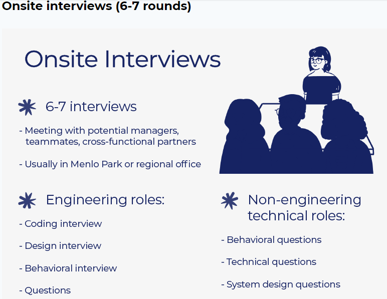

# facebook_interview_prep_2021
## Facebook Interview Process Explained
* [Hacking the Facebook Interview Process](https://candor.co/articles/interview-prep/hacking-the-facebook-interview-process)
* [Preparing for your Software Engineering Interview at Facebook](https://www.facebook.com/careers/life/preparing-for-your-software-engineering-interview-at-facebook/)

## Facebook - Interview Stages
* Stage 1 - Initial Technical Screen
1. Introductions
2. Discussion of Career Aspirations
3. Coding
4. Questions


* Stage 2 - Onsite Interview
1. Coding Interview
2. Design Interview
3. Behavioral Interview
4. Questions


## Facebook - 5 Core Values
1. Be Bold
2. Focus on Impact
3. Move Fast
4. Be Open
5. Build Social Value

## Tips for the Interview
* Familiarize yourself with our 5 core values (move fast, be bold, focus on impact, be open, and build social value). This is how we work together to make the world more open and connected. We look for people who believe in these values and practice them daily.
* Be yourself! Be open and honest about your successes and failures.
* Be humble and focus on team work, leadership and mentorship qualities.

## Important Resources
* [Facebook Phone Interview Questions](https://leetcode.com/discuss/interview-question/790428/Facebook-Phone-Interview-Questions)
* [Facebook interview experiences - All Combined from LC - Till Date 07-Jun-2020](https://leetcode.com/discuss/general-discussion/675445/facebook-interview-experiences-all-combined-from-lc-till-date-07-jun-2020)
* [Facebook Interviews](https://leetcode.com/list/xyvbjku7/)
* [FB-Phone-Interview-List](https://leetcode.com/list/5h1lvmem/)
* [Cracking the top 40 Facebook coding interview questions](https://www.educative.io/blog/cracking-top-facebook-coding-interview-questions)
* [Facebook Interview Questions and Answers](https://hackr.io/blog/facebook-interview-questions)
* [Import and Useful Links from all over the LeetCode](https://leetcode.com/discuss/general-discussion/665604/important-and-useful-links-from-all-over-the-leetcode)

## Data_Structure Deep-Dives
* [Heap](https://leetcode.com/discuss/general-discussion/1127238/master-heap-by-solving-23-questions-in-4-patterns-category)

## Algorithm Deep-Dives
* [Dynamic_Programming](https://leetcode.com/discuss/general-discussion/475924/my-experience-and-notes-for-learning-dp)
* [Dynamic_Programming_from_good_to_great](https://leetcode.com/problems/house-robber/discuss/156523/From-good-to-great.-How-to-approach-most-of-DP-problems.)
* [Dynamic_Programming_Patterns-MUST-READ](https://leetcode.com/discuss/general-discussion/458695/dynamic-programming-patterns)

## 1. Phone Screen:
| No. | LC-#     | Title	                                                                                                 | url                                                                                        | Time                                                       | Space                 | Difficulty | Data_Structure | Algorithm                    | Premium    |
| --- | -------- | --------------------------------------------------------------------------------------------------------- | ------------------------------------------------------------------------------------------ | ---------------------------------------------------------- | --------------------- | ---------- | -------------- | ---------------------------- | ---------- |
| 1   | 238      | [Product of Array Except Self](#lc-238product-of-array-except-self)                                       | https://leetcode.com/problems/product-of-array-except-self/                                | _O(n)_                                                     | _O(1)_                | Medium     | Array          |                              |            |
| 2   | 1428     | [Leftmost Column with at Least a One](#lc-1428leftmost-column-with-at-least-a-one)                        | https://leetcode.com/problems/leftmost-column-with-at-least-a-one/                         | _O(R+C)_ or _O(N+M)_ [ RxC matrix or N*M matrix ]          | _O(1)_                | Medium     | Array/Matrix   | Binary Search                | 🔒         |
| 3   |          | [Leftmost Column Index of 1](#leftmost-column-index-of-1) { Similar to LC-1428 }                          | https://leetcode.com/discuss/interview-question/341247/facebook-leftmost-column-index-of-1 | _O(R*log(C)_ or _O(N*log(M))_ [ RxC matrix or N*M matrix ] | _O(1)_                | Medium     | Array/Matrix   | Binary Search                |            |
| 4   | 240      | [Search a 2D Matrix II](#lc-240search-a-2d-matrix-ii)                                                     | https://leetcode.com/problems/search-a-2d-matrix-ii                                        | _O(M+N)_                                                   | _O(1)_                | Medium     | Array          |                              |            |
| 5   | 759      | [Employee Free Time](#lc-759employee-free-time)                                                           | https://leetcode.com/problems/employee-free-time/                                          | _O(m * log(n))_                                            | _O(n)_                | Hard       | Heap/Priority Queue | Greedy                  | 🔒         |
| 6   |          | [Lowest Common Ancestor When Root Node Is Not Known](#lowest-common-ancestor-when-root-node-is-not-known) | https://www.geeksforgeeks.org/lowest-common-ancestor-in-a-binary-tree-set-2-using-parent-pointer/ | _O(h)_                                              | _O(1)_                | Medium     | Binary Tree    |                              |            |
| 7   | 560      | [Subarray Sum Equals K](#lc-560subarray-sum-equals-k)                                                     | https://leetcode.com/problems/subarray-sum-equals-k/                                       | _O(n)_                                                     | _O(n)_                | Medium     | Array          | DP ; Prefix Sum              |            |
| 8   | 138      | [Copy List with Random Pointer](#lc-138copy-list-with-random-pointer)                                     | https://leetcode.com/problems/copy-list-with-random-pointer/                               | _O(n)_                                                     | _O(1)_                | Medium     | Linked List    |                              |            |
| 9   | 297      | [Serialize and Deserialize Binary Tree](#lc-297serialize-and-deserialize-binary-tree)                     | https://leetcode.com/problems/serialize-and-deserialize-binary-tree/                       | _O(n)_                                                     | _O(n)_                | Hard       | Tree           | Level Order Traversal ; DFS ; BFS |            |
| 10  | 428      | [Serialize and Deserialize N-ary Tree](#lc-428serialize-and-deserialize-n-ary-tree)                       | https://leetcode.com/problems/serialize-and-deserialize-n-ary-tree/                        | _O(n)_                                                      | _O(h)_                | Hard       | Tree           | Binary Serailzation ; DFS-Recursive ; BFS | 🔒  |
| 11  | 139      | [Word Break](#lc-139word-break)                                                                           | https://leetcode.com/problems/word-break/                                                  | _O(n^2)_                                                   | _O(n)_                | Medium     |                | DP                           |            |
| 12  | 140      | [Word Break II](#lc-140word-break-ii)                                                                     | https://leetcode.com/problems/word-break-ii/                                               | _O(n^2)_                                                   | _O(n^2)_              | Hard       |                | DP ; DFS                     |            |

#### [LC-238:Product of Array Except Self](https://leetcode.com/problems/product-of-array-except-self/)
##### Solution Explanation
```
=================================================================================================================================================================
Approach 1: Left and Right Arrays that capture the multiplication product scanning from left-to-right or right-to-left.
=================================================================================================================================================================
- We maintain a left and right array that captures the multiplication product scanning from left-to-right or right-to-left.
- The time complexity is two linear traversals, thus it's linear time.

- The tricky part is to keep a multiplicative counter with result till its previous element (not its self),
  and assign this value on to its left/right_array.

=================================================================================================================================================================
Approach 2: Optimized Space Solution. Without using extra memory of left and right product list.
=================================================================================================================================================================
Step 1. Create a list that contains the product of all left side elements except the current index of nums element.
Step 2. Create a variable of the right product and multiply with what we have in Step 1 (List that contains all the
        left side produts except the current index itself) through the loop --> this will calculate the product of
        array except for self.
Step 3. Keep updating the right product and loop.
Step 4. Return the answer.
```
##### Complexity Analysis:
```
=================================================================================================================================================================
Approach 1: Left and Right Arrays that capture the multiplication product scanning from left-to-right or right-to-left.
=================================================================================================================================================================
Time complexity : O(N) [ Technically O(2N) ]
========================
We traverse the list containing N elements twice. Each look up in the list costs only O(1) time.

Space complexity : O(1) [ As per problem, the output array does not count as extra space for space complexity analysis. ]
========================
Constant space since we only create a single output array to store the results.

=================================================================================================================================================================
Approach 2: Optimized Space Solution. Without using extra memory of left and right product list.
=================================================================================================================================================================
Time complexity : O(N) [ Technically O(2N) ]
========================
We traverse the list containing N elements twice. Each look up in the list costs only O(1) time.

Space complexity : O(1) [ As per problem, the output array does not count as extra space for space complexity analysis. ]
========================
Constant space since we only create a single output array to store the results.
```
```python
from typing import List
import unittest

class Solution(object):
    #
    # -------------------------------------------------------------------------------------------------------------------------
    # Approach 1: Left and Right Arrays that capture the multiplication product scanning from left-to-right or right-to-left.
    # -------------------------------------------------------------------------------------------------------------------------
    #
    # TC: O(N)
    # SC: O(N)
    def productExceptSelf_Solution_1(self, nums: List[int]) -> List[int]:
        """
        :type nums: List[int]
        :rtype: List[int]
        """
        if not nums: return []
        
        l = len(nums)
        left_arr, right_arr, left, right = [1]*l, [1]*l, 1, 1
        
        for i in range(1, l):
            left *= nums[i-1]
            left_arr[i] = left
        
        for j in range(l-2, -1, -1):
            right *= nums[j+1]
            right_arr[j] = right
        
        return [tup[0]*tup[1] for tup in zip(left_arr, right_arr)]

    #
    # -------------------------------------------------------------------------------------------------------------------------
    # Approach 2: Optimized Space Solution. Without using extra memory of left and right product list.
    # -------------------------------------------------------------------------------------------------------------------------
    # TC: O(N)
    # SC: O(1) [ excluding the output/result array, which does not count towards extra space, as per problem description. ]
    def productExceptSelf_Solution_2(self, nums: List[int]) -> List[int]:
        """
        :type nums: List[int]
        :rtype: List[int]
        """
        length_of_list = len(nums)
		result = [0]*length_of_list
		
        # update result with left product.
        result[0] = 1
        for i in range(1, length_of_list):
            result[i] = result[i-1] * nums[i-1]

        right_product = 1
        for i in reversed(range(length_of_list)):
            result[i] = result[i] * right_product
			right_product *= nums[i]

        return result

class Test(unittest.TestCase):
    def setUp(self) -> None:
        pass

    def tearDown(self) -> None:
        pass

    def test_reverseList(self) -> None:
        sol = Solution()
        for nums, solution in (
            [
                [1,2,3,4],
                [24,12,8,6],
            ],
            [
                [-1,1,0,-3,3],
                [0,0,9,0,0]
            ]
        ):
            self.assertEqual(
                sol.productExceptSelf_Solution_1(nums),
                solution
            )
            self.assertEqual(
                sol.productExceptSelf_Solution_2(nums),
                solution
            )

if __name__ == "__main__":
    ##Input: nums = [1,2,3,4]
    ##Output: [24,12,8,6]
    #nums = [1,2,3,4]
    #print(productExceptSelf(nums))
    ##Input: nums = [-1,1,0,-3,3]
    ##Output: [0,0,9,0,0]
    #nums = [-1,1,0,-3,3]
    #print(productExceptSelf(nums))
	unittest.main()
```

<br/>
<div align="right">
    <b><a href="#algorithms">⬆️ Back to Top</a></b>
</div>
<br/>

####  [LC-1428:Leftmost Column with at Least a One](https://leetcode.com/problems/leftmost-column-with-at-least-a-one/)
##### Solution Explanation:
```
=================================================================================================================================================================
 Approach 1: Linear Search Each Row
=================================================================================================================================================================
Intuition
------------------------------------------------------------------
This approach won't pass, but we'll use it as a starting point.
Also, it might be helpful to you if you just needed an example of how to use the API, but don't want to see a complete solution yet!
------------------------------------------------------------------
The leftmost 1 is the 1 with the lowest column index.

The problem can be broken down into finding the index of the first 1 in each row and then taking the minimum of those indexes.

     0   1   2   3   4   5   6   7   8   9
   +---+---+---+---+---+---+---+---+---+---+   +---+
 0 | 0 | 0 | 0 | 0 | 0 | 0 |*1*|   |   |   |-->| 6 |
   +---+---+---+---+---+---+---+---+---+---+   +---+
 1 | 0 | 0 | 0 | 0 | 0 | 0 | 0 |*1*|   |   |-->| 7 |
   +---+---+---+---+---+---+---+---+---+---+   +---+
 2 | 0 | 0 | 0 | 0 | 0 |*1*|   |   |   |   |-->| 5 |
   +---+---+---+---+---+---+---+---+---+---+   +---+
 3 | 0 | 0 | 0 | 0 | 0 | 0 | 0 | 0 | 0 | 0 |-->|-1 |
   +---+---+---+---+---+---+---+---+---+---+   +---+
 4 | 0 | 0 | 0 | 0 | 0 |*1*|   |   |   |   |-->| 5 |
   +---+---+---+---+---+---+---+---+---+---+   +---+
 5 | 0 | 0 |*1*|   |   |   |   |   |   |   |-->+ 2 +
   +---+---+---+---+---+---+---+---+---+---+   +---+
 6 | 0 | 0 | 0 | 0 |*1*|   |   |   |   |   |-->| 4 |
   +---+---+---+---+---+---+---+---+---+---+   +---+

The simplest way of doing this would be a linear search on each row.

-------------------------------------------------------------------
Complexity Analysis for Approach-1
-------------------------------------------------------------------
If you ran this code, you would have gotten the following error.

text You made too many calls to BinaryMatrix.get().

The maximum grid size is 100 by 100 , so it would contain 10000 cells. In the worst case, the linear search algorithm we implemented has to check every cell. With the problem description telling us that we can only make up to 1000 API calls, this clearly isn't going to work.

Let N be the number of rows, and M be the number of columns.

Time complexity : O(N * M)

We don't know the time complexity of binaryMatrix.get() as its implementation isn't our concern.
Therefore, we can assume it's O(1).

In the worst case, we are retrieving a value for each of the N * M cells.
At O(1) per operation, this gives a total of O(N * M).

Space complexity : O(1).

We are only using constant extra space.

=================================================================================================================================================================
 Approach-2 ( Binary Search Each Row )
=================================================================================================================================================================
Intuition
------------------------------------------------------------------
This isn't the best approach, but it passes, and coding it up is a good opportunity to practice binary search.
------------------------------------------------------------------
When linear search is too slow, we should try to find a way to use binary search.
If you're not familiar with binary search, [check out this Explore Card!](https://leetcode.com/explore/learn/card/binary-search/).
We recommend doing the first couple of binary search questions to get familiar with the algorithm before coming back to this problem.

Also, have a go at First Bad Version.
The only difference between that problem and this one is that instead of 0 and 1 , it uses false and true.

Like we did with the linear search, we're going to apply binary search independently on each row.
The target element we're searching for is the first 1 in the row .

The core part of a binary search algorithm is how it decides whether the target element 
is to the left or the right of the middle element.
Let's figure this out by thinking through a couple of examples.

In the row below, we've determined that the middle element is a 0.
On what side must the target element (first 1 ) be?
The left, or the right? Don't forget, all the 0's are before all the 1's.
   
                                            middle
											  |
											 \|/
    +----+----+----+----+----+----+----+----******----+----+----+----+----+----+----+----+
*** | 51 | 52 | 53 | 54 | 55 | 56 | 57 | 58 * 59 * 60 | 61 | 62 | 63 | 64 | 65 | 66 | 67 | ***
    +----+----+----+----+----+----+----+----******----+----+----+----+----+----+----+----+
    +----+----********************+----+----******----+----+******************-+----+----+
*** |    |    *Is it to the left?*|    |    * 0  *    |    |*Or to the right?* |    |    | ***
    +----+----********************+----+----******----+----+******************-+----+----+

In this next row, the middle element is a 1?
What side must the target element be on? Could it also possibly be the 1 we just found?

                                            middle
											  |
											 \|/
    +----+----+----+----+----+----+----+----******----+----+----+----+----+----+----+----+
*** | 28 | 29 | 30 | 31 | 32 | 33 | 34 | 35 * 36 * 37 | 38 | 39 | 40 | 41 | 42 | 43 | 44 | ***
    +----+----+----+----+----+----+----+----******----+----+----+----+----+----+----+----+
    +----+----********************+----+----******----+----+******************-+----+----+
*** |    |    *Is it to the left?*|    |    * 1  *    |    |*Or to the right?* |    |    | ***
    +----+----********************+----+----******----+----+******************-+----+----+

For the first example, we can conclude that the target element ( if it exists ) must be to the 
**right** of the middle element.
This is because we know that everything to the left of a 0 must also be a 0.

For the second example, we can conclude that the target element is either the middle element 
itself or it is some other 1 to the **left** of the middle element.
We know that everything to the right of a 1 is also a 1,
but these can't possibly be further left than the one we just found.

In summary, if the middle element is a:

- **0** , then the target must be to the **right**.
- **1** , then the target is either this element or to the **left**.

We can then put this together into an algorithm that finds the index of the target element (first 1)
in each row, and then returns the minimum of those indexes.

-------------------------------------------------------------------
Algorithm
-------------------------------------------------------------------
If you're already quite familiar with binary search, feel free to skip down to the implementation below.
I've decided to include lots of details here, as binary search is one of those algorithms 
that a lot of people get frustrated with easily and find it difficult to master.

In a binary search, we always keep track of the range that the target might be in by using two variables: 
lo to represent the lowest possible index it could be, and hi to represent the highest possible index it could be.
Ignoring the binaryMatrix API details for the moment, here is a rough outline of our binary search in pseudocode.

define function binary_search(input_list):
  lo = the lowest possible index
  hi = the highest possible index
  while the search space contains 2 or more items:
    mid = the middle index in the remaining search space
	if the element at input_list[mid] is 0:
      lo = mid + 1 (the first 1 is *further right*, and can't be mid itself)
	else:
      hi = mid (the first 1 is either mid itself, *or is further left*)
  return the only index remaining in the search space

As always in binary search, there are a couple more key implementation details we still need to deal with:

 1. An even-length search space has two middles. Which do we choose?
 2. The row might be all 0's.

Let's tackle these issues one at a time.

The first issue, the choice of middle, is important, as otherwise, the search space might stop shrinking 
when it gets down to two elements. When the search space doesn't shrink, the algorithm does the exact 
same thing the next loop cycle, resulting in an infinite loop. Remember that when the search space 
only contains two elements, they are the ones pointed to by lo and hi. 
This means that the lower middle equals lo , and the upper-middle equals hi. 
We, therefore, need to think about which cases would shrink the search space, and which would not.

If we use the lower-middle
 - If it is a 0 , then we set lo = mid + 1. Because hi == mid + 1 , this means that lo == hi (search space is of length-one).
 - If it is a 1 , then we set hi = mid . Because mid == lo , this means that hi == lo (search space is of length-one).

If we use the upper-middle
 - If it is a 0 , then we set lo = mid + 1 . Because hi = mid , we now have hi > lo (search space is of length-zero).
 - If it is a 1 , then we set hi = mid . Because hi == mid was already true, the search space stays as is (of length-two).

If we use the lower-middle, we know the search space will always shrink.
If we use the upper-middle, it might not.
Therefore, we should go with the lower-middle.

The formula for this is mid = (low + high) / 2 .

The second issue, a row of all zeroes, is solved by recognizing that the algorithm always shrinks down the 
search space to a single element. This is supposed to be the first 1 , but if that doesn't exist, 
then it has to be a 0 . Therefore, we can detect this case by checking whether or not the last 
element in the search space is a 1 .

It is good practice to think these details through carefully so that you can write your 
binary search algorithm decisively and confidently. Resist the urge to Program by Permutation!

-------------------------------------------------------------------
Complexity Analysis for Approach-2
-------------------------------------------------------------------
Let N be the number of rows, and M be the number of columns.

Time complexity : O(N * logM).

There are M items in each row. Therefore, each binary search will have a cost of O(logM).
We are performing N of these binary searches, giving a time complexity of N * O(logM) = O(N * logM).

Space complexity : O(1).

We are using constant extra space.

=================================================================================================================================================================
 Approach-3 ( Start at Top Right, Move Only Left and Down ) 
                                ( or, Start at Bottom Left, Move only Up and Right ) 
=================================================================================================================================================================
Intuition
------------------------------------------------------------------
Did you notice in Approach 2 that we didn't need to finish searching all the rows?
One example of this was row 3 on the example in the animation.
At the point shown in the image below, it was clear that row 3 
could not possibly be better than the minimum we'd found so far.

     0   1   2   3   4   5   6   7   8   9
   +---+---+---+---+---+---+---+---+---+---+
 0 | 0 | 0 | 0 | 0 |+0+|+0+|*1*| 1 | 1 | 1 |
   +---+---+---+---+---+---+---+---+---+---+
 1 | 0 | 0 | 0 | 0 |+0+|+0+|+0+|*1*| 1 | 1 |
   +---+---+---+---+---+---+---+---+---+---+
 2 | 0 | 0 | 0 | 0 |+0+|*1*| 1 |+1+| 1 | 1 |
   +---+---+---+---+---+---+---+---+---+---+
 3 | 0 | 0 | 0 | 0 |+0+| 0 | 0 |*0*|   |   |
   +---+---+---+---+---+---+---+---+---+---+
 4 |   |   |   |   |   |   |   |   |   |   |
   +---+---+---+---+---+---+---+---+---+---+
 5 |   |   |   |   |   |   |   |   |   |   |
   +---+---+---+---+---+---+---+---+---+---+
 6 |   |   |   |   |   |   |   |   |   |   |
   +---+---+---+---+---+---+---+---+---+---+

API Calls: 12

Therefore, an optimization we could have made was to keep track of the minimum index so far,
and then abort the search on any rows where we have discovered a 0 at, or to the right of,
that minimum index.

We can do even better than that; on each search, we can set hi = smallest_index - 1, 
where smallest_index is the smallest index of a 1 we've seen so far.
In most cases, this is a substantial improvement.
It works because we're only interested in finding 1 s at lower indexes than we previously found.

Here is what the worst-case looks like. Like before, its time complexity is still O(N * log(M)).

     0   1   2   3   4   5   6   7   8   9
   +---+---+---+---+---+---+---+---+---+---+
 0 |***|***|***|***| 0 |***|***| 0 | 0 | 1 |
   +---+---+---+---+---+---+---+---+---+---+
 1 |***|***|***|***| 0 |***| 0 | 0 | 1 |***|
   +---+---+---+---+---+---+---+---+---+---+
 2 |***|***|***| 0 |***| 0 | 0 | 1 |***|***|
   +---+---+---+---+---+---+---+---+---+---+
 3 |***|***|***| 0 |***| 0 | 1 |***|***|***|
   +---+---+---+---+---+---+---+---+---+---+
 4 |***|***| 0 |***| 0 | 1 |***|***|***|***|
   +---+---+---+---+---+---+---+---+---+---+
 5 |***|***| 0 | 0 | 1 |***|***|***|***|***|
   +---+---+---+---+---+---+---+---+---+---+
 6 |***| 0 | 0 | 1 |***|***|***|***|***|***|
   +---+---+---+---+---+---+---+---+---+---+

While this is no worse than Approach 2, there is a better algorithm.

-------------------------------------------------------------------
Algorithm
-------------------------------------------------------------------

Start in the top right corner, and if the current value is a 0 , move down. If it is a 1 , then move left.

- When we encounter a 0, we know that the leftmost 1 can't be to the left of it.
- When we encounter a 1, we should continue the search on that row (move pointer to the left), in order to find an even smaller index.
------------------------------------------------------------------

-------------------------------------------------------------------
Complexity Analysis for Approach-3
-------------------------------------------------------------------
Let N be the number of rows, and M be the number of columns.

Time complexity : O(N + M).

At each step, we're moving 1 step left or 1 step down.
Therefore, we'll always finish looking at either one of the M rows or N columns.
Therefore, we'll stay in the grid for at most N+M steps, and therefore get a time complexity of O(N+M).

Space complexity : O(1).

We are using constant extra space.


```
##### Complexity Analysis:
```
N = # of rows 
M = # of columns
=================================================================================================================================================================
 Approach 1: Linear Search Each Row
=================================================================================================================================================================
TC  : O(N * M)
SC  : O(1)

=================================================================================================================================================================
 Approach-2 ( Binary Search Each Row )
=================================================================================================================================================================
TC  : O(N * log(M))
SC  : O(1)

=================================================================================================================================================================
 Approach-3 ( Start at Top Right, Move Only Left and Down ) 
=================================================================================================================================================================
TC  : O(N + M)
SC  : O(1)
```
```python
# """
# This is BinaryMatrix's API interface.
# You should not implement it, or speculate about its implementation
# """
#class BinaryMatrix(object):
#    def get(self, row: int, col: int) -> int:
#    def dimensions(self) -> list[]:
class BinaryMatrix(object):
    def get(self, row, col):
        pass

    def dimensions(self):
        pass

#=================================================================================================================================================================
# Approach 1: Linear Search Each Row
#=================================================================================================================================================================
#N = # of rows 
#M = # of columns
#
# TC: O(N *  M)
# SC: O(1)
# NOTE: This approach won't pass ( so don't use it in an interview ).
class Solution_1:
    def leftMostColumnWithOne(self, binaryMatrix: 'BinaryMatrix') -> int:
        """
        :type binaryMatrix: BinaryMatrix
        :rtype: int
        """
        row_len, col_len = binaryMatrix.dimensions()
        smallest_index = col_len
        # Go through each of the rows.
        for row in range(row_len):
            # Linear seach for the first 1 in this row.
            for col in range(col_len):
                if binaryMatrix.get(row, col) == 1:
                    smallest_index = min(smallest_index, col)
                    break
        # If we found an index, we should return it. Otherwise, return -1.
        return -1 if smallest_index == col_len else smallest_index

#=================================================================================================================================================================
# Approach-2 ( Binary Search Each Row )
#=================================================================================================================================================================
#N = # of rows 
#M = # of columns
#
#TC  : O(N * log(M))
#SC  : O(1)
#
class Solution_2:
    def leftMostColumnWithOne(self, binaryMatrix: 'BinaryMatrix') -> int:
        """
        :type binaryMatrix: BinaryMatrix
        :rtype: int
        """
        row_len, col_len = binaryMatrix.dimensions()
        smallest_index = col_len
        for row in range(row_len):
            # Binary Search for the first 1 in the row.
            lo = 0
            hi = col_len - 1
            while lo < hi:
                mid = (lo + hi) // 2
                if binaryMatrix.get(row, mid) == 0:
                    lo = mid + 1
                else:
                    hi = mid
            # If the last element in the search space is a 1, then this row
            # contained a 1.
            if binaryMatrix.get(row, lo) == 1:
                smallest_index = min(smallest_index, lo)
        # If smallest_index is still set to col_len, then there were no 1's in 
        # the grid. 
        return -1 if smallest_index == col_len else smallest_index

#=================================================================================================================================================================
# Approach-3 ( Start at Top Right, Move Only Left and Down ) 
#=================================================================================================================================================================
#N = # of rows 
#M = # of columns
#
#TC  : O(N + M)
#SC  : O(1)
#
#NOTE : This is a solution you should go for in an interview situation.
#
class Solution_3:		
    def leftMostColumnWithOne(self, binaryMatrix: 'BinaryMatrix') -> int:
        """
        :type binaryMatrix: BinaryMatrix
        :rtype: int
        """
        row_len, col_len = binaryMatrix.dimensions()
        
        # Set pointers to the top-right corner.
        current_row = 0
        current_col = col_len - 1
        
        # Repeat the search until it goes off the grid.
        while current_row < row_len and current_col >= 0:
            if binaryMatrix.get(current_row, current_col) == 0:
                current_row += 1
            else:
                current_col -= 1
        
        # If we never left the last column, it must have been all 0's.
        return current_col + 1 if current_col != col_len - 1 else -1
```

<br/>
<div align="right">
    <b><a href="#algorithms">⬆️ Back to Top</a></b>
</div>
<br/>

####  [Leftmost Column Index of 1]
##### Solution Explanation:
[Refer to LC-1428:Leftmost Column with at Least a One - Complexity Analysis](https://github.com/sm2774us/facebook_interview_prep_2021#solution-explanation-1)
##### Complexity Analysis:
[Refer to LC-1428:Leftmost Column with at Least a One - Complexity Analysis](https://github.com/sm2774us/facebook_interview_prep_2021#complexity-analysis-1)
```python
#=================================================================================================================================================================
# Approach-1 ( Binary Search Each Row )
#=================================================================================================================================================================
#
#N = # of rows 
#M = # of columns
#
#TC  : O(N * log(M))
#SC  : O(1)
#
from typing import List

def leftMostColumnWithOne_using_binary_search(matrix: List[List[int]]) -> int:
    lengthOfRow = len(matrix[0])
    leftMost = float('inf')
    for row in matrix:
        # Start binary search per row
        start = 0
        end = lengthOfRow - 1
        while start < end:
            median = (start + end) // 2
            if row[median] == 1:
                end = median - 1
            else:
                start = median + 1
        if start + 1 < lengthOfRow and row[start] == 0 and row[start + 1] == 1:
            start += 1
        if row[start] == 1:
            leftMost = min(leftMost, start)
    return leftMost if leftMost != float('inf') else -1

if __name__ == "__main__":
    print(leftMostColumnWithOne_using_binary_search(
    [
        [0,0,0,0],
        [0,0,1,1],
        [0,0,1,1],
        [0,1,1,1]
    ]
    ))

    print(leftMostColumnWithOne_using_binary_search(
    [
        [0,0,0,0],
        [0,0,0,0],
        [0,0,0,0],
        [0,0,0,1]
    ]
    ))

    print(leftMostColumnWithOne_using_binary_search(
    [
        [0,0,0,0],
        [0,0,0,0],
        [0,0,0,0],
        [0,0,0,0]
    ]
    ))

    print(leftMostColumnWithOne_using_binary_search(
    [
        [0,1,1,1],
        [0,0,1,1],
        [0,0,1,1],
        [0,0,0,0]
    ]
    ))
    #Output:
    #1
    #3
    #-1
    #1

#=================================================================================================================================================================
# Approach-2 ( Start at Top Right, Move Only Left and Down ) 
#=================================================================================================================================================================
#N = # of rows 
#M = # of columns
#
#TC  : O(N + M)
#SC  : O(1)
#
#NOTE : This is a solution you should go for in an interview situation.
#
from typing import List

def leftMostColumnWithOne_using_optimal_approach(matrix: List[List[int]]) -> int:
    if not len(matrix) or not len(matrix[0]):
        # Quick response for empty matrix
        return -1
    row_len, col_len = len(matrix), len(matrix[0])

    # Set pointers to the top-right corner.
    current_row = 0
    current_col = col_len - 1
        
    # Repeat the search until it goes off the grid.
    while current_row < row_len and current_col >= 0:
        if matrix[current_row][current_col] == 0:
            current_row += 1
        else:
            current_col -= 1
        
    # If we never left the last column, it must have been all 0's.
    return current_col + 1 if current_col != col_len - 1 else -1
	
if __name__ == "__main__":
    print(leftMostColumnWithOne_using_optimal_approach(
    [
        [0,0,0,0],
        [0,0,1,1],
        [0,0,1,1],
        [0,1,1,1]
    ]
    ))

    print(leftMostColumnWithOne_using_optimal_approach(
    [
        [0,0,0,0],
        [0,0,0,0],
        [0,0,0,0],
        [0,0,0,1]
    ]
    ))

    print(leftMostColumnWithOne_using_optimal_approach(
    [
        [0,0,0,0],
        [0,0,0,0],
        [0,0,0,0],
        [0,0,0,0]
    ]
    ))

    print(leftMostColumnWithOne_using_optimal_approach(
    [
        [0,1,1,1],
        [0,0,1,1],
        [0,0,1,1],
        [0,0,0,0]
    ]
    ))
    #Output:
    #1
    #3
    #-1
    #1	

```

<br/>
<div align="right">
    <b><a href="#algorithms">⬆️ Back to Top</a></b>
</div>
<br/>

####  [LC-240:Search a 2D Matrix II](https://leetcode.com/problems/search-a-2d-matrix-ii)
##### Solution Explanation:
```
=================================================================================================================================================================
 Approach-1 ( Binary Search Each Row )
=================================================================================================================================================================

Hint:

Method_#1:

Take advantage of the property with sorted ordering in row and column respectively.

"Searching in sorted element" usually has strong connection with binary search framework.

Think of classical 1D binary search, and built a element search algorithm with range check and 1D binary search.

First, use range check to locate possible candidate row.

Second, launch 1D binary search on each possible candidate row.

=================================================================================================================================================================
 Approach-2 ( Adaptive Search : Start at Top Right, Move Only Left and Down ) 
                                ( or, Start at Bottom Left, Move only Up and Right )
=================================================================================================================================================================

Hint:

Again, utilize the property with sorted ordering.

Start iteration from top right corner.

If target is larger then current element, then go right next time.
If target is smaller than current element, then go up next time.

If target is current element, then return True

When next move is out of boundary of matrix, return False ( i.e., target does Not exist in matrix )
```
##### Complexity Analysis:
```
N = # of rows 
M = # of columns

=================================================================================================================================================================
 Approach-1 ( Binary Search Each Row )
=================================================================================================================================================================
TC  : O(N * log(M))
SC  : O(1)

=================================================================================================================================================================
 Approach-2 ( Adaptive Search : Start at Top Right, Move Only Left and Down ) 
                                ( or, Start at Bottom Left, Move only Up and Right )
=================================================================================================================================================================
TC  : O(N + M)
SC  : O(1)
```
```python
#=================================================================================================================================================================
# Approach-1 ( Binary Search Each Row )
#=================================================================================================================================================================
#
#N = # of rows 
#M = # of columns
#
#TC  : O(N * log(M))
#SC  : O(1)
#
from typing import List

class Solution:
    def searchMatrix(self, matrix: List[List[int]], target: int)-> bool:
        
        
        if not len(matrix) or not len(matrix[0]):
            # Quick response for empty matrix
            return False
        
        h, w = len(matrix), len(matrix[0])
        
        for row in matrix:
			
			# range check
            if row[0] <= target <= row[-1]:
                
				# launch binary search on current possible row
				
                left, right = 0, w-1
                
                while left <= right:
                    
                    mid = left + (right - left) // 2
                    
                    mid_value = row[mid]
                    
                    if target > mid_value:
                        left = mid+1
                    elif target < mid_value:
                        right = mid-1
                    else:
                        return True
                
        return False

#=================================================================================================================================================================
# Approach-2 ( Adaptive Search : Start at Top Right, Move Only Left and Down ) 
#                                ( or, Start at Bottom Left, Move only Up and Right )
#=================================================================================================================================================================
#N = # of rows 
#M = # of columns
#
#TC  : O(N + M)
#SC  : O(1)
#
#NOTE : This is a solution you should go for in an interview situation.
#
from typing import List
import unittest

class Solution:
    # Start at Top Right, Move Only Left (target is larger then current element) and Down (target is smaller than current element)
    def searchMatrix_from_top_right(self, matrix: List[List[int]], target: int) -> bool:    
        """
        :type matrix: List[List[int]]
        :type target: int
        :rtype: bool
        """
        if not len(matrix) or not len(matrix[0]):
			# Quick response for empty matrix
            return False
        if target < matrix[0][0] or target > matrix[-1][-1]:
            return False
			
        row_len, col_len = len(matrix), len(matrix[0])
        # Set pointers to the top-right corner.
        row, col = 0, col_len-1
        while 0 <= row < row_len and 0 <= col < col_len:
            if matrix[row][col] == target:
                return True
            if matrix[row][col] < target:
                row += 1
            else:
                col -= 1
        return False
		
    # Twin Algorithm
	# Start at Bottom Left, Move Only Right (target is larger then current element) and Up (target is smaller than current element)
    def searchMatrix_from_bottom_left(self, matrix: List[List[int]], target: int) -> bool:    
        """
        :type matrix: List[List[int]]
        :type target: int
        :rtype: bool
        """
        if not len(matrix) or not len(matrix[0]):
			# Quick response for empty matrix
            return False
        if target < matrix[0][0] or target > matrix[-1][-1]:
            return False
			
        row_len, col_len = len(matrix), len(matrix[0])
        # Set pointers to the bottom-left corner.
        row, col = row_len-1, 0        
        while 0 <= row < row_len and 0 <= col < col_len:
            if matrix[row][col] == target:
                return True
            if matrix[row][col] < target:
                col += 1
            else:
                row -= 1
        return False		

class Test(unittest.TestCase):
    def setUp(self) -> None:
        pass

    def tearDown(self) -> None:
        pass

    def test_searchMatrix_from_top_right(self) -> None:
        sol = Solution()
        for matrix, target, solution in (
            [
                [[1,4,7,11,15],[2,5,8,12,19],[3,6,9,16,22],[10,13,14,17,24],[18,21,23,26,30]],
                5,
				True
            ],
            [
                [[1,4,7,11,15],[2,5,8,12,19],[3,6,9,16,22],[10,13,14,17,24],[18,21,23,26,30]],
                20,
                False
            ]
        ):
            self.assertEqual(
                sol.searchMatrix_from_top_right(matrix, target),
                solution
            )
            self.assertEqual(
                sol.searchMatrix_from_bottom_left(matrix, target),
                solution
            )

if __name__ == "__main__":
	unittest.main()
```

<br/>
<div align="right">
    <b><a href="#algorithms">⬆️ Back to Top</a></b>
</div>
<br/>

####  [LC-759:Employee Free Time](https://leetcode.com/problems/employee-free-time/)
##### Solution Explanation:
```
=================================================================================================================================================================
 Approach-1 ( Using an Event Class with details about the intervals  )
=================================================================================================================================================================

=================================================================================================================================================================
 Approach-2 ( Greedy Algorithm + Priority Queue  )
=================================================================================================================================================================

```
##### Complexity Analysis:
```
=================================================================================================================================================================
 Approach-1 ( Using an Event Class with details about the intervals  )
=================================================================================================================================================================
I = number of intervals
-------------------------------
Time : O(I log I)
Space: O(I)
-------------------------------

=================================================================================================================================================================
 Approach-2 ( Greedy Algorithm + Priority Queue  )
=================================================================================================================================================================		
m is the number of schedule, n is the number of employees, m >= n
-------------------------------
Time : O(m * logn)
Space: O(n)
-------------------------------
```
```python

"""
# Definition for an Interval.
class Interval:
    def __init__(self, start: int = None, end: int = None):
        self.start = start
        self.end = end
"""

#=================================================================================================================================================================
# Approach-1 ( Using an Event Class with details about the intervals  )
#=================================================================================================================================================================
#I = number of intervals
#-------------------------------
#Time : O(I log I)
#Space: O(I)

class Event:
    def __init__(self, time: int, start: bool):
        self.time = time
        self.start = start

    def __repr__(self): return str(self.time)

class Solution:
    def employeeFreeTime(self, schedule: '[[Interval]]') -> '[Interval]':
        # Time Complexity: O(I log I), I = number of intervals
        # Space Complexity: O(I)

        num_employee = len(schedule)

        events = []
        for employee in schedule:
            for interval in employee:
                events.append(Event(interval.start, True))
                events.append(Event(interval.end, False))
        events.sort(key=lambda e: e.time)
        print(events)

        num_working = 0
        i = 0
        break_start = -1
        breaks = []

        for event in events:
            if event.start:
                num_working += 1
                if break_start != - 1:
                    if event.time - break_start > 0:
                        breaks.append(Interval(break_start, event.time))
                    break_start = -1
            else:
                num_working -= 1
                if num_working == 0:
                    break_start = event.time

        return breaks

#=================================================================================================================================================================
# Approach-2 ( Greedy Algorithm + Priority Queue  )
#=================================================================================================================================================================
#m is the number of schedule, n is the number of employees, m >= n
#-------------------------------
#Time : O(m * logn)
#Space: O(n)

import heapq

class Solution:
    def employeeFreeTime(self, schedule: '[[Interval]]') -> '[Interval]':
        # Based on LeetCode's Solution 2
        # Greedy + Priority Queue
        # Time Complexity: O(I log N), I = number of intervals
        # Space Complexity: O(N)

        num_employee = len(schedule)
        breaks = []
        next_busy_pq = [(employee[0].start, ei, 0) for ei, employee in enumerate(schedule)]
        heapq.heapify(next_busy_pq)
        break_start = min(interval.start for employee in schedule for interval in employee)

        while len(next_busy_pq) > 0:
            t, eid, iid = heapq.heappop(next_busy_pq)
            if break_start < t:
                breaks.append(Interval(break_start, t))
            break_start = max(break_start, schedule[eid][iid].end)
            if iid + 1 < len(schedule[eid]):
                heapq.heappush(next_busy_pq, (schedule[eid][iid + 1].start, eid, iid + 1))
        return breaks
```

<br/>
<div align="right">
    <b><a href="#algorithms">⬆️ Back to Top</a></b>
</div>
<br/>

####  [Lowest Common Ancestor When Root Node Is Not Known](https://www.geeksforgeeks.org/lowest-common-ancestor-in-a-binary-tree-set-2-using-parent-pointer/)
```python
# Given two nodes of an n-ary tree, return the LCA node. you are *not* given the root node. however, each node has
# a (nullaple) parent pointer. (this problem may be presented as a binary tree; approach is the same)

class Node:
    val = ''
    parent = None
    children = set()

    def __init__(self, val, parent=None, children=None):
        self.val = val
        self.parent = parent
        if children is not None:
            self.children = children

    def __str__(self):
        return self.val


# time complexity: O(d). we don't traverse all nodes, just straight up the tree for each pointer.
# space complexity: O(1), modify the input, no extra data. hashing visited nodes would also work but, uses O(d) space.
def lca(n1: Node, n2: Node) -> Node:
    if not n1 or (not n2):
        return None

    if n1 == n2:
        return n1

    n1_level = get_level(n1)
    n2_level = get_level(n2)

    while n1_level > n2_level:
        n1 = n1.parent  # don't need to null check here since get_level() did that for us
        n1_level -= 1

    while n2_level > n1_level:
        n2 = n2.parent
        n2_level -= 1

    # keep traversing up until the two pointers collide
    while n1 != n2:
        if not n1.parent:
            # n1 and n2 are same level so don't need to null check both, check either
            return None

        n1 = n1.parent
        n2 = n2.parent

    # return either
    return n1


# root is level 0 (not level 1)
# time complexity: O(d)
# space complexity: O(1).
def get_level(node: Node) -> int:
    steps = 0
    while node.parent:
        node = node.parent
        steps += 1

    return steps


#         A
#     B      C
#   D     E  F  G
#               I
a = Node('a', None)
b = Node('b', a)
c = Node('c', a)
d = Node('d', b)
e = Node('e', c)
f = Node('f', c)
g = Node('g', c)
i = Node('i', g)
a.children = {b, c}
c.children = {d}
c.children = {e, f, g}
g.children = {i}

cases = [
    # valid cases:
    (b, g),  # => a
    (a, i),  # => a
    (b, b),  # => b
    (e, i),  # => c
    (e, e),  # => e

    # invalid cases:
    (a, None),  # => None
    (None, a),  # => None
]

for case in cases:
    print(lca(*case))
```

<br/>
<div align="right">
    <b><a href="#algorithms">⬆️ Back to Top</a></b>
</div>
<br/>

####  [LC-560:Subarray Sum Equals K](https://leetcode.com/problems/subarray-sum-equals-k/)
##### Solution Explanation:
```
# --------------------------------------
# Approach 1 ( DP + Prefix Sum )
# --------------------------------------


# --------------------------------------
# Approach 2 ( given a list of 'hops' you've taken down a road ... how many of these hops travelled k meters )
# --------------------------------------
Think about it this way: you're given a list of 'hops' you've taken down a road: 1, 2, 2, 0, 3, 2, 5. Initially you hopped 1 meter, then 2, and 2 again, then 0 meters etc.

You are then asked: how many of these hops travelled 5 meters consecutively? The answer is 6:

             _
         ___
       _____
     _____     
________
______
[1,2,2,0,3,2,5]
Rather than working with individual hop data, let's think of the total distance we travelled.

Work with accumulation values
So our total distance travelled at each hop is:

nums:          1,  2,  2,  0,  3,  2,  5
accumulation:  1,  3,  5,  5,  8,  10, 15
This is something that trips me up often with DP questions: you can often end up working in a totally different solution space. We are no longer concerned with our input values.. only their accumulation values. That can take quite a leap of the imagination (no pun intended).

Could i hop back 'k'?
Let's add our starting point 0 to the accumulator, think of it as the starting point. This 'total distance travelled' data is invaluable, because we can ask it questions, namely:

0, 1, 3, 5, 5, 8, 10, 15
-
|
|
Q: have i travelled 5 meters yet
A: nope
0, 1, 3, 5, 5, 8, 10, 15
   -
   |
   |
Q: have i travelled 5 meters yet
A: nope
0, 1, 3, 5, 5, 8, 10, 15
      -
      |
      |
Q: have i travelled 5 meters yet
A: nope
0, 1, 3, 5, 5, 8, 10, 15
         -
         |
         |
Q: have i travelled 5 meters yet
A: ah yes you have
Let's think of another question to ask:

0, 1, 3, 5, 5, 8, 10, 15
x........-
         |
         |
Q: if i hop back 5 meters, do i land on a hop
A: yes
acc - k
In other words, the question we are asking is: is there an accumulation value equal to acc - k.

Let's count the 'hits':

0, 1, 3, 5, 5, 8, 10, 15
x........x
x...........x
      x........x
         x..x......x
               x......x
Now it gets a little trickier. When we travel 10 meters, and ask do i land on a hop if i travel 5 meters back? the answer is: actually you could land on two hops. Since there is a 0 in the array, there are two subarrays that add up to the same accumulation value. We need to account for that.

An easy to understand implementation
from itertools import accumulate

def subarraySum(nums, k):
    total = 0
    accum = [0] + [*accumulate(nums)]
    for i, acc in enumerate(accum[1:]):
        total += accum[: i + 1].count(acc - k)
    return total
	
We begin by adding out starting position 0 to our accumulation array (when we hop back, it's valid to land on the starting position).
We then iterate over our accumulate (barring 0).

We then ask if i hop back k meters, how many valid hops do i find?. This works, but is highly inefficient.

A more efficient implementation:

from collections import Counter
from itertools import accumulate

def subarraySum(nums, k):
    count, total = Counter({0: 1}), 0
    for acc in accumulate(nums):
        total += count[acc - k]
        count[acc] += 1
    return total
A more efficient implementation is to count the acc (distance travelled) values in a counter,
on line 8 as we go along (as we iterate over accumulate). This is purely for the O(1) lookup.

We initialise the counter with {0:1} since if we land on our starting position, we've made a valid hop.

We'll want to perform the lookup (ask the question, on line 7) before adding our accumulation value (distance) to the counter.
```
##### Complexity Analysis:
```
For both solutions:
-------------------
TC: O(N)
SC: O(N)

Time complexity : O(n). The entire numsnums array is traversed only once.

Space complexity : O(n). Hashmap mapmap can contain up to nn distinct entries in the worst case.
```
```python
# --------------------------------------
# Approach 1 ( DP + Prefix Sum )
# --------------------------------------
from typing import List

class Solution:
    def subarraySum(self, nums: List[int], k: int) -> int:
        presums = collections.defaultdict(int)
        presum = 0
        total = 0
        presums[0] = 1
        for i in range(len(nums)):
            presum = presum+nums[i]
            if presum - k in presums:
                total += presums[presum-k]                
            presums[presum] +=1

        return total

# --------------------------------------
# Approach 2 ( given a list of 'hops' you've taken down a road ... how many of these hops travelled k meters )
# --------------------------------------
from collections import Counter
from itertools import accumulate
from typing import List

class Solution:
    def subarraySum(self, nums: List[int], k: int) -> int:
        total = 0
        accum = [0] + [*accumulate(nums)]
        for i, acc in enumerate(accum[1:]):
            total += accum[: i + 1].count(acc - k)
        return total
		
    # A more efficient implementation of Approach-2
    #
    # A more efficient implementation is to count the acc (distance travelled) values in a counter,
	# on Line-5 as we go along (as we iterate over accumulate). This is purely for the O(1) lookup.
    #
    # We initialise the counter with {0:1} since if we land on our starting position, we've made a valid hop.
    #
    # We'll want to perform the lookup (ask the question, on Line-4) before adding our accumulation value (distance) to the counter.
    def subarraySum(self, nums: List[int], k: int) -> int:
        count, total = Counter({0: 1}), 0
        for acc in accumulate(nums):
            total += count[acc - k]                                  # Line-4
            count[acc] += 1                                          # Line-5
        return total
	
```

<br/>
<div align="right">
    <b><a href="#algorithms">⬆️ Back to Top</a></b>
</div>
<br/>

####  [LC-138:Copy List with Random Pointer](https://leetcode.com/problems/copy-list-with-random-pointer/)
##### Solution Explanation:
```
# --------------------------------------
# Approach 1 ( Iterative )
# --------------------------------------
- Use hash table to store information {original_node: new_node}
- Two passes
  + First create new node and connect with next
  + Second use hash table to connect random node

- Time: O(n); Space: O(n)

# --------------------------------------
# Approach 2 ( Recursive )
# --------------------------------------
- Recursively create copy of each node and connect their random nodes

- Time: O(n); Space: O(n)
```
##### Complexity Analysis:
```
For both solutions:

TC : O(N)
SC : O(N)
```
```python
"""
# Definition for a Node.
class Node:
    def __init__(self, x: int, next: 'Node' = None, random: 'Node' = None):
        self.val = int(x)
        self.next = next
        self.random = random
"""

# --------------------------------------
# Approach 1 ( Iterative )
# --------------------------------------
# TC: O(N)
# SC: O(N) 
class Solution:
    def copyRandomList(self, head: 'Node') -> 'Node':
        d = {None:None}
        dummy = Node(-1)
        cur, new_cur = head, dummy
        while cur:
            new_cur.next = d[cur] = Node(cur.val)
            cur, new_cur = cur.next, new_cur.next
        cur, new_cur = head, dummy.next
        while cur:
            new_cur.random = d[cur.random]
            cur, new_cur = cur.next, new_cur.next
        return dummy.next    
# --------------------------------------
# Approach 2 ( Recursive )
# --------------------------------------
# TC: O(N)
# SC: O(N) 
class Solution:
    def copyRandomList(self, head: 'Node') -> 'Node':
        d = dict()
        def deep_copy(node):
            if not node: return
            if node in d: return d[node]
            d[node] = n = Node(node.val)
            n.next = deep_copy(node.next)
            n.random = deep_copy(node.random)
            return n
        return deep_copy(head)
```

<br/>
<div align="right">
    <b><a href="#algorithms">⬆️ Back to Top</a></b>
</div>
<br/>

####  [LC-297:Serialize and Deserialize Binary Tree](https://leetcode.com/problems/serialize-and-deserialize-binary-tree/)
##### Solution Explanation:
```
# --------------------------------------
# Approach 1 ( Level Order for encoding )
#              BFS
#              DFS ( Iterative and Recursive )
# --------------------------------------
Use level-order traversal to encode ( to match LeetCode's serialization format ).

Time complexity for both serialize and deserialize are O(n), where n is the number of nodes in the binary tree.

# --------------------------------------
# Approach 2 ( Using Native Serialization )
# --------------------------------------
Efficient for large integers which can be packed into 4 bytes.

Serializes the tree in to following format:

<val><size_of_left_tree><size_of_right_tree><left_data><right_data>

So constant 12 bytes (4 + 4 + 4) followed by arbiatry sized byte sequences one each for left and right subtree.

Time complexity for both serialize and deserialize are O(n), where n is the number of nodes in the binary tree.
```
##### Complexity Analysis:
```
N = the number of nodes in the binary tree.

For both solutions:

TC : O(N)
SC : O(N)
```
```python
# Definition for a binary tree node.
# class TreeNode(object):
#     def __init__(self, x):
#         self.val = x
#         self.left = None
#         self.right = None

# --------------------------------------
# Approach 1 ( Level Order for encoding )
#              BFS
#              DFS ( Iterative and Recursive )
# --------------------------------------
# N = the number of nodes in the binary tree.
# --------------------------------------
# TC : O(N)
# SC : O(N)
#
# BFS
class Codec:
    def serialize(self, root):
        """Encodes a tree to a single string.
        
        :type root: TreeNode
        :rtype: str
        """
        if not root:
            return "#"
        queue = [root]
        res = [str(root.val)]
        while queue:
            res += [str(node.val) if node else "#" for root in queue for node in (root.left,root.right)]
            queue = [node for root in queue for node in (root.left, root.right) if node]
        return ",".join(res)

    def deserialize(self, data):
        if data == "#":
            return None
        d = iter(data.split(","))
        root = TreeNode(int(next(d)))
        queue = [root]
        while queue:
            for node in queue:
                left = next(d)
                node.left = TreeNode(int(left)) if left!="#" else None
                right = next(d)
                node.right = TreeNode(int(right)) if right!="#" else None
            queue = [node for root in queue for node in (root.left, root.right) if node]
        return root

# Recursive DFS
class Codec:   
    def serialize(self, root):
        """Encodes a tree to a single string.
        
        :type root: TreeNode
        :rtype: str
        """
        if not root:
            return "#"
        s = "{},{},{}".format(root.val, self.serialize(root.left), self.serialize(root.right))
        return s

    def deserialize(self, data):
        """Decodes your encoded data to tree.
        
        :type data: str
        :rtype: TreeNode
        """
        d = iter(data.split(','))
        def helper(d):
            root = next(d)
            if root == "#":
                return None
            root = TreeNode(root)
            root.left = helper(d)
            root.right = helper(d)
            return root
        return helper(d) 
		
# Iterative DFS
class Codec:
    def serialize(self, root):
        """Encodes a tree to a single string.
        
        :type root: TreeNode
        :rtype: str
        """
        if not root:
            return "#"
        s = "{},{},{}".format(root.val, self.serialize(root.left), self.serialize(root.right))
        return s

    def deserialize(self, data):
        """Decodes your encoded data to tree.
        
        :type data: str
        :rtype: TreeNode
        """
        if data == "#":
            return None
        
        root = TreeNode(int(d[0]))
        stack = [[root,0]]
        for i in d[1:]:
            t = TreeNode(int(i)) if i !="#" else None
            if stack:
                last, status = stack[-1]
                if status == 0:
                    last.left = t
                    stack[-1][1] += 1
                else:
                    last.right = t
                    stack.pop()
            if t:
                stack.append([t,0])
        return root

# --------------------------------------
# Approach 2 ( Using Native Serialization )
# --------------------------------------
# N = the number of nodes in the binary tree.
# --------------------------------------
# TC : O(N)
# SC : O(N)
import struct

class Codec:
    def serialize(self, root):
        if not root:
            return ''
        left = self.serialize(root.left)
        right = self.serialize(root.right)
        return struct.pack('iii{0}s{1}s'.format(len(left), len(right)),
                           root.val, len(left), len(right), left, right)

    def deserialize(self, data):
        if not data:
            return None
        val, left_size, right_size = struct.unpack('iii', data[:12])
        left_data, right_data = struct.unpack(
            '{0}s{1}s'.format(
                left_size,
                right_size,
            ), data[12:])
        root = TreeNode(val)
        root.left, root.right = self.deserialize(left_data), self.deserialize(right_data)
        return root

# --------------------------------------
# --------------------------------------
# Your Codec object will be instantiated and called as such:
# ser = Codec()
# deser = Codec()
# ans = deser.deserialize(ser.serialize(root))
```

<br/>
<div align="right">
    <b><a href="#algorithms">⬆️ Back to Top</a></b>
</div>
<br/>

####  [LC-428:Serialize and Deserialize N-ary Tree](https://leetcode.com/problems/serialize-and-deserialize-n-ary-tree/)
##### Solution Explanation:
```
# --------------------------------------
# Approach 1 ( Level Order for encoding )
#              BFS           ( Queue )
#              DFS-Recursive ( Stack )
# --------------------------------------
Use level-order traversal to encode ( to match LeetCode's serialization format ).

Time complexity for both serialize and deserialize are O(n), where n is the number of nodes in the n-ary tree.
Space complexity = O(h), where h is the height of the n-ary tree.

# --------------------------------------
# Approach 2 ( Using Native Serialization )
# --------------------------------------
Efficient for large integers which can be packed into 4 bytes.

Serializes the tree in to following format:

<val><size_of_children><children_data>

So constant 12 bytes (4 + 4 + 4) followed by arbiatry sized byte sequences one each for left and right subtree.

Time complexity for both serialize and deserialize are O(n), where n is the number of nodes in the n-ary tree.
Space complexity = O(h), where h is the height of the n-ary tree.
```
##### Complexity Analysis:
```
N = the number of nodes in the binary tree.
H = height of the binary tree.

For both solutions:

TC: O(N)
SC: O(H)
```
```python
"""
# Definition for a Node.
class Node(object):
    def __init__(self, val, children):
        self.val = val
        self.children = children
"""

# --------------------------------------
# Approach 1 ( Level Order for encoding )
#              BFS           ( Queue )
#              DFS-Recursive ( Stack )
# --------------------------------------
# BFS
class Codec:
    def serialize(self, root):
        if root is None:
            return ""
        res = [root.val, "#"]
        q = collections.deque([root])
        while q:
            node = q.popleft()
            for child in node.children:
                res.append(child.val)
                q.append(child)
            res.append("#")
        return ",".join(res)

    def deserialize(self, s):
        if len(s) == 0:
            return
        vals = s.split(",")
        q = collections.deque()
        root = Node(vals[0])
        q.append(root)
        i = 1
        while q:
            node = q.popleft()
            i += 1
            while vals[i] != "#":
                child = Node(vals[i])
                node.children.append(child)
                q.append(child)
                i += 1
        return root

# Recursive DFS
class Codec:

    def serialize(self, root):
        """Encodes a tree to a single string.
        
        :type root: Node
        :rtype: str
        """
        def dfs(node, vals):
            if not node:
                return
            vals.append(str(node.val))
            for child in node.children:
                dfs(child, vals)
            vals.append("#")
        
        vals = []
        dfs(root, vals)
        return " ".join(vals)


    def deserialize(self, data):
        """Decodes your encoded data to tree.
        
        :type data: str
        :rtype: Node
        """
        def isplit(source, sep):
            sepsize = len(sep)
            start = 0
            while True:
                idx = source.find(sep, start)
                if idx == -1:
                    yield source[start:]
                    return
                yield source[start:idx]
                start = idx + sepsize
                
        def dfs(vals):
            val = next(vals)
            if val == "#":
                return None
            root = Node(int(val), [])
            child = dfs(vals)
            while child:
                root.children.append(child)
                child = dfs(vals)
            return root

        if not data:
            return None
    
        return dfs(iter(isplit(data, ' ')))
		

# --------------------------------------
# Approach 2 ( Using Native Serialization )
# --------------------------------------
import struct

class Codec:
    def _serialize(self, node):
        self.data += struct.pack('i', node.val)
        self.data += struct.pack('i', len(node.children))
        for child in node.children:
            self._serialize(child)
        return
        
    def serialize(self, root):
        """Encodes a tree to a single string.
        :type root: Node
        :rtype: str
        """
        if root == None: return ""
        self.data = ""
        self._serialize(root)
        return self.data
        
    def _deserialize(self, data):
        val = struct.unpack('i', data[self.idx:self.idx+4])[0]
        childrenNum = struct.unpack('i', data[self.idx+4:self.idx+8])[0]
        self.idx += 8
        children = []
        for i in range(childrenNum):
            children.append(self._deserialize(data))
        return Node(val, children)
        
    def deserialize(self, data):
        """Decodes your encoded data to tree.
        :type data: str
        :rtype: Node
        """
        if data == "": return None
        self.idx = 0
        return self._deserialize(data)

#
#
# Your Codec object will be instantiated and called as such:
# codec = Codec()
# codec.deserialize(codec.serialize(root))
```

<br/>
<div align="right">
    <b><a href="#algorithms">⬆️ Back to Top</a></b>
</div>
<br/>

####  [LC-139:Word Break](https://leetcode.com/problems/word-break/)
##### Solution Explanation:
```
Let dp[i] = whether s[:i] can be segmented into a space-separated sequence of words, i=0,1,2,..., len(s).
Base case: dp[0] = True.
Recursive relationship: dp[i] = any([dp[j] and s[j:i] in wordDict for j = i-1, i-2, ..., 0]).

# --------------------------------------
# Approach 1 ( DP - Top Down - Memoization & Recursion )
# --------------------------------------

Solution 1: top-down approach with time O(n^2) and space O(n) (36ms, beat 95.64%)
(dp[i] will be calculated only if it is necessary).

# --------------------------------------
# Approach 2 ( DP - Bottom Up - Iterative )
# --------------------------------------

Solution 2: bottom-up approach with time O(n^2) and space O(n) (36ms, beat 95.64%)
```
##### Complexity Analysis:
```
For both solutions:

TC: O(N^2)
SC: O(N^2)
```
```python
# --------------------------------------
# Approach 1 ( DP - Top Down - Memoization & Recursion )
# --------------------------------------
# TC: O(N^2)
# SC: O(N^2)
from typing import List

class Solution:
    # dp[i] will be calculated only if it is necessary
    def wordBreak(self, s: str, wordDict: List[str]) -> bool:
        def recursive(i):
            if i in dp:
                return dp[i]
            j = i - 1
            while j >= 0:
                if s[j:i] in word_set and recursive(j):
                    dp[i] = True
                    return dp[i]
                j -= 1
            dp[i] = False
            return dp[i]
            
        word_set = set(wordDict)
        dp = {0: True}
        return recursive(len(s))

# --------------------------------------
# Approach 2 ( DP - Bottom Up - Iterative )
# --------------------------------------
# TC: O(N^2)
# SC: O(N^2)
from typing import List

class Solution:
    def wordBreak(self, s: str, wordDict: List[str]) -> bool:
        word_set = set(wordDict)
        n = len(s)
        dp = (n + 1) * [False]
        dp[0] = True
        for i in range(1, n + 1):
            j = i - 1
            while j >= 0:
                if s[j:i] in word_set and dp[j]:
                    dp[i] = True
                    break
                j -= 1
        return dp[n]
```

<br/>
<div align="right">
    <b><a href="#algorithms">⬆️ Back to Top</a></b>
</div>
<br/>

####  [LC-140:Word Break II](https://leetcode.com/problems/word-break-ii/)
##### Solution Explanation:
```
# --------------------------------------
# Approach 1 ( standard DP )
# --------------------------------------
Algorithm
# --------------------------------------
Let dp[i] = a list of all possible segmentations of s[:i], i=0,1,2,...,len(s).
Initially set dp = [[] for _ in range(len(s) + 1)].
Base case: dp[0] = [''].
Recursive relationship for dp[i]:
for j = i-1, i-2, ..., 0,
     if dp[j] != [] and s[j:i] in wordDict: 
	     for each s_break in dp[j]: append s_break + ' ' + s[j:i] to dp[i].

# --------------------------------------
# Approach 2 ( standard DP + DFS reconstruction )
# --------------------------------------
Algorithm
# --------------------------------------
Let dp[i] = a list of all possible last positions of segmentations of s[:i], i=0,1,2,...,len(s).
Initially set dp = [[] for _ in range(len(s) + 1)].
Base case: dp[0] = [0].
Recursive relationship for dp[i]:
for j = i -1, i-2, ..., 0,
     if dp[j] != [] and s[j:i] in wordDict: 
	     dp[i].append(j)
Use DFS to reconstruct all possible segmentations from the end to the start.
```
##### Interview Notes
```
Approach 1 is for comparison purposes only.
Use Approach 2 in an interview situation.

Also not that for this problem traditional DP (i.e., Approach 1) is a BFS,
it will save substring for each levels until it finds the word is not breakable.
So it will cause "Memory Limit Exceeded".
```
##### Complexity Analysis:
```
# --------------------------------------
# Approach 1 ( standard DP )
# --------------------------------------
TC: O(N^2)
SC: O(N^3)

# --------------------------------------
# Approach 2 ( standard DP + DFS reconstruction )
# --------------------------------------
TC: O(N^2)
SC: O(N^2)
```
```python
# --------------------------------------
# Approach 1 ( standard DP )
# --------------------------------------
#TC: O(N^2)
#SC: O(N^3)
#
# Top Down DP ( Memoization + Recursion )
from typing import List

class Solution:
    # dp[i] will be calculated only if it is necessary. In some test cases, not all d[i] are calculated	
    def wordBreak(self, s: str, wordDict: List[str]) -> List[str]:
        def recursive(i):
            if i in dp:
                return dp[i]
            dp[i] = []
            j = i - 1
            while j >= 0:
                if s[j:i] in word_set and recursive(j) != []:
                    for s_break in dp[j]:
                        dp[i].append(s_break + (' ' if s_break != '' else '') + s[j:i])
                j -= 1
            return dp[i]
            
        word_set = set(wordDict)
        dp = {0: ['']}
        return recursive(len(s))	

# Bottom Up DP ( Iterative )
from typing import List

class Solution:
    # space complexity: dp: O(n), each dp[i]: O(n), each word in dp[i]: O(n)
    def wordBreak(self, s: str, wordDict: List[str]) -> List[str]:
        word_set = set(wordDict)
        n = len(s)
        dp = [[] for _ in range(n + 1)]
        dp[0] = ['']
        for i in range(1, n + 1):
            j = i - 1
            while j >= 0:
                if s[j:i] in word_set and dp[j] != []:
                    for s_break in dp[j]:
                        dp[i].append(s_break + (' ' if s_break != '' else '') + s[j:i])
                j -= 1
        return dp[n]

# --------------------------------------
# Approach 2 ( standard DP + DFS reconstruction )
# --------------------------------------
#TC: O(N^2)
#SC: O(N^2)
#
# Top Down DP ( Memoization + Recursion )
from typing import List

class Solution:
    # dp[i] will be calculated only if it is necessary. In some test cases, not all d[i] are calculated	
    def wordBreak(self, s: str, wordDict: List[str]) -> List[str]:
        def dfs(i, path):
            if i == 0:
                path.append(0)
                paths.append(path[::-1])
            else:
                for j in dp[i]:
                    dfs(j, path + [i])
        
        def recursive(i):
            if i in dp:
                return dp[i]
            dp[i] = []
            j = i - 1
            while j >= 0:
                if s[j:i] in word_set and recursive(j) != []:
                    dp[i].append(j)
                j -= 1
            return dp[i]
            
        word_set = set(wordDict)
        dp = {0: 0}
        recursive(len(s))
        paths = []
        dfs(len(s), [])
        res = []
        for path in paths:
            s_break = ' '.join([s[path[k]:path[k+1]] for k in range(len(path) - 1)])
            res.append(s_break)
        return res

# Bottom Up DP ( Iterative )
from typing import List

class Solution:
    def wordBreak(self, s: str, wordDict: List[str]) -> List[str]:
        def dfs(i, path):
            if i == 0:
                path.append(0)
                paths.append(path[::-1])
            else:
                for j in dp[i]:
                    dfs(j, path + [i])
                
        word_set = set(wordDict)
        n = len(s)
        dp = [[] for _ in range(n + 1)]
        dp[0] = [0]
        for i in range(1, n + 1):
            j = i - 1
            while j >= 0:
                if s[j:i] in word_set and dp[j] != []:
                    dp[i].append(j)
                j -= 1
        paths = []
        dfs(n, [])
        res = []
        for path in paths:
            s_break = ' '.join([s[path[k]:path[k+1]] for k in range(len(path) - 1)])
            res.append(s_break)
        return res
```

<br/>
<div align="right">
    <b><a href="#algorithms">⬆️ Back to Top</a></b>
</div>
<br/>

Validate Single Binary Tree
https://leetcode.com/discuss/interview-question/347374/
Task Scheduler
https://leetcode.com/discuss/interview-question/673575/Facebook-or-Phone-or-Task-Scheduler
https://leetcode.com/problems/task-scheduler/
https://leetcode.com/problems/target-sum/
https://leetcode.com/problems/generate-parentheses/
https://leetcode.com/problems/nth-digit/
https://leetcode.com/problems/insert-delete-getrandom-o1/
https://leetcode.com/problems/insert-delete-getrandom-o1-duplicates-allowed/
https://leetcode.com/problems/accounts-merge/
https://leetcode.com/problems/valid-word-abbreviation/
https://leetcode.com/problems/candy-crush/
https://leetcode.com/problems/koko-eating-bananas/
https://leetcode.com/problems/binary-tree-right-side-view/
https://leetcode.com/problems/restore-ip-addresses/
https://leetcode.com/problems/powx-n/
https://leetcode.com/problems/russian-doll-envelopes/
https://leetcode.com/problems/walls-and-gates/
https://leetcode.com/problems/best-time-to-buy-and-sell-stock/
https://leetcode.com/problems/find-largest-value-in-each-tree-row/
https://leetcode.com/problems/add-strings/
https://leetcode.com/problems/combination-sum/
https://leetcode.com/problems/maximum-swap/
Dot Product of Sparse vectors
https://leetcode.com/discuss/interview-question/124823/
Find an efficient way to represent a vector (1,1,1,1,1,1,22,2,2,2,2,2,2,2,3,4,4,5,6,6,7,7,7,8,8,8,9,9,9,99,9,,1,1,1,1,1,1,2,3,34,3,4,,3,3,3,3....)
Use the representation you come up with to compute dot product of two vectors
Ex: If you come up with MyDataStructure to represent a vector, then your function signature will be
int dotProduct(MyDataStructure vector1, MyDataStructure vector2)
// dot product of two vectors [1,2,3,4] and [5,6,7,8] is 1 * 5 + 2 * 6 + 3 * 7 + 4 * 8
Take advantage of your "efficient" representation to compute the dot product faster.
New question added for dot product of sparse vectors,
https://leetcode.com/problems/dot-product-of-two-sparse-vectors/

https://leetcode.com/problems/random-pick-with-weight/

Some questions are the closest that it can get to the actual question. Like Russian Doll envelopes or Task Scheduler.

https://leetcode.com/problems/find-all-anagrams-in-a-string/
A string / array problem involving distinct characters and window
https://leetcode.com/problems/shortest-bridge/
https://leetcode.com/problems/partition-equal-subset-sum/
https://leetcode.com/problems/valid-palindrome-ii/
https://leetcode.com/problems/kth-smallest-element-in-a-bst/
You are given a mn grid. You are asked to generate k mines on this grid randomly. Each cell should have equal probability of k / mn of being chosen. Your algorithm should run in O(m) time.
https://leetcode.com/problems/continuous-subarray-sum/
(Given a list of positive numbers and a target integer k, write a function to check if the array has a continuous subarray which sums to k.)
https://leetcode.com/problems/verifying-an-alien-dictionary/
https://leetcode.com/problems/alien-dictionary/
https://leetcode.com/problems/course-schedule/
https://leetcode.com/problems/interval-list-intersections/
https://leetcode.com/problems/minimum-remove-to-make-valid-parentheses/
https://leetcode.com/problems/plus-one/
https://www.***.org/find-index-maximum-occurring-element-equal-probability/***
https://leetcode.com/problems/range-sum-of-bst/
Similar strings ("face", "eacf") returns true if only 2 positions in the strings are swapped. Here 'f' and 'e' are swapped in the example.
https://leetcode.com/problems/number-of-connected-components-in-an-undirected-graph
https://leetcode.com/problems/add-binary/
Given two binary search trees how do we merge everything so it prints inorder. The answer I gave was to run inorder on both trees and use "merge" from merge-sort.
https://leetcode.com/problems/valid-palindrome
https://leetcode.com/problems/add-strings
https://leetcode.com/problems/serialize-and-deserialize-binary-tree/
https://leetcode.com/problems/lowest-common-ancestor-of-a-binary-tree
https://leetcode.com/problems/smallest-subtree-with-all-the-deepest-nodes/
https://leetcode.com/problems/binary-tree-paths
https://leetcode.com/problems/minimum-window-substring
How to remove duplicates from a list
https://leetcode.com/problems/maximum-subarray
https://leetcode.com/problems/valid-parentheses
https://leetcode.com/problems/merge-intervals
https://leetcode.com/problems/task-scheduler/
https://leetcode.com/problems/clone-graph/

| [34] - Facebook - Onsite - Generate Random Max Index | <p>Given an array of integers `arr`, randomly return an index of the maximum value seen by far.</p> | [Facebook - Onsite - Generate random max index](https://leetcode.com/discuss/interview-question/451431/facebook-onsite-generate-random-max-index) | [Python](Arrays/034_facebook_onsite_Generate_Random_Max_Index/Solution.py) |
| [20] - Facebook - Interview Question - Minimum number of people to spread a message | <p>You need to find the minimum number of people to reach out so that your promotion message is spread out across entire network in twitter.</p> | [Facebook - Interview Question - Minimum number of people to spread a message](https://leetcode.com/discuss/interview-question/124827/Find-minimum-number-of-people-to-reach-to-spread-a-message-across-all-people-in-twitter/) | [Python](Graph/020_facebook_interview_question_Minimum_Number_Of_People_To_Spread_A_Message/Solution.py) |
| [21] - Facebook - Phone Interview Question - Given a directed graph remove return minimum of edges to keep all paths | <p>Given a directed graph remove return minimum of edges to keep all paths.</p> | [Facebook - Phone Interview Question - Given a directed graph remove return minimum of edges to keep all paths](https://leetcode.com/discuss/interview-question/630806/facebook-phone-transitive-reduction-factorial-trailing-zeroes) | [Python](Graph/021_facebook_phone_interview_question_Transitive_Reduction/Solution.py) |
| [27] - Facebook - Phone screen - Shortest Path with Obstacles | <p>Given a 2D matrix where some of the elements are filled with 1<br>and the rest of the elements are filled with X, except 2 elements, of which one is S (start point) and E (endpoint).<br>Here X means you cannot traverse to that particular point.<br>From a cell you can either traverse to left, right, up or down.<br>Given two points in the matrix find the shortest path between these points.</p> | [Facebook - Phone screen - Shortest Path with Obstacles](https://leetcode.com/discuss/interview-question/301192/Facebook-phone-screen-Shortest-Path-with-Obstacles/283312) | [Python](Graph/027_facebook_PhoneScreen_Shortest_Path_With_Obstacles/Solution.py) |

## 2. Coding Round 1:
https://leetcode.com/problems/insert-interval/
https://leetcode.com/problems/convert-a-number-to-hexadecimal/
https://leetcode.com/problems/rotate-array/
https://leetcode.com/problems/k-closest-points-to-origin/
https://leetcode.com/discuss/interview-question/124759/
https://leetcode.com/problems/product-of-array-except-self
https://leetcode.com/problems/find-all-anagrams-in-a-string/
https://leetcode.com/problems/minimum-window-substring/
https://leetcode.com/problems/closest-binary-search-tree-value/
https://leetcode.com/problems/insert-delete-getrandom-o1/
https://leetcode.com/problems/fraction-to-recurring-decimal/
https://leetcode.com/problems/powx-n
https://leetcode.com/problems/subarray-sum-equals-k
https://leetcode.com/problems/best-time-to-buy-and-sell-stock
https://leetcode.com/problems/best-time-to-buy-and-sell-stock-iii
https://leetcode.com/problems/best-time-to-buy-and-sell-stock-iv
https://leetcode.com/problems/add-and-search-word-data-structure-design
https://leetcode.com/problems/sudoku-solver/
https://leetcode.com/discuss/interview-question/338948/Facebook-or-Onsite-or-Schedule-of-Tasks
https://leetcode.com/problems/binary-tree-maximum-path-sum
https://leetcode.com/problems/maximum-subarray
https://leetcode.com/problems/move-zeroes
https://leetcode.com/problems/valid-number
https://leetcode.com/problems/first-bad-version/

## 3. Coding Round 2:
https://leetcode.com/problems/valid-number/
You have an API to check if is it possible to move left, right, up, down and one more method to check if current position is the last one. Find the shortest way to the last position. You don't have any data structure - only API.
https://leetcode.com/problems/serialize-and-deserialize-binary-tree/
https://leetcode.com/problems/group-shifted-strings/
https://leetcode.com/problems/task-scheduler/
Calculate tax if Salary and Tax Brackets are given as list in the form
[ [10000, 0.3],[20000, 0.2], [30000, 0.1], [null, .1]]
null being rest of the salary
Is there a way to reach (0,0) from a mXn matrix to (m-1,n-1) position and give the path.
https://leetcode.com/problems/simplify-path/
n-ary Tree with each node having a boolean flag. Traverse all the nodes with only boolean flag = True. Return the total distance traveled from root to all those nodes.
https://leetcode.com/problems/product-of-array-except-self/
https://leetcode.com/discuss/interview-question/432086/Facebook-or-Phone-Screen-or-Task-Scheduler/394783
https://leetcode.com/problems/find-all-anagrams-in-a-string
https://leetcode.com/problems/is-graph-bipartite
https://leetcode.com/problems/merge-sorted-array
https://leetcode.com/problems/maximum-subarray
https://leetcode.com/problems/serialize-and-deserialize-binary-tree
https://leetcode.com/problems/remove-invalid-parentheses/
https://leetcode.com/problems/subarray-sum-equals-k/
https://leetcode.com/problems/binary-tree-level-order-traversal/
https://leetcode.com/problems/longest-increasing-path-in-a-matrix/
https://leetcode.com/problems/custom-sort-string
https://leetcode.com/problems/read-n-characters-given-read4
https://leetcode.com/problems/remove-invalid-parentheses
https://leetcode.com/problems/palindrome-permutation
https://leetcode.com/problems/max-consecutive-ones-iii
https://leetcode.com/problems/range-sum-of-bst
https://leetcode.com/problems/exclusive-time-of-functions
https://leetcode.com/problems/search-in-rotated-sorted-array/
https://leetcode.com/problems/search-in-rotated-sorted-array-ii/

## 4. Design:

Design Google search
Some question related to caching and balancing. Not exactly the "design twitter" type of question, but expect to talk about different components, latency, throughput, consistency and availability.
A remote server is not responding. Debug the issue. Needed to cover entire TCP/IP stack(fragmentation/icmp/etc) + machine metrics (vmstat,iostat,strace etc). Describe virtual memory in terms of demand paging.
2 machines are connected, suddenly 1 machine is responding slowly. Why ?
We had a good discussion in which we discussed everything under the sun, from NFS being bad to Networking being wrong to Kernel running out of resources(buffer-cache/inodes/virtual memory). Interviewer was interested to know the commands that i would use (strace, lsof, readlink, cat /proc/pid etc).
Copy some resource from N sources to M sinks. where N could be < 10 and M could be 10k/Millions etc.
Design File Storage System. Like Dropbox, Google Drive
Not any fancy one like design Twitter or Uber. More on scheduling service side and i designed using SQL appraoch. Discussed concuurency issues, Table schemas, composite keys etc.
Design recommendation of celebrities to user on Instagram
Design search for Twitter
Design a Content publishing site with privacy restrictions.
System Design of Uber. He liked my design. He was really nice guy, i felt he was interested in my success.
Design a type ahead features for a website. We discussed various data structures, advantage /disadvantages. Lot of different cases, scenario to handle etc.
Design instagram client side.
Design a leetcode contest, leadership board system
Design Instagram
Design keyword search in FB Posts
There are music providers like spotify, apple music etc. Design a service for these providers to display top 10 songs played by each user. Was aked to write ER tables and API's.
Design a system like Hacker Rank for a programming contest and their ranking.

https://leetcode.com/discuss/interview-question/1002218/Facebook-or-Google-or-Top-System-Design-Interview-Questions-(Part-1)
https://leetcode.com/discuss/interview-question/1042229/Facebook-or-Google-or-Top-System-Design-Interview-Questions-(Part-2)
https://leetcode.com/discuss/interview-question/719253/Design-Facebook-%3A-System-Design-Interview
https://leetcode.com/discuss/interview-question/124657/Facebook-or-System-Design-or-A-web-crawler-that-will-crawl-Wikipedia
Found this above list in this LeetCode Post - https://leetcode.com/discuss/interview-question/1140451/Helpful-list-of-LeetCode-Posts-on-System-Design-at-Facebook-Google-Amazon-Uber-Microsoft

## 5. Behavioral:

Work experience, past projects, standard "tell me about a time" questions, hypothetical scenario questions
Usual stuff around things that I am proud of/ projects that I regret etc
Tell me about your current role
Tell me about a projects you are proud of
Tell Me About A Time When You Had To Give Someone Difficult Feedback. How Did You Handle It?(What kind of feedback you give ?)
Tell me about a time when you had a conflict with a manage and how you resolved it
What's the most difficult/challenging problem you have had to solve?
Which environment is best to you to work ?
Tell about best decision in your life from childhood ? Decision that changed your life
On which topics you want improve? What are doing to impoving on that topics ? Did you try build project on that topics ?